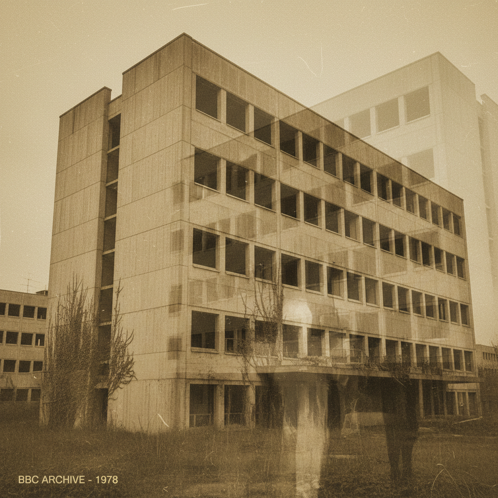

# Nostalgiacore / Hauntology（怀旧核 / 幽灵学美学）

> **别名**：Hauntology Aesthetic, Lost Futures, 记忆幽灵  
> **活跃年代**：2006 – 至今（理论）；2018 – 至今（作为互联网美学）  
> **起源**：Mark Fisher 的文化批评 → Tumblr/YouTube 视觉化

---

## 一句话定义

Nostalgiacore/Hauntology 是一种以**"从未实现的未来"**为核心的美学——它不怀念过去本身，而是怀念**过去曾经许诺但从未到来的未来**：70年代想象的太空殖民、80年代承诺的飞行汽车、90年代预言的数字乌托邦。

---

## 视觉语言

| 元素 | 描述 |
|------|------|
| 媒介 | VHS 磁带、卡带、黑胶唱片、CRT 电视 |
| 色调 | 褪色、泛黄、低对比度、"记忆中的颜色" |
| 空间 | 废弃的公共建筑、70s/80s 建筑、旧图书馆 |
| 声音 | 磁带嘶嘶声、黑胶噼啪声、失真的广播 |
| 文字 | 旧式公共信息字体（如英国 Rail Alphabet） |
| 情绪 | 哀悼、失落、温柔的悲伤 |
| 时间 | "过去的未来"——复古未来主义的哀悼版 |

---

## 理论根源

### Jacques Derrida 的"幽灵学"

"Hauntology"一词由法国哲学家德里达在 *Specters of Marx*（1993）中创造：
- 原意：马克思主义的"幽灵"在后冷战时代依然"缠绕"着我们
- 文化含义：**过去的未来承诺像幽灵一样缠绕着现在**

### Mark Fisher 的文化批评

英国文化批评家 Mark Fisher（1968-2017）将 Hauntology 发展为一种完整的文化理论：

> "21世纪的文化被一种奇特的停滞所困扰。我们不再能想象真正的新事物，只能不断回收过去。"

Fisher 的核心概念：
- **Lost Futures（失落的未来）**：60-70年代的社会民主主义曾承诺一个更好的未来，但这个未来从未到来
- **Capitalist Realism（资本主义现实主义）**：我们无法想象资本主义之外的任何替代方案
- **The Slow Cancellation of the Future（未来的缓慢取消）**：文化不再产生真正的"新"，只有对过去的重组

---

## 历史时间线

| 时期 | 事件 |
|------|------|
| 1993 | Derrida 出版 *Specters of Marx*，创造"Hauntology"一词 |
| 2005-2006 | 英国音乐人 Burial 发行同名专辑；Ghost Box Records 成立 |
| 2006-2009 | Mark Fisher 在博客 k-punk 上发展 Hauntology 文化理论 |
| 2009 | Fisher 出版 *Capitalist Realism* |
| 2011 | BBC 纪录片 *The Ghosts of Broadcasting House* |
| 2014 | Fisher 出版 *Ghosts of My Life* |
| 2017 | Mark Fisher 去世；其思想在互联网上广泛传播 |
| 2018-2020 | Hauntology 从学术概念变为 Tumblr/YouTube 视觉美学 |
| 2020+ | 与 Liminal Space、Dreamcore 交叉；"Nostalgiacore"标签流行 |

---

## 文化内核

### 怀旧的怀旧

Nostalgiacore 不是简单的怀旧——它是**对怀旧本身的反思**：
- 为什么我们如此沉迷于过去？
- 我们怀念的"过去"真的存在过吗？
- 怀旧是一种逃避还是一种批判？

### "从未到来的未来"

Hauntology 美学的核心意象是**被取消的未来**：
- 60年代的太空计划承诺了月球殖民——没有实现
- 70年代的公共建筑承诺了社会平等——被私有化
- 80年代的科技承诺了飞行汽车——我们得到了社交媒体
- 90年代的互联网承诺了信息民主——我们得到了监控资本主义

### 英国特殊性

Hauntology 美学有强烈的英国特色：
- **BBC Radiophonic Workshop**：60-70年代的电子实验音乐
- **Public Information Films**：政府公共安全宣传片的诡异感
- **Brutalist Architecture**：战后混凝土建筑的废墟
- **Ghost Box Records**：专门制作 Hauntology 音乐的厂牌

---

## 与其他风格的关系

| 风格 | 关系 |
|------|------|
| **Vaporwave** | 共享对消费文化的批判性怀旧，但 Hauntology 更学术、更哀伤 |
| **Liminal Space** | 共享对废弃空间的迷恋 |
| **Cassette Futurism** | 共享对旧媒介的怀旧，但 Cassette Futurism 更乐观 |
| **Mallsoft** | Mallsoft 是 Hauntology 的商场版本 |
| **Synthwave** | Synthwave 怀念80年代的"酷"，Hauntology 哀悼80年代的"失败" |
| **Dreamcore** | 共享超现实和记忆扭曲的元素 |

---

## 代表性视觉参考

- Ghost Box Records 专辑封面
- Burial 专辑美术
- 英国 Brutalist 建筑摄影
- BBC Radiophonic Workshop 档案影像
- Mark Fisher 讲座视频截图
- 70年代公共信息片（Public Information Films）

---

## 延伸阅读

- Mark Fisher, *Ghosts of My Life*（2014）
- Mark Fisher, *Capitalist Realism*（2009）
- [Aesthetics Wiki - Hauntology](https://aesthetics.fandom.com/wiki/Hauntology)
- Ghost Box Records 目录
- 本项目相关：[Vaporwave](vaporwave.md) | [Liminal Space](liminal-space.md) | [Cassette Futurism](cassette-futurism.md) | [Mallsoft](mallsoft.md)
