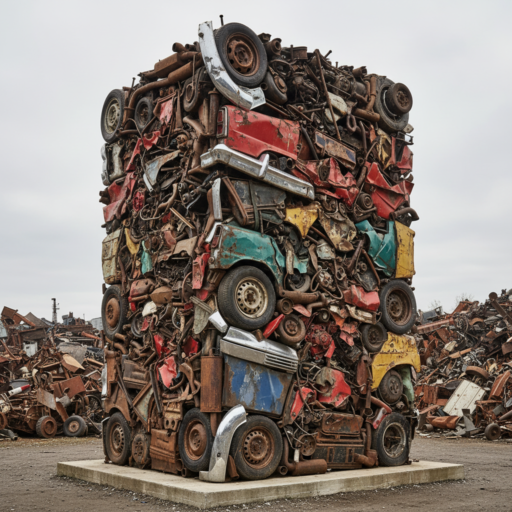

# Nouveau Réalisme 新现实主义（法国）

> **时期：** 1960–1970  
> **关键词：** 物质诗学、décollage、积累、蓝色单色、射击绘画

## 概述

Nouveau Réalisme 是1960年由皮埃尔·雷斯塔尼在巴黎宣言成立的艺术团体，成员包括伊夫·克莱因、阿尔曼、丁格利、妮基·德·圣法尔等。他们宣称"绘画已死"，转而直接使用现实世界的碎片——废弃物、工业产品、城市残骸——创造一种"对现实的新感知方式"。

## 风格特征

- **单色画**：克莱因的国际克莱因蓝（IKB）
- **Décollage**：撕裂城市海报层露出时间痕迹
- **积累**：将同类物品密集排列封入树脂
- **动力雕塑**：丁格利的自毁机器装置
- **射击绘画**：用步枪射击颜料袋创作

## 代表人物与作品

- Yves Klein 人体测量、火焰绘画
- Arman《愤怒》系列（砸碎乐器）
- Daniel Spoerri 陷阱画（固定餐桌残余）
- Mimmo Rotella 撕裂电影海报
- Raymond Hains décollage

## 概念图

