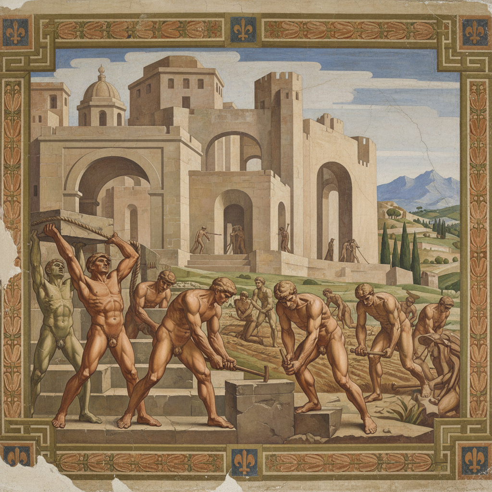

# Novecento Italiano 意大利二十世纪运动



> **"致敬Quattrocento与Cinquecento的伟大——在现代画布上复兴古典秩序与纪念碑性。"**

## 概述

意大利二十世纪运动（Novecento Italiano，直译"意大利1900世纪"）是1922年发源于米兰的艺术运动，主张回归意大利古典传统，复兴巨幅历史题材绘画与纪念碑性构图，反对欧洲先锋派的激进实验。

## 时代背景

| 维度 | 内容 |
|------|------|
| 创立 | 1922年，米兰 |
| 首展 | 1923年米兰，墨索里尼出席 |
| 活跃期 | 1922–1940年代 |
| 思想背景 | "恢复秩序"（Retour à l'ordre）运动 |
| 政治语境 | 意大利法西斯主义时期 |

## 创始成员

| 艺术家 | 生卒 |
|------|------|
| Anselmo Bucci | 1887–1955 |
| Leonardo Dudreville | 1885–1975 |
| Achille Funi | 1890–1972 |
| Gian Emilio Malerba | 1880–1926 |
| Piero Marussig | 1879–1937 |
| Ubaldo Oppi | 1889–1942 |
| Mario Sironi | 1885–1961 |

## 视觉特征

- **纪念碑性构图**：大尺幅、庄严的画面结构
- **古典人体**：理想化的人物造型
- **沉稳色调**：大地色、赭石、深蓝
- **建筑感**：画面如建筑般坚实有序
- **历史题材**：神话、寓言、劳动场景
- **壁画传统**：延续意大利文艺复兴壁画的宏大叙事

## 核心理念

### 命名的野心

"Novecento"（1900世纪）直接致敬了意大利艺术史上的伟大时代：
- Quattrocento（1400世纪）= 早期文艺复兴
- Cinquecento（1500世纪）= 盛期文艺复兴
- Novecento = 20世纪的"新文艺复兴"

### 恢复秩序

一战后欧洲艺术界普遍出现的"回归古典"倾向——厌倦了前卫实验的破坏性，渴望重建秩序、传统与可辨识的美。

## 与政治的关系

Novecento运动与法西斯政权存在复杂关联：
- 组织者Margherita Sarfatti是墨索里尼的情人和文化顾问
- 墨索里尼出席1923年首展并发言
- 但运动本身缺乏统一的政治纲领
- 成员风格差异巨大，并非单纯的宣传工具

## 与其他运动的关系

```
未来主义(1909) ──→ [反动] ──→ Novecento(1922)
                                    ↓
新古典主义 ←── Novecento ──→ 形而上画派
                                    ↓
                        战后意大利现实主义
```

## 当代影响

- 对意大利战后具象绘画传统的延续
- 当代"新古典"设计趋势的历史参照
- 建筑中新理性主义（Neo-Rationalism）的精神前身
- 对"艺术与政治"关系的持续反思案例

## 多语言名称

| 语言 | 名称 |
|------|------|
| 意大利语 | Novecento Italiano |
| 英语 | Italian Novecento / Twentieth Century Movement |
| 中文 | 意大利二十世纪运动 |
| 法语 | Novecento italien |

## 延伸阅读

- Margherita Sarfatti 相关文献
- 1926年米兰集体展览图录
- Elena Pontiggia《Il Novecento Italiano》

---

*最后更新：2026-07-26*
