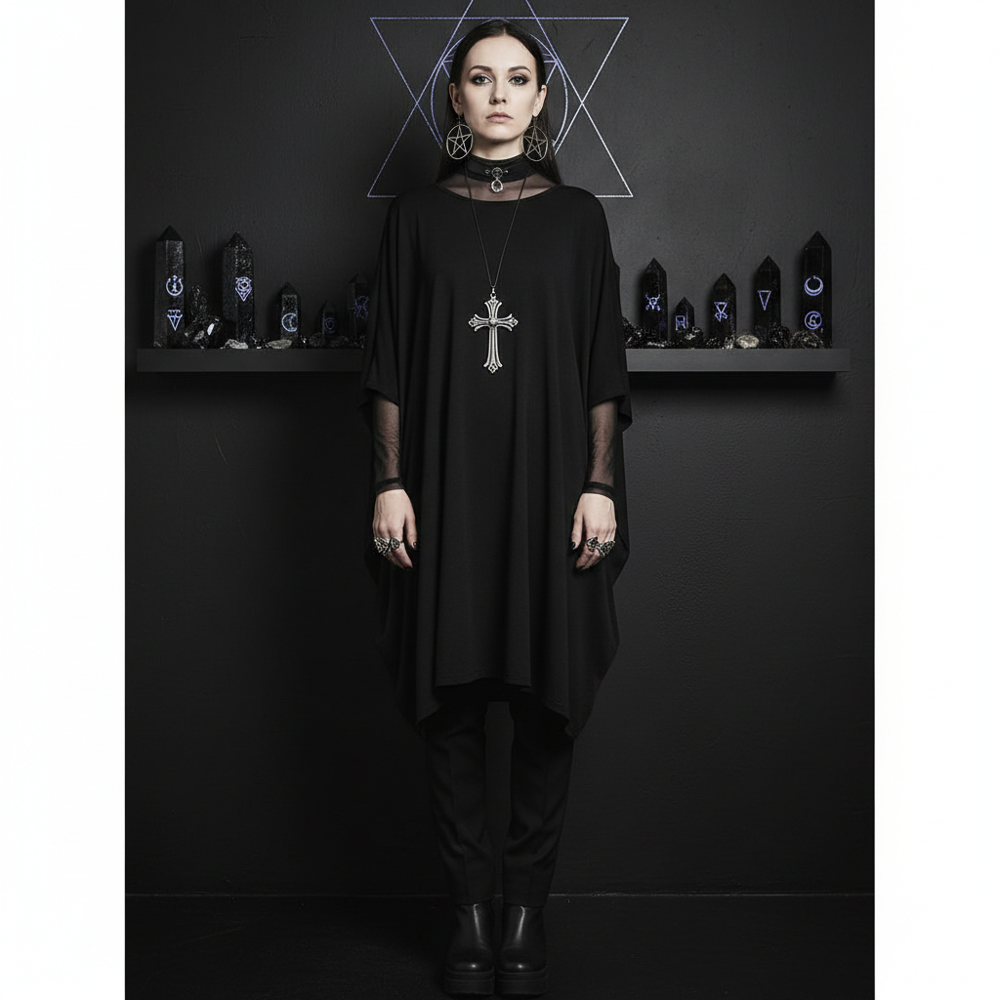

# Nu-Goth 新哥特



> **"倒十字架、全黑运动装、Tumblr 滤镜——哥特在社交媒体时代的重生。"**

## 概述

| 维度 | 描述 |
|------|------|
| 时期 | 2010–至今 |
| 别名 | Nu-Goth, Nu Goth, Tumblr Goth, Internet Goth |
| 核心色彩 | 黑色、深灰、银色、偶尔酒红 |
| 关键元素 | 全黑极简、倒十字架、五角星、运动+哥特混搭 |
| 代表人物 | Tumblr 博主、Killstar 品牌 |
| 关联风格 | Gothic, Health Goth, Pastel Goth, Witchcore |

---

## 历史脉络

| 年份 | 事件 |
|------|------|
| 2010 | "Nu-Goth" 一词在 Tumblr 上出现 |
| 2012 | Killstar 品牌成立——Nu-Goth 商业化 |
| 2013 | 与 Health Goth 交叉——运动+黑色 |
| 2015 | 全盛期——Tumblr/Instagram 美学 |
| 2018 | 与 Witchcore 融合 |
| 2020s | 继续演变——与 Dark Academia 交叉 |

### 核心哲学

Nu-Goth 的精神是**"哥特不需要蕾丝和蝙蝠——黑色+极简+神秘就够了"**：
- 极简 = 新哥特（不需要维多利亚装饰）
- 运动 = 可以是黑暗的（Nike + 五角星）
- 网络 = 社区（"我们在 Tumblr 上找到彼此"）
- 神秘 = 美学（塔罗、月亮、水晶）
- "传统哥特太复杂了——我只想穿全黑"

---

## 视觉语法

### 色彩系统

```
主色：
  黑色 (#000000) — 绝对主导
  深灰 (#333333) — 层次
  银色 (#C0C0C0) — 首饰

辅色：
  酒红 (#4A0000) — 偶尔点缀
  深紫 (#1A001A) — 神秘
  白色 (#FFFFFF) — 图案、对比

规则：
  - 90%+ 黑色
  - 极简——少即是多
  - 几何图案（三角形、十字架）
  - 哑光 > 光泽

质感：
  棉 — 基础（T恤、连衣裙）
  网眼 — 层叠
  皮革 — 配饰
  银 — 首饰
```

### 标志性元素

| 类别 | 元素 |
|------|------|
| 服装 | 全黑极简、oversized T恤、黑色运动裤 |
| 符号 | 倒十字架、五角星、月亮、眼睛 |
| 配饰 | 银色首饰、choker、戒指堆叠 |
| 品牌 | Killstar, Disturbia, Long Clothing |
| 音乐 | Witch House, Dark Wave, Crystal Castles |
| 态度 | 极简、神秘、网络、现代 |

---

## 与千禧怀旧的关系

### Tumblr 时代的哥特
- Nu-Goth = Tumblr 美学的黑暗面
- 与 Soft Grunge 同时代同平台
- "Tumblr 让哥特变得'可接近'"
- 从亚文化到"美学标签"的转变

### 与传统哥特的区别
- 传统哥特 = 蕾丝、蝙蝠、维多利亚、Bauhaus
- Nu-Goth = 极简、运动、几何、Witch House
- 传统哥特 = 音乐驱动 / Nu-Goth = 视觉驱动
- "Nu-Goth 是哥特的 Instagram 版本"

---

## 中国语境

- 与中国"暗黑系"/"黑色极简"的交叉
- Killstar 在中国的粉丝群
- 小红书上的"全黑穿搭"
- 与中国"巫女风"的关系

---

## 设计应用

| 场景 | 应用方式 |
|------|----------|
| 时尚 | 全黑+极简+几何符号+银色 |
| 品牌 | 黑色+神秘+极简+现代+暗黑 |
| 数字 | 黑色+白色图案+极简+Tumblr感 |
| 空间 | 黑色+蜡烛+水晶+月亮+极简 |

---

## 相关风格

← [Gothic 哥特美学](gothic.md) | [Pastel Goth 粉彩哥特](pastel-goth.md) →

↑ [返回千禧怀旧目录](README.md) | [返回总目录](../README.md)
