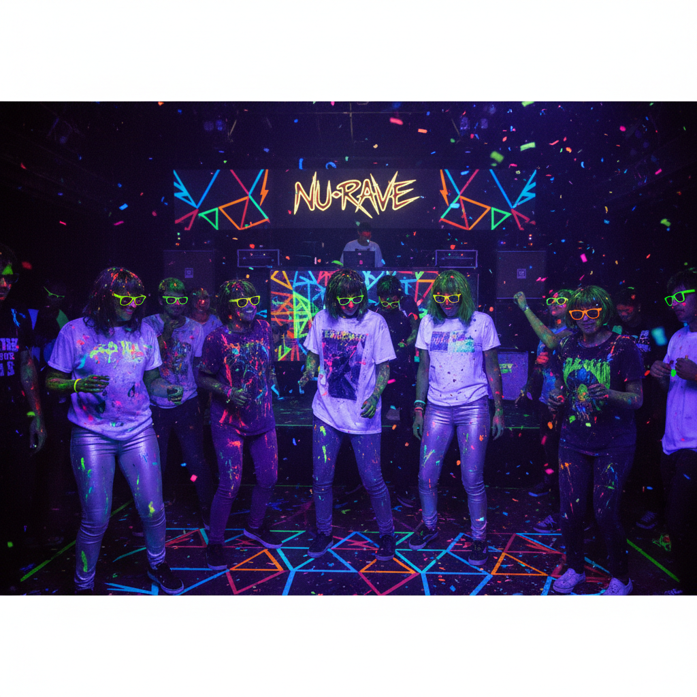
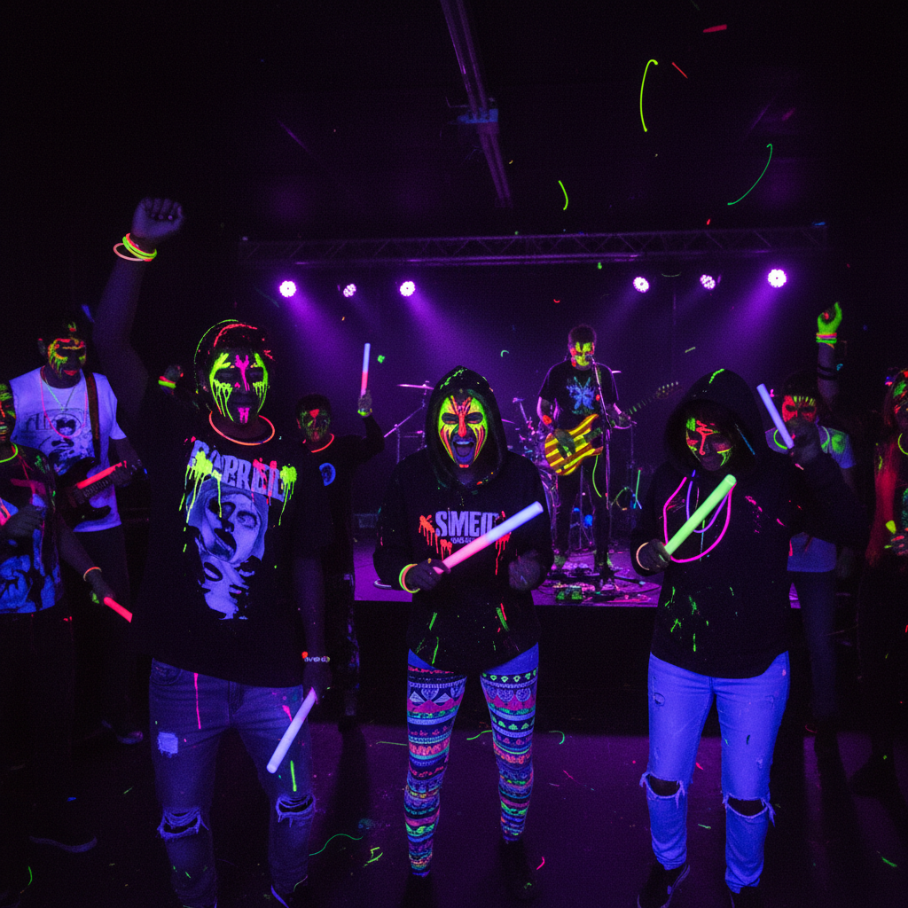

# Nu-Rave | 新锐舞风

## 概述

- **时间跨度**：2006 – 2009
- **发源地**：英国独立音乐圈（伦敦、布莱顿）
- **核心理念**：将80年代酸性浩室（Acid House）的荧光色彩与2000年代独立摇滚混合
- **别名**：New Rave、Indie Rave

## 历史背景

Nu-Rave 是2006-2009年间短暂但影响深远的英国音乐与时尚运动。NME杂志在2006年用"New Rave"来描述 Klaxons 乐队的音乐风格——将电子舞曲的节拍与独立摇滚的吉他结合，配以极度鲜艳的视觉呈现。

这个运动的核心乐队包括 Klaxons（2007年水星奖得主）、CSS、New Young Pony Club、Shitdisco 等。他们的演出现场充满荧光涂料、UV灯光和Day-Glo色彩。

### 为什么是2006年？

Nu-Rave 的出现有其精确的时代背景：

- **独立音乐的"严肃化"**：2004-2006年，Arctic Monkeys、Franz Ferdinand、Bloc Party 主导英国独立圈，风格冷静克制
- **对"酷"的疲劳**：年轻人厌倦了"装酷"，想要更直接的快乐
- **Rave文化的怀旧**：80年代末的酸性浩室（Acid House）和Second Summer of Love 已经过去近20年，足够产生怀旧情绪
- **MySpace的兴起**：社交媒体让小众乐队能快速积累粉丝
- **数码相机普及**：闪光灯派对照片成为一种社交货币

### 三年生命周期

| 阶段 | 时间 | 事件 |
|------|------|------|
| 命名 | 2006年秋 | NME 用"New Rave"描述 Klaxons |
| 爆发 | 2007年初 | Klaxons 获水星奖，CSS 全球巡演 |
| 巅峰 | 2007-2008 | 荧光色派对遍布英国各大城市 |
| 衰退 | 2009 | 乐队纷纷转型，媒体兴趣消退 |
| 遗产 | 2010+ | 影响EDM视觉文化和音乐节美学 |

## 视觉特征

### 核心元素
- **荧光色（Day-Glo）**：荧光黄、荧光粉、荧光绿——越亮越好
- **UV反应材料**：在紫外灯下发光的服装和涂料
- **几何图案**：三角形、闪电符号、棱形
- **面部彩绘**：荧光色的战争涂装
- **紧身裤+宽松上衣**：skinny jeans + oversized band tee
- **Ray-Ban Wayfarer**：标配太阳镜（即使在室内/夜晚）
- **荧光胶带**：贴在衣服、鞋子、脸上
- **DIY T恤**：用荧光笔和剪刀改造的band tee

### 色彩
- 荧光黄、荧光粉、荧光绿、荧光橙
- 搭配黑色或白色底色
- 高对比度、高饱和度
- 关键原则：**在黑暗中必须能看见你**

### 音乐特征

Nu-Rave 的音乐是其视觉的直接延伸：
- 独立摇滚吉他 + 电子合成器
- 4/4拍舞曲节奏 + 朋克能量
- 歌词通常是派对主题或超现实主义
- 现场演出强调参与感（荧光涂料战、气球雨）

**关键曲目**：
- Klaxons - "Golden Skans" (2007)
- CSS - "Let's Make Love and Listen to Death from Above" (2006)
- New Young Pony Club - "Ice Cream" (2007)
- Shitdisco - "I Know Kung Fu" (2007)
- Late of the Pier - "Bathroom Gurgle" (2008)

### 派对文化

Nu-Rave 的核心体验是**派对**：
- 小型俱乐部（200-500人容量）
- UV灯光是必备设施
- 入场时发放荧光手环和涂料
- DJ set 和 live band 交替
- 派对结束后所有人身上都是荧光涂料

伦敦的 Trash（Soho）、Erol Alkan 的 Bugged Out! 是标志性场所。

## 代表案例

| 领域 | 代表 | 说明 |
|------|------|------|
| 音乐 | Klaxons | "Myths of the Near Future" 水星奖 |
| 音乐 | CSS | 巴西电子朋克 |
| 音乐 | New Young Pony Club | 电子迪斯科 |
| 音乐 | Late of the Pier | 实验性Nu-Rave |
| 音乐 | Hadouken! | 更重型的Nu-Rave |
| 时尚 | Cassette Playa | 荧光色街头品牌（Carri Munden） |
| 时尚 | House of Holland | "Fashion Groupie" T恤 |
| 夜店 | Trash (London) | Nu-Rave圣地 |
| 夜店 | Bugged Out! | Erol Alkan 的传奇派对 |
| 媒体 | NME杂志 | 命名者与推广者 |
| 摄影 | The Cobrasnake | 派对摄影记录者 |

## 与相关风格的关系

| 风格 | 关系 |
|------|------|
| Acid House (80s) | 直接祖先——荧光色+电子乐+MDMA文化 |
| Bloghouse | 同时期——但更法国、更电子、更"酷" |
| Electropop 08 | 后继者——更流行化、更主流 |
| Indie Sleaze | 共存——但Nu-Rave更彩色、更电子 |
| Rave (90s) | 精神前辈——但Nu-Rave更"indie"、更小众 |
| EDM (2010s) | 继承了Nu-Rave的视觉语言（荧光色、LED） |

## 文化内核

Nu-Rave 是对2000年代中期英国独立音乐"过于严肃"的反叛。当 Arctic Monkeys 和 Franz Ferdinand 代表着冷静克制时，Nu-Rave 说：**穿上荧光色，跳起来，别想那么多。**

### 短命的原因

Nu-Rave 只持续了约3年，原因包括：
- **媒体过度炒作**：NME 的命名本身就带有"制造潮流"的嫌疑
- **乐队拒绝标签**：Klaxons 多次公开否认自己是"New Rave"
- **音乐深度不足**：派对氛围难以支撑长期创作
- **2008年金融危机**：经济衰退让"无忧无虑的派对"显得不合时宜

### 持久遗产

虽然短命，Nu-Rave 对后来的文化产生了持久影响：
- **EDM视觉文化**：2010年代的电子音乐节（Tomorrowland、Ultra）大量使用荧光色和LED
- **音乐节美学**：面部彩绘、荧光配饰成为音乐节标配
- **Color Run**：荧光粉末跑步活动直接继承了Nu-Rave的视觉逻辑
- **Instagram滤镜**：高饱和度、霓虹色调的滤镜审美

## 图片画廊

| | |
|:---:|:---:|
|  | |
| *新锐舞风 · 荧光涂料与UV灯光* | |

## 延伸阅读

- [New Rave | Wikipedia](https://en.wikipedia.org/wiki/New_rave)
- NME: "The Rise and Fall of New Rave"
- [Klaxons - Myths of the Near Future (2007)](https://en.wikipedia.org/wiki/Myths_of_the_Near_Future)

---

[← Coquette Y2K](coquette-y2k.md) | [→ Harajuku Y2K](harajuku-y2k.md) | [↑ 返回目录](README.md)
