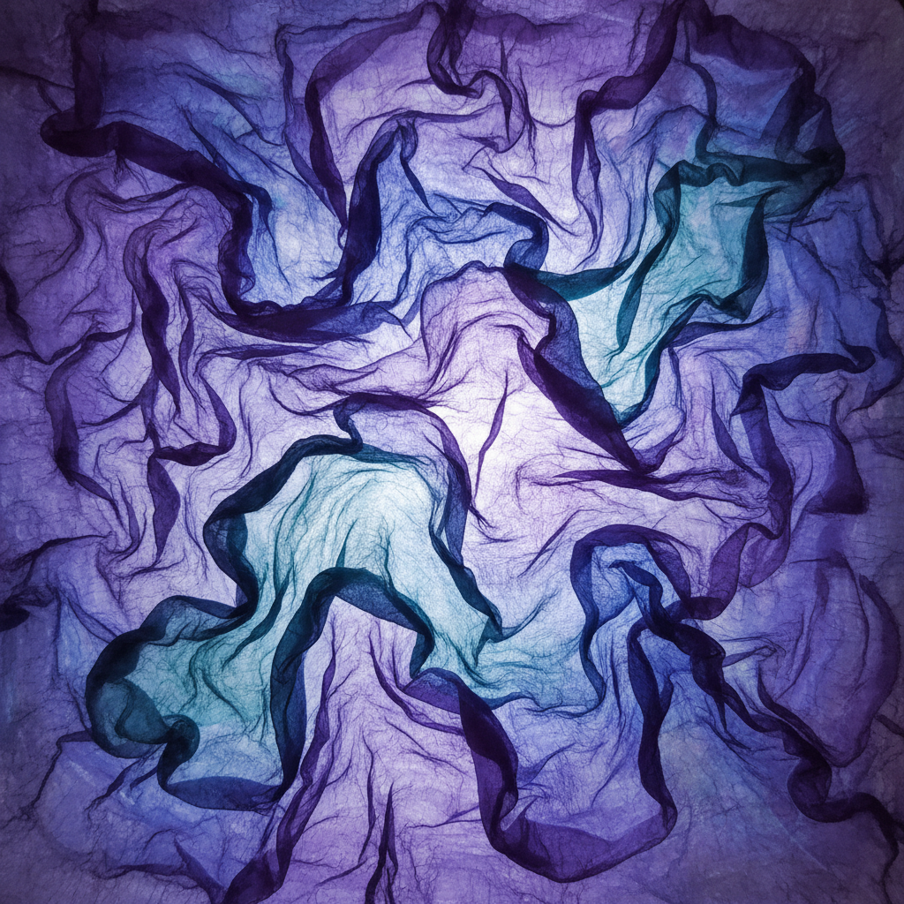

# Nuno Felting Art 布毡艺术

> "Nuno felting is the marriage of wool and woven cloth — loose fibers are laid onto a base fabric and then worked with water, soap, and friction until the wool migrates through the weave and locks itself permanently into the cloth. The result is a textile that is neither purely felt nor purely woven, but a hybrid with the drape of fabric and the sculptural texture of felt, creating surfaces that ripple, pucker, and undulate like living skin." — Unknown

## 概述

布毡艺术（Nuno Felting Art）是一种将松散的羊毛纤维通过湿毡工艺与轻薄织物（如丝绸、纱布）结合的纤维艺术技法——羊毛纤维在水、肥皂和摩擦的作用下穿透织物的经纬结构并与之永久结合。Nuno（日语"布"）felting由澳大利亚纤维艺术家Polly Stirling于1992年发明，创造出具有独特褶皱和起伏质感的轻薄毡布。

布毡艺术的实践包括：1）基布选择——选择适合的轻薄织物作为基底；2）纤维铺设——在织物上铺设羊毛纤维；3）湿毡——用水和肥皂使纤维穿透织物；4）摩擦——通过摩擦使纤维缠结；5）缩绒——使毡布收缩产生褶皱；6）造型——利用收缩创造立体效果；7）当代布毡——将传统技法与时装和艺术结合的创作。

## 核心特征

| 特征 | 描述 |
|------|------|
| 混合 | 羊毛与织物的结合 |
| 褶皱 | 独特的褶皱质感 |
| 轻薄 | 比传统毡布轻薄 |
| 垂坠 | 保持织物的垂坠性 |
| 现代 | 1992年发明的新技法 |
| 时装 | 广泛用于时装设计 |

## 视觉特征

- **褶皱**：自然的褶皱和起伏
- **质感**：丰富的表面质感
- **轻盈**：轻盈通透的效果
- **有机**：有机自然的形态
- **层次**：纤维与织物的层次
- **流动**：流动的布料质感

## 代表作品

| 作品 | 艺术家/文化 | 年代 | 意义 |
|------|-------------|------|------|
| *Polly Stirling works* | 澳大利亚 | 1992年起 | 布毡的发明者 |
| *Sachiko Kotaka works* | 日本 | 当代 | 日本布毡大师 |
| *Nuno felt fashion* | 国际 | 当代 | 布毡时装设计 |
| *Nuno felt sculpture* | 国际 | 当代 | 布毡雕塑艺术 |
| *Contemporary nuno felt* | 国际 | 当代 | 当代布毡发展 |

## 历史时间线

| 时期 | 事件 |
|------|------|
| 1992年 | Polly Stirling发明布毡技法 |
| 1990年代 | 布毡在纤维艺术界传播 |
| 2000年代 | 布毡在时装设计中的应用 |
| 2010年代 | 布毡的全球化普及 |
| 当代 | 布毡的多元化发展 |

## 中国语境

布毡艺术在中国近年来获得了快速发展。中国的纤维艺术家和手工爱好者开始学习和实践布毡技法——将其视为一种创新的纺织艺术形式。中国的时装设计师将布毡应用于服装设计——利用其独特的褶皱质感创造前卫的时装作品。中国的美术院校中，布毡作为纤维艺术的新兴课程——培养学生对材料创新的理解。中国的手工艺市场中，布毡围巾和配饰是受欢迎的手工产品——以其独特的质感和手工价值吸引消费者。中国的一些纤维艺术工作室专注于布毡创作——将中国丝绸与羊毛结合创造独特的东方布毡。中国的非遗传承中，传统的毡制品工艺与现代布毡有互补关系——如蒙古族和哈萨克族的毡艺传统。

## AI生成概念图

## 与其他风格的关系

- **Needle Felting** → 针毡
- **Wet Felting** → 湿毡
- **Textile Art** → 纺织艺术
- **Fashion Design** → 时装设计
- **Fiber Art** → 纤维艺术
- **Silk Art** → 丝绸艺术

---

*浮光艺志 | Chronicle of Artistry*
