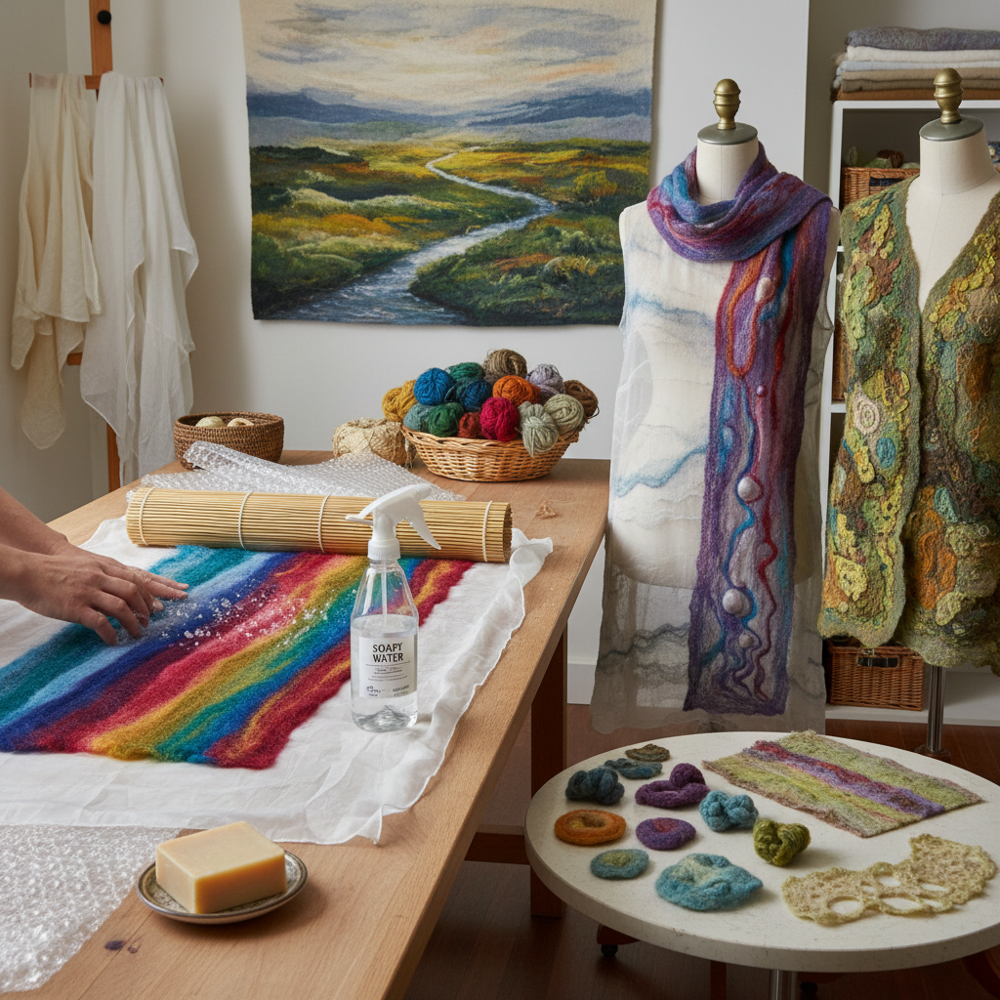

# Nuno Felting 布毡

> "Nuno felting is the marriage of wool and cloth — fibers migrating through open-weave fabric under the persuasion of water and friction, creating a textile that is neither felt nor woven but something entirely new." — Unknown

## 概述

布毡（Nuno Felting）是一种将羊毛纤维与轻薄织物（如丝绸、棉纱布、薄纱等）结合的毡化技法。"Nuno"来自日语"布"（ぬの）。这种技法由澳大利亚纤维艺术家Polly Stirling于1992年发明——她发现羊毛纤维可以在湿毡过程中穿透开放编织的织物，与织物融为一体，创造出一种全新的复合材料。

布毡的独特之处在于：羊毛纤维在毡化过程中收缩，而织物不收缩（或收缩程度不同），这种差异性收缩使织物产生褶皱、起伏和立体的质感。最终的布毡织物轻薄、有弹性、有独特的三维质感——既有毡的温暖，又有丝绸的光泽和垂坠感。

## 核心特征

| 特征 | 描述 |
|------|------|
| 复合 | 羊毛与织物的结合 |
| 穿透 | 纤维穿透织物 |
| 收缩 | 差异性收缩 |
| 质感 | 独特的三维质感 |
| 轻薄 | 比传统毡更轻薄 |
| 现代 | 1992年发明 |

## 视觉特征

- **褶皱**：自然的褶皱质感
- **轻薄**：轻薄的垂坠感
- **光泽**：丝绸的光泽
- **立体**：三维的表面
- **色彩**：丰富的色彩层次
- **有机**：有机的纹理

## 代表作品

| 作品 | 艺术家 | 年代 | 意义 |
|------|--------|------|------|
| *Original nuno felt* | Polly Stirling | 1992 | 布毡的发明 |
| *Nuno felt garments* | Various | 当代 | 布毡服装 |
| *Nuno felt scarves* | Various | 当代 | 布毡围巾 |
| *Nuno felt art* | Various | 当代 | 布毡艺术 |
| *Architectural nuno felt* | Various | 当代 | 建筑布毡 |

## 历史时间线

| 时期 | 事件 |
|------|------|
| 1992 | Polly Stirling发明布毡 |
| 1990s | 布毡技法的传播 |
| 2000s | 布毡的全球流行 |
| 2010s | 布毡服装设计的发展 |
| 当代 | 布毡作为艺术媒介 |
| 当代 | 布毡教育的普及 |

## 中国语境

布毡在中国的纤维艺术爱好者群体中越来越受欢迎。中国的丝绸资源丰富，为布毡创作提供了优质的基底材料——丝绸与羊毛的结合是布毡最经典的组合。一些中国的纤维艺术家和设计师将布毡技法融入服装设计和艺术创作。中国的手工工作坊和艺术教育机构提供布毡课程。中国的电商平台上也有丰富的布毡材料供应。布毡的轻薄特性使其特别适合制作围巾、披肩等配饰。

## AI生成概念图

## 与其他风格的关系

- **Wet Felting** → 湿毡
- **Needle Felting** → 针毡
- **Silk Art** → 丝绸艺术
- **Textile Art** → 纺织艺术
- **Fiber Art** → 纤维艺术
- **Wearable Art** → 可穿戴艺术

---

*浮光艺志 | Chronicle of Artistry*
