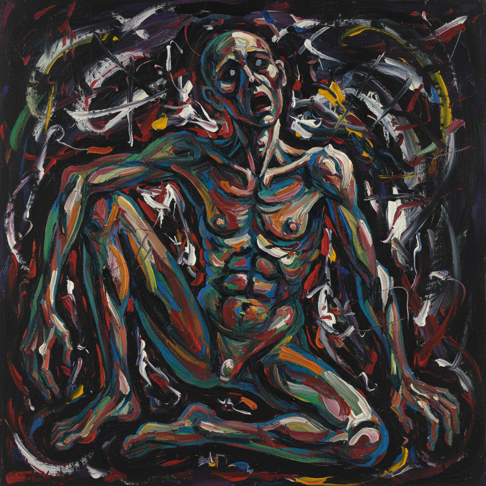

# Nuova Figurazione 新具象

> **时期：** 1959年–1970年代  
> **关键词：** 意大利、具象回归、存在主义、社会批判、反抽象

## 概述

Nuova Figurazione（新具象）是1959年在意大利兴起的绘画运动，反对当时主导的抽象艺术——Art Informel和几何抽象。画家们重新引入人物形象，但不是回到传统写实，而是用扭曲、碎片化和表现主义的手法描绘当代人的存在困境。它是战后意大利社会焦虑的视觉表达。

## 风格特征

- **扭曲人物**：变形但可辨识的人体
- **存在焦虑**：孤独、异化、困惑的主题
- **表现手法**：粗犷笔触和强烈色彩
- **社会批判**：消费社会和政治压迫
- **混合语言**：抽象与具象的融合

## 代表人物与作品

- 弗朗西斯·培根（影响源）
- 雷纳托·古图索 社会场景
- 瓦莱里奥·阿达米 轮廓人物
- 安东尼奥·雷卡尔卡蒂 存在主义人物

## 概念图

