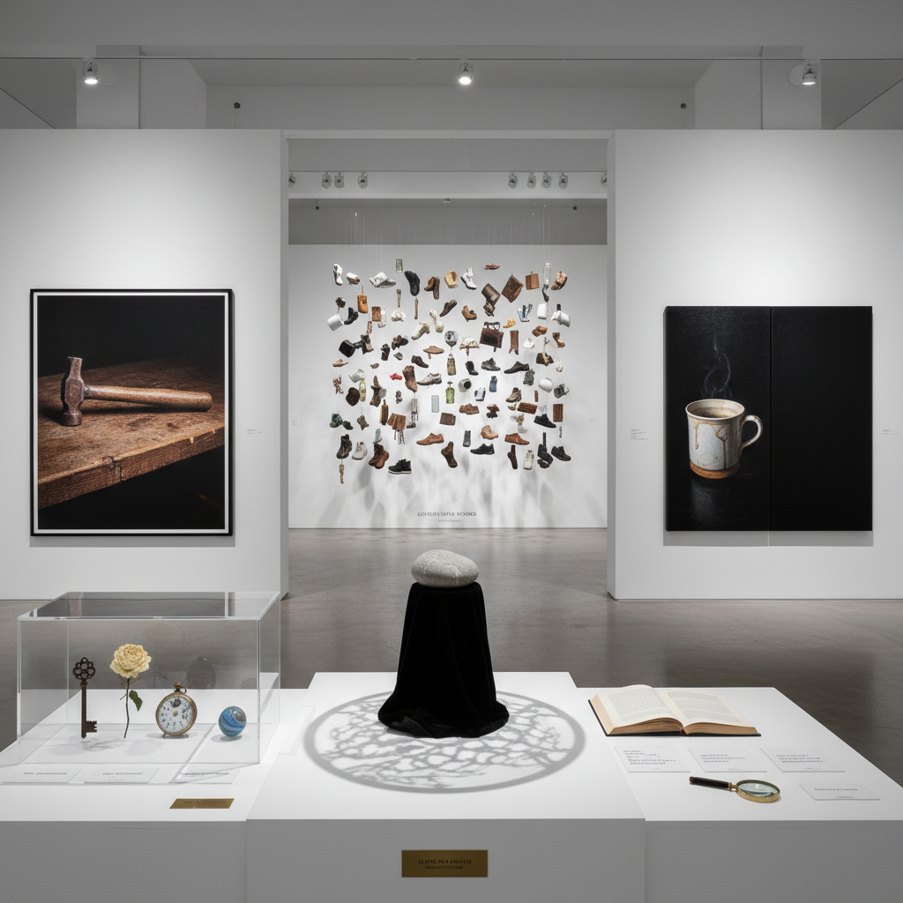

# Object-Oriented Art 面向对象艺术

> "Object-Oriented Art takes seriously the proposition that objects have lives of their own — that a stone in a field has its own reality that exceeds what any human, animal, or other entity can grasp of it, that every object withdraws from every relation it enters into, maintaining a dark inexhaustible core that no perception or use can ever fully access, and that art might be the practice of gesturing toward this withdrawn reality of things, of making visible the invisible depths that every humble object conceals beneath its surface." — Graham Harman

## 概述

面向对象艺术（Object-Oriented Art，简称OOA或OO Art）是受格拉汉姆·哈曼（Graham Harman）的面向对象本体论（Object-Oriented Ontology，OOO）启发的艺术实践。OOO主张所有对象——无论是人类、动物、原子还是虚构实体——都具有同等的本体论地位，且每个对象都有一个"退隐"（withdrawn）的核心，永远无法被任何其他对象完全接触或穷尽。

面向对象艺术试图在创作中体现这些哲学原则：尊重物体的自主性和神秘性、避免将物体还原为人类的工具或符号、探索物体之间不经人类中介的关系、以及呈现物体"退隐"的不可见维度。这种艺术实践与新唯物主义（New Materialism）、物质转向（Material Turn）和后人类主义有密切关联，但更强调个体对象的独特性和不可还原性。

## 核心特征

| 特征 | 描述 |
|------|------|
| 退隐 | 对象的退隐本质 |
| 平等 | 万物的本体论平等 |
| 自主 | 物体的自主存在 |
| 关系 | 物体间的非人类关系 |
| 深度 | 不可穷尽的深度 |
| 魅力 | 对象的感性魅力 |

## 视觉特征

- **物体**：日常物体的庄严呈现
- **孤立**：物体的孤立和自足
- **材质**：材质的深度和复杂性
- **黑暗**：暗示退隐的黑暗
- **并置**：异质物体的平等并置
- **静物**：重新定义的静物画

## 代表作品

| 作品 | 艺术家 | 年代 | 意义 |
|------|--------|------|------|
| *Immaterials* | Timo Arnall | 2012 | 不可见对象的可视化 |
| *Object-Oriented feminism* | Various | 2010年代 | OOO与女性主义 |
| *Alien Phenomenology* | Ian Bogost | 2012 | 异类现象学 |
| *The Quadruple Object* | Graham Harman | 2011 | 四重对象理论 |
| *OOO-inspired installations* | Various | 2010年代 | 面向对象的装置 |

## 历史时间线

| 时期 | 事件 |
|------|------|
| 2002 | Harman的《Tool-Being》 |
| 2007 | 思辨实在论研讨会 |
| 2010 | OOO概念的流行化 |
| 2012 | Bogost的《异类现象学》 |
| 当代 | OOO影响当代艺术策展 |

## 中国语境

面向对象本体论在中国当代艺术和哲学界有一定的影响。中国传统哲学中有丰富的"物论"传统——庄子的"齐物论"主张万物平等、不以人类为中心的世界观，与OOO有深层的共鸣。中国的一些当代艺术家在创作中探索物体的自主性和神秘性——如对自然材料的尊重、对日常物品的重新审视、以及对"物"的哲学思考。中国的工艺传统中对材料的尊重（如玉雕中的"因材施艺"）也体现了一种朴素的面向对象思维。

## AI生成概念图

## 与其他风格的关系

- **Speculative Realism** → 思辨实在论
- **New Materialism** → 新唯物主义
- **Conceptual Art** → 概念艺术
- **Still Life** → 静物画
- **Installation Art** → 装置艺术
- **Post-Minimalism** → 后极简主义

---

*浮光艺志 | Chronicle of Artistry*
