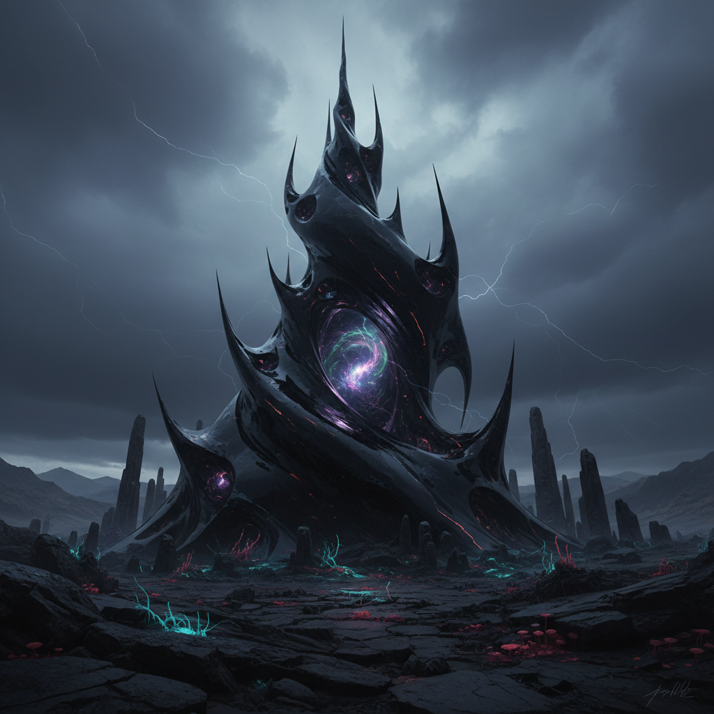

# Object-Oriented Ontology Art 物导向本体论艺术

> **时期：** 2010年代–至今  
> **关键词：** 非人类视角、物的自主性、平面本体论、暗物质、退隐

## 概述

物导向本体论（OOO）艺术受哲学家格雷厄姆·哈曼（Graham Harman）等人的思辨实在论影响，试图从"物"的视角而非人类中心的视角来创作。在OOO看来，每个物体——无论是石头、算法还是星系——都拥有自己不可被完全认知的"退隐"内核。艺术家们试图暗示这种物的神秘自主性，创造出让观者感受到"非人类世界"存在感的作品。

## 风格特征

- **物的自主性**：物体不再是人类叙事的道具
- **退隐（Withdrawal）**：暗示物体不可被完全认知的维度
- **平面本体论**：人与物处于同一存在层面
- **非人类尺度**：地质时间、微观世界、宇宙尺度
- **物质思辨**：对材料本身的哲学性探索

## 代表人物与作品

- Timothy Morton 超物体理论与艺术合作
- Ian Bogost 外星现象学
- 当代雕塑中的物质主义转向
- 新物质主义装置艺术

## 概念图

