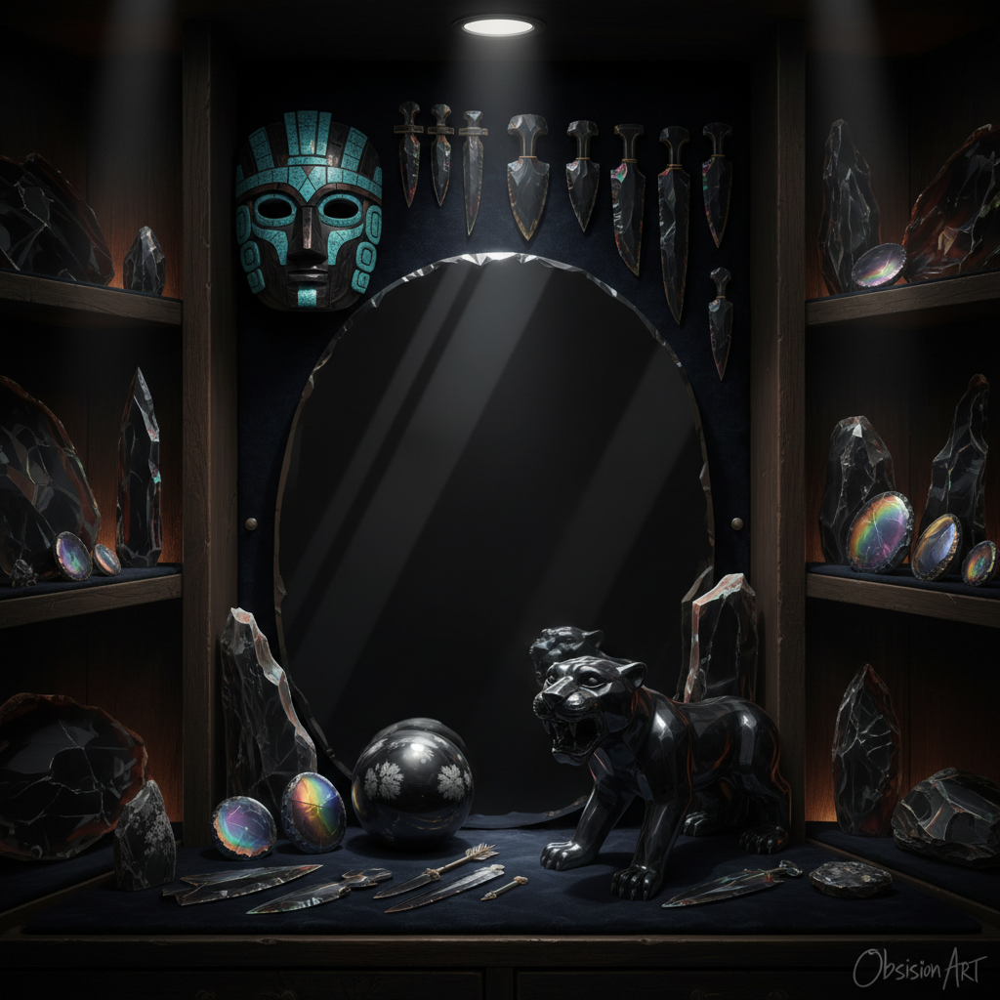

# Obsidian Art 黑曜石艺术

> "Obsidian is volcanic glass — lava that cooled so quickly it had no time to crystallize, freezing instead into a material sharper than any surgical steel, blacker than any pigment, and more reflective than any mirror humans could make for thousands of years. It is fire become stone, chaos become order, destruction become beauty." — Unknown

## 概述

黑曜石艺术（Obsidian Art）是以黑曜石（火山玻璃）为材料进行艺术创作的实践——利用黑曜石的极致黑色、玻璃光泽、可打制成极锋利边缘的特性和天然的虹彩效果创造艺术品。黑曜石是人类最早使用的工具和装饰材料之一。

黑曜石艺术的实践包括：1）黑曜石雕刻——在黑曜石上进行精细雕刻；2）黑曜石镜——用抛光黑曜石制作的镜子（阿兹特克传统）；3）黑曜石首饰——用黑曜石制作的首饰和装饰品；4）黑曜石刀具——用打制技法制作的仪式性刀具；5）黑曜石镶嵌——将黑曜石嵌入其他材料中；6）黑曜石球——抛光的黑曜石球体（水晶球）；7）当代黑曜石雕塑——用黑曜石创作的当代艺术。

## 核心特征

| 特征 | 描述 |
|------|------|
| 黑色 | 极致的黑色 |
| 玻璃 | 天然玻璃质地 |
| 锋利 | 可打制成极锋利边缘 |
| 反射 | 高度反射性 |
| 虹彩 | 某些品种有虹彩效果 |
| 火山 | 火山起源 |

## 视觉特征

- **黑色**：深邃的纯黑色
- **光泽**：玻璃般的光泽
- **反射**：镜面般的反射
- **虹彩**：彩虹黑曜石的虹彩
- **锋利**：贝壳状断口的锋利边缘
- **深邃**：深不可测的视觉深度

## 代表作品

| 作品 | 艺术家 | 年代 | 意义 |
|------|--------|------|------|
| *Aztec obsidian mirrors* | 阿兹特克 | 古代 | 黑曜石镜 |
| *Obsidian blades* | 各古代文化 | 史前至今 | 黑曜石刀具 |
| *Obsidian masks* | 中美洲传统 | 古代 | 黑曜石面具 |
| *Obsidian jewelry* | Various | 古代至今 | 黑曜石首饰 |
| *Contemporary obsidian* | Various | 当代 | 当代黑曜石艺术 |

## 历史时间线

| 时期 | 事件 |
|------|------|
| 石器时代 | 黑曜石工具的使用 |
| 古代 | 黑曜石贸易网络 |
| 阿兹特克 | 黑曜石镜和仪式用品 |
| 古罗马 | 黑曜石装饰品 |
| 当代 | 黑曜石作为当代艺术材料 |

## 中国语境

黑曜石艺术在中国有独特的文化意义。中国古代虽然不是黑曜石的主要产地，但通过贸易获得的黑曜石被视为珍贵的宝石材料。中国传统文化中，黑曜石被认为具有辟邪和保护的功能——黑曜石佛珠、貔貅和护身符在中国民间信仰中有重要地位。中国当代的黑曜石加工主要集中在首饰和装饰品领域——用黑曜石制作的手串、吊坠和摆件在中国市场非常流行。中国的一些当代艺术家也在探索黑曜石的艺术潜力——利用其极致的黑色和反射性创作当代雕塑和装置。

## AI生成概念图

## 与其他风格的关系

- **Glass Art** → 玻璃艺术
- **Gemstone Art** → 宝石艺术
- **Jewelry Art** → 首饰艺术
- **Flintknapping** → 打制石器
- **Mirror Art** → 镜面艺术
- **Volcanic Art** → 火山艺术

---

*浮光艺志 | Chronicle of Artistry*
