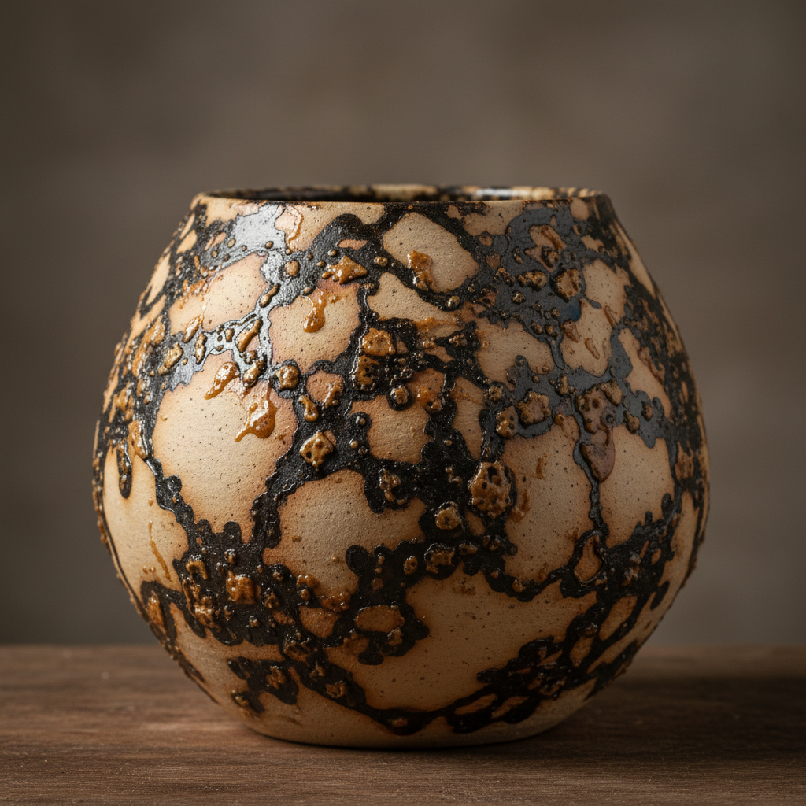

# Obvara Art 奥布瓦拉艺术

> "Obvara is alchemy at speed — a pot pulled glowing from the kiln at 650 degrees and plunged into a fermenting mixture of flour, sugar, and yeast that erupts on contact, the living culture scorching onto the surface in seconds, leaving behind a skin of carbon and caramelized sugars in patterns as unpredictable as lightning, each piece branded by the explosive meeting of fire and fermentation." — Unknown

## 概述

奥布瓦拉艺术（Obvara Art）是一种源于东欧（波罗的海地区）的古老陶瓷表面处理技法。其过程是将刚从窑中取出的高温陶器（约650°C）迅速浸入由面粉、糖和酵母发酵而成的混合液中——发酵液在接触高温陶器的瞬间剧烈反应，在器物表面形成独特的碳化和焦糖化图案。这种技法产生的效果完全不可预测，每件作品都是独一无二的。

奥布瓦拉艺术的核心要素包括：1）发酵液——面粉、糖和酵母的发酵混合物；2）高温取出——从窑中取出约650°C的陶器；3）快速浸泡——将热陶器迅速浸入发酵液；4）瞬间反应——发酵液在高温下的剧烈碳化；5）不可预测——完全随机的图案形成；6）碳化效果——碳和焦糖在表面的沉积；7）密封表面——碳化层形成防水效果。

## 核心特征

| 特征 | 描述 |
|------|------|
| 发酵液 | 面粉糖酵母的活性混合物 |
| 热浸技法 | 高温陶器浸入冷液体 |
| 碳化图案 | 碳和焦糖形成的纹理 |
| 不可预测 | 完全随机的效果 |
| 瞬间完成 | 几秒内完成的表面处理 |
| 有机纹理 | 自然有机的图案 |

## 视觉特征

- **焦褐色**：深浅不一的焦糖褐色
- **碳黑斑块**：碳化形成的黑色区域
- **闪电纹**：如闪电般的随机纹路
- **金属光泽**：某些区域的金属质感
- **有机图案**：如树皮或岩石的自然纹理
- **对比强烈**：深色碳化与浅色陶体的对比

## 代表作品

| 作品 | 艺术家/文化 | 年代 | 意义 |
|------|-------------|------|------|
| *波罗的海传统obvara陶器* | 东欧民间 | 12世纪起 | 传统obvara |
| *Jane Shellenbarger作品* | Jane Shellenbarger | 当代 | 美国obvara先驱 |
| *当代obvara花瓶* | 各地陶艺家 | 当代 | 现代obvara创作 |
| *Obvara茶碗* | 当代陶艺家 | 当代 | obvara与茶道结合 |
| *大型obvara雕塑* | 当代陶艺家 | 当代 | obvara的雕塑应用 |

## 历史时间线

| 时期 | 事件 |
|------|------|
| 12世纪 | 波罗的海地区发展出obvara技法 |
| 中世纪 | 东欧民间广泛使用 |
| 20世纪末 | 西方陶艺界重新发现obvara |
| 2000年代 | obvara在国际陶艺工作坊中传播 |
| 当代 | obvara成为替代烧制技法的热门选择 |

## 中国语境

奥布瓦拉技法在中国陶艺界是相对新颖的引入。中国传统陶瓷中没有直接对应的技法，但中国的"窑变"概念——在烧制过程中产生不可预测的效果——与obvara的随机性有精神上的相通。中国当代陶艺工作坊和陶艺教育中，obvara作为一种有趣的替代烧制技法被引入教学。它的即时性和戏剧性——几秒内完成的不可预测效果——吸引了许多中国年轻陶艺家的兴趣。obvara也被视为探索"偶然性美学"的一种途径。

## AI生成概念图

## 与其他风格的关系

- **Raku** → 乐烧
- **Pit Firing** → 坑烧
- **Smoke Firing** → 熏烧
- **Alternative Firing** → 替代烧制
- **Fermentation Art** → 发酵艺术
- **Chance Art** → 偶然性艺术

---

*浮光艺志 | Chronicle of Artistry*
