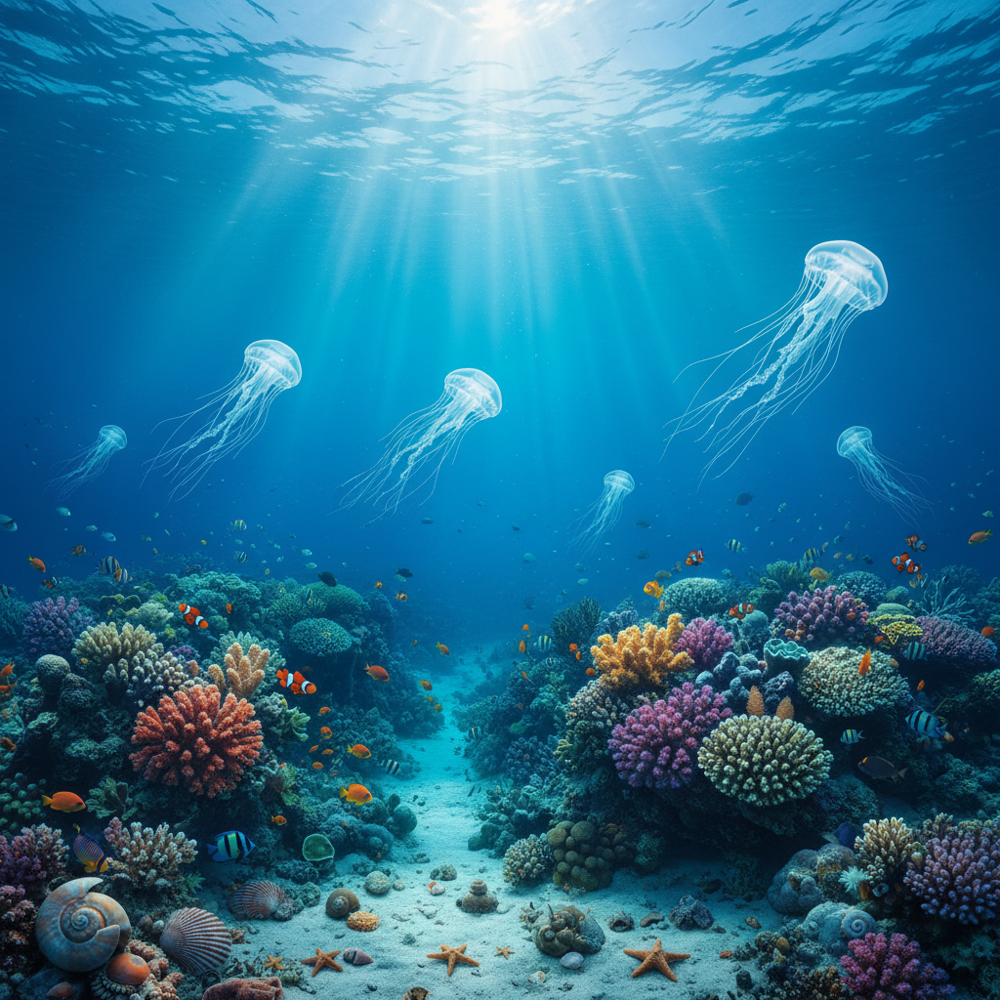

# Oceancore 海洋核



> **"深蓝海水、珊瑚礁、贝壳项链——让大海的呼吸成为日常。"**

## 概述

| 维度 | 描述 |
|------|------|
| 时期 | 2020–至今 |
| 别名 | Oceancore, Ocean Aesthetic, Deep Sea Aesthetic |
| 核心色彩 | 深蓝、青绿、白色、珊瑚色、沙色 |
| 关键元素 | 海浪、贝壳、珊瑚、水母、深海生物 |
| 代表人物 | Pinterest/TikTok 社区驱动 |
| 关联风格 | Mermaidcore, Nautical, Coastal Grandmother, Seapunk |

---

## 历史脉络

| 年份 | 事件 |
|------|------|
| 古代 | 海洋在各文化中的神圣地位 |
| 1800s | 浪漫主义绘画中的海洋 |
| 2011 | Seapunk——第一个海洋主题互联网美学 |
| 2020 | Oceancore 作为独立美学兴起 |
| 2022 | 与可持续/海洋保护运动交叉 |

### 核心哲学

Oceancore 的精神是**"海洋是地球最后的神秘——深蓝中藏着无限"**：
- 深海 = 未知 = 敬畏
- 海洋 = 平静 + 力量
- 蓝色 = 治愈
- "我们来自海洋，终将回到海洋"

---

## 视觉语法

### 色彩系统

```
主色：
  深蓝 (#003366) — 深海
  青绿 (#008B8B) — 浅海
  白色 (#FFFFFF) — 浪花、贝壳
  珊瑚 (#FF7F50) — 珊瑚礁
  沙色 (#C2B280) — 海滩

辅色：
  紫色 (#4B0082) — 深海生物
  绿色 (#2E8B57) — 海藻
  银色 (#C0C0C0) — 鱼鳞

质感：
  流动 — 水、海浪
  光滑 — 贝壳、珍珠
  粗糙 — 珊瑚、岩石
  半透明 — 水母、海水
```

### 标志性元素

| 类别 | 元素 |
|------|------|
| 生物 | 水母、鲸鱼、海龟、珊瑚、海马 |
| 物件 | 贝壳、珍珠、海玻璃、漂流木 |
| 场景 | 深海、珊瑚礁、海滩、潮汐池 |
| 图案 | 波浪、鳞片、螺旋（贝壳） |
| 光线 | 水下光线、焦散、深蓝渐变 |
| 态度 | 平静、神秘、敬畏、保护 |

---

## 与千禧怀旧的关系

### 与 Mermaidcore/Seapunk 的区别
- Seapunk = 讽刺的、互联网的、3D渲染的
- Mermaidcore = 幻想的、闪光的、人鱼的
- Oceancore = 真实的、科学的、敬畏的
- 三者共享"海洋"但态度不同

---

## 中国语境

- 中国海洋文化（南海、东海）
- 与中国"海洋风"/"度假风"的交叉
- 海洋保护在中国的兴起
- 三亚/厦门 = 中国的海洋美学圣地

---

## 设计应用

| 场景 | 应用方式 |
|------|----------|
| 品牌 | 蓝色渐变+流动+贝壳+自然 |
| 空间 | 蓝色调+天然材料+贝壳+光线 |
| 时尚 | 蓝绿色+流动面料+贝壳首饰 |
| 数字 | 水下动效+蓝色渐变+流动 |

---

## 相关风格

← [Mermaidcore 美人鱼核](mermaidcore.md) | [Nautical 航海风](nautical.md) →

↑ [返回千禧怀旧目录](README.md) | [返回总目录](../README.md)
