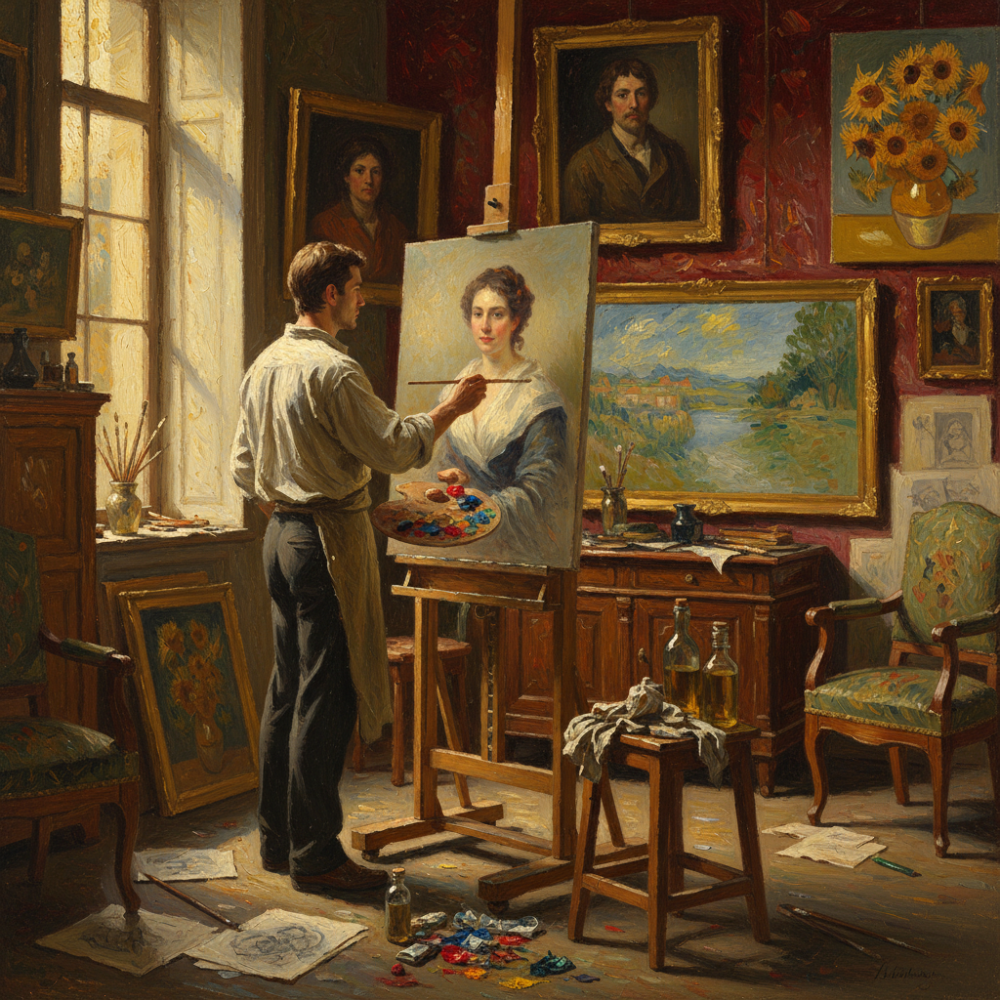

# Oil Painting 油画

> "Oil painting is time made visible — the slow drying allows endless revision, and centuries later the colors still glow as if freshly laid." — Unknown

## 概述

油画（Oil Painting）是使用干性油（如亚麻籽油、核桃油）作为颜料粘合剂的绘画技法。油画是西方绑画最重要的媒介——从15世纪凡·艾克兄弟完善油画技法以来，油画统治了西方艺术500多年。油画的独特优势在于：干燥极慢（数天到数周），允许画家反复修改和混合；色彩饱和度极高；可以从极薄的透明罩染到极厚的堆积肌理；干燥后色彩几乎不变。这些特性使油画成为最灵活、最丰富的绘画媒介——从伦勃朗的明暗法到莫奈的印象派，从维米尔的光影到弗洛伊德的肉体，油画承载了西方艺术史上几乎所有重要的视觉革命。

油画的哲学在于：时间的礼物——慢干的特性给予画家无限的修改空间，让每一幅画都可以被反复推敲至完美。

## 核心特征

| 特征 | 描述 |
|------|------|
| 油基 | 干性油作为粘合剂 |
| 慢干 | 干燥极慢允许修改 |
| 饱和 | 色彩饱和度极高 |
| 灵活 | 从薄到厚极其灵活 |
| 耐久 | 干燥后极其耐久 |
| 丰富 | 表现力最丰富 |

## 视觉特征

- **光泽**：油润的光泽
- **饱和**：饱和深沉的色彩
- **层次**：丰富的层次感
- **肌理**：从光滑到厚重的肌理
- **深度**：色彩的深度和透明度
- **真实**：极高的写实能力

## 代表作品

| 作品 | 艺术家 | 年代 | 意义 |
|------|--------|------|------|
| *Mona Lisa* | Leonardo da Vinci | 1503-19 | 油画的巅峰 |
| *Girl with a Pearl Earring* | Vermeer | 1665 | 光影的极致 |
| *Starry Night* | Van Gogh | 1889 | 表现力的革命 |
| *Water Lilies* | Monet | 1890s+ | 印象派油画 |
| *Las Meninas* | Velázquez | 1656 | 空间的魔术 |

## 历史时间线

| 时期 | 事件 |
|------|------|
| 7世纪 | 阿富汗最早的油画痕迹 |
| 15世纪 | 凡·艾克完善油画技法 |
| 16-17世纪 | 油画的黄金时代 |
| 19世纪 | 印象派革命 |
| 20世纪 | 现代主义的多样探索 |
| 当代 | 油画在当代艺术中的延续 |

## 中国语境

油画在清代传入中国，但真正的发展始于20世纪初。徐悲鸿、林风眠、刘海粟等先驱将油画引入中国美术教育体系。新中国成立后，油画成为主要的创作媒介之一——从革命历史画到改革开放后的多元探索。中国油画经历了从学习苏联写实主义到探索本土化表达的过程。当代中国油画在国际艺术市场上有重要地位，张晓刚、曾梵志、刘小东等画家享有国际声誉。中国油画学会是全国性的专业组织。

## AI生成概念图

## 与其他风格的关系

- **Tempera** → 蛋彩画（前身）
- **Acrylic** → 丙烯画（现代替代）
- **Watercolor** → 水彩画（水基对比）
- **Impasto** → 厚涂法
- **Glazing** → 罩染法
- **Alla Prima** → 直接画法

---

*浮光艺志 | Chronicle of Artistry*
