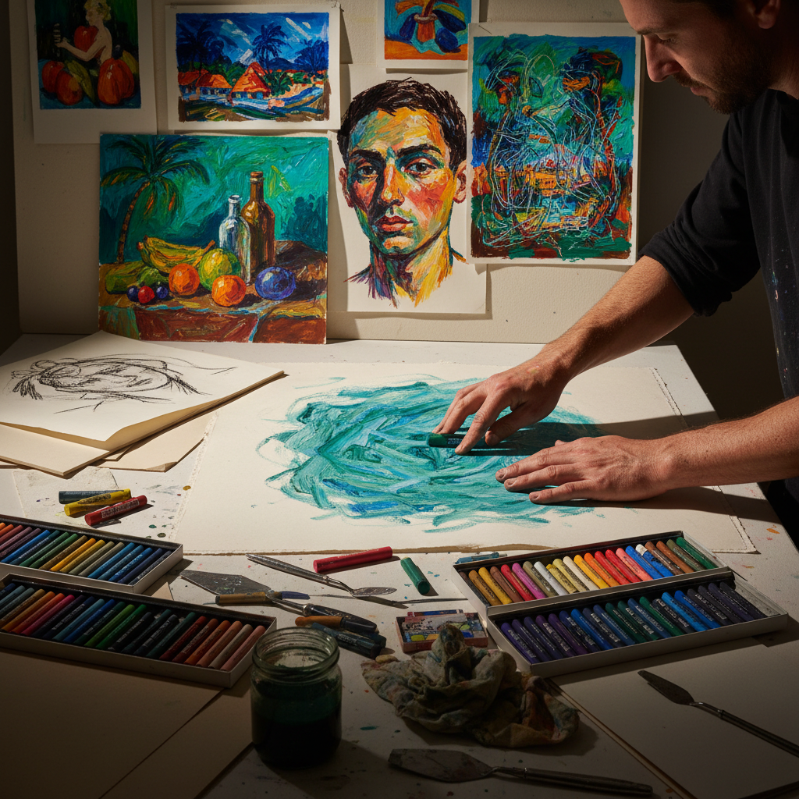

# Oil Pastel 油画棒

> "Oil pastel is color with the weight of wax and the boldness of crayon — it resists water, builds texture like impasto, and puts the visceral pleasure of smearing pure pigment back into the hands of anyone brave enough to get messy." — Unknown

## 概述

油画棒（Oil Pastel）是一种以蜡和油脂为粘合剂、将颜料粉末压制成棒状的绘画媒介。油画棒与色粉笔（soft pastel）不同——色粉笔是干性的、粉质的，而油画棒是油性的、蜡质的。油画棒不会产生粉尘，不需要固定剂，可以在纸、画布、木板等多种表面上使用。

油画棒由日本的Sakura公司在1925年发明（最初叫Cray-Pas），后来由法国的Sennelier公司在1949年为Pablo Picasso开发了艺术家级油画棒。油画棒的特点是：色彩浓郁饱和、可以厚涂产生肌理、可以用溶剂（如松节油）溶解混合、可以刮擦产生sgraffito效果。油画棒在当代艺术中被广泛使用——从儿童绘画到专业艺术创作。

## 核心特征

| 特征 | 描述 |
|------|------|
| 油蜡 | 油脂和蜡为粘合剂 |
| 浓郁 | 色彩浓郁饱和 |
| 厚涂 | 可以厚涂 |
| 无尘 | 不产生粉尘 |
| 可溶 | 可用溶剂溶解 |
| 直接 | 直接的表达方式 |

## 视觉特征

- **浓郁**：浓郁饱和的色彩
- **肌理**：丰富的肌理效果
- **蜡质**：蜡质的光泽
- **大胆**：大胆的笔触
- **混合**：色彩的混合过渡
- **厚重**：厚重的质感

## 代表作品

| 作品 | 艺术家 | 年代 | 意义 |
|------|--------|------|------|
| *Oil pastel works* | Pablo Picasso | 20世纪 | 大师的油画棒作品 |
| *Oil pastel paintings* | Jean Dubuffet | 20世纪 | 原生艺术中的油画棒 |
| *Untitled series* | Jean-Michel Basquiat | 1980s | 新表现主义油画棒 |
| *Contemporary oil pastels* | Various | 当代 | 当代油画棒艺术 |
| *Mixed media with oil pastel* | Various | 当代 | 混合媒介中的油画棒 |

## 历史时间线

| 时期 | 事件 |
|------|------|
| 1925 | Sakura公司发明Cray-Pas |
| 1949 | Sennelier为Picasso开发艺术家级油画棒 |
| 1960s | 油画棒在当代艺术中的采用 |
| 1980s | Basquiat等艺术家的推广 |
| 2000s | 高品质油画棒品牌的增多 |
| 当代 | 油画棒在社交媒体时代的流行 |

## 中国语境

油画棒在中国有极其广泛的应用——从儿童美术教育到专业艺术创作。中国的儿童美术教育中，油画棒是最常用的绘画工具之一。近年来，中国的成人油画棒绘画课程和社交媒体分享推动了油画棒在成人群体中的流行。中国的一些当代艺术家使用高品质油画棒进行专业创作。中国市场上有丰富的油画棒品牌选择——从国产品牌到进口的Sennelier、Holbein等。

## AI生成概念图

## 与其他风格的关系

- **Soft Pastel** → 软色粉
- **Pastel Painting** → 色粉画
- **Crayon** → 蜡笔
- **Impasto** → 厚涂
- **Expressionism** → 表现主义
- **Mixed Media** → 混合媒介

---

*浮光艺志 | Chronicle of Artistry*
