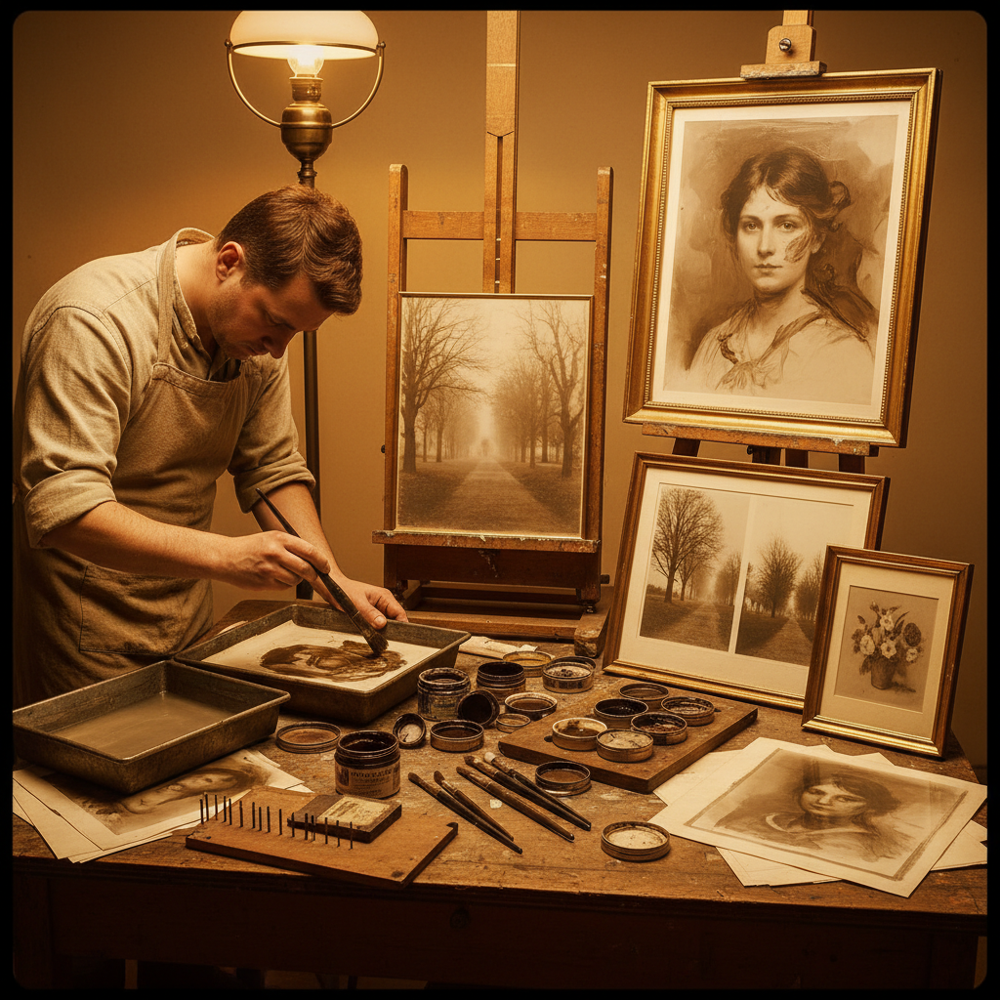

# Oil Printing 油印

> "Oil printing transforms a photograph into a painting by hand — the silver image removed and replaced with greasy ink dabbed onto a gelatin matrix swollen with water, each stroke a deliberate artistic choice that elevates mechanical reproduction into personal expression, the photographer becoming painter." — Unknown

## 概述

油印（Oil Printing）是一种将银盐照片转化为手工油墨印刷品的摄影-绘画混合技法——与溴油印刷（bromoil）密切相关，但过程略有不同。油印由G.E.H. Rawlins在1904年发明，是画意摄影（Pictorialism）运动中最重要的手工印刷技法之一。

油印的过程：首先制作一张重铬酸明胶印刷品（类似碳素印刷或重铬酸胶印的中间步骤）——将含有重铬酸盐的明胶涂在纸上，通过负片曝光使明胶硬化。将曝光后的明胶纸浸水——未硬化的明胶（原亮部）吸水膨胀排斥油墨，硬化的明胶（原暗部）不吸水接受油墨。用刷子将油性印刷油墨涂抹在湿润的明胶表面上。油印与溴油的区别在于：油印从重铬酸明胶开始，溴油从银盐照片开始。

## 核心特征

| 特征 | 描述 |
|------|------|
| 明胶 | 重铬酸明胶基底 |
| 油墨 | 手工涂抹油墨 |
| 手工 | 完全手工控制 |
| 绘画性 | 绘画般的效果 |
| 画意 | 画意摄影技法 |
| 艺术性 | 高度的艺术性 |

## 视觉特征

- **绘画性**：绘画般的笔触
- **质感**：油墨的丰富质感
- **柔和**：柔和的色调
- **手工**：明显的手工痕迹
- **温暖**：油墨的温暖色调
- **个性**：强烈的个人风格

## 代表作品

| 作品 | 艺术家 | 年代 | 意义 |
|------|--------|------|------|
| *Oil prints* | G.E.H. Rawlins | 1904 | 技法的发明 |
| *Pictorialist oil prints* | Various | 1900-20s | 画意摄影油印 |
| *Robert Demachy oil prints* | Robert Demachy | 1900s | 油印大师 |
| *Contemporary oil prints* | Various | 当代 | 当代油印 |

## 历史时间线

| 时期 | 事件 |
|------|------|
| 1904年 | G.E.H. Rawlins发明油印 |
| 1904-30年代 | 画意摄影运动中的流行 |
| 1930年代后 | 技法的衰落 |
| 1990年代 | 替代摄影中的复兴 |
| 当代 | 油印的持续实践 |

## 中国语境

油印在中国属于非常小众的历史性摄影技法。中国早期的画意摄影（民国时期的"美术摄影"）中可能有油印的实践。当代中国的替代摄影社区中，油印作为一种"将摄影转化为绘画"的技法有学术性的关注。中国的摄影史研究中会提及油印作为画意摄影运动的重要技法。

## AI生成概念图

## 与其他风格的关系

- **Bromoil** → 溴油印刷
- **Gum Bichromate** → 重铬酸胶印
- **Carbon Printing** → 碳素印刷
- **Pictorialism** → 画意摄影
- **Alternative Photography** → 替代摄影
- **Painting** → 绘画

---

*浮光艺志 | Chronicle of Artistry*
