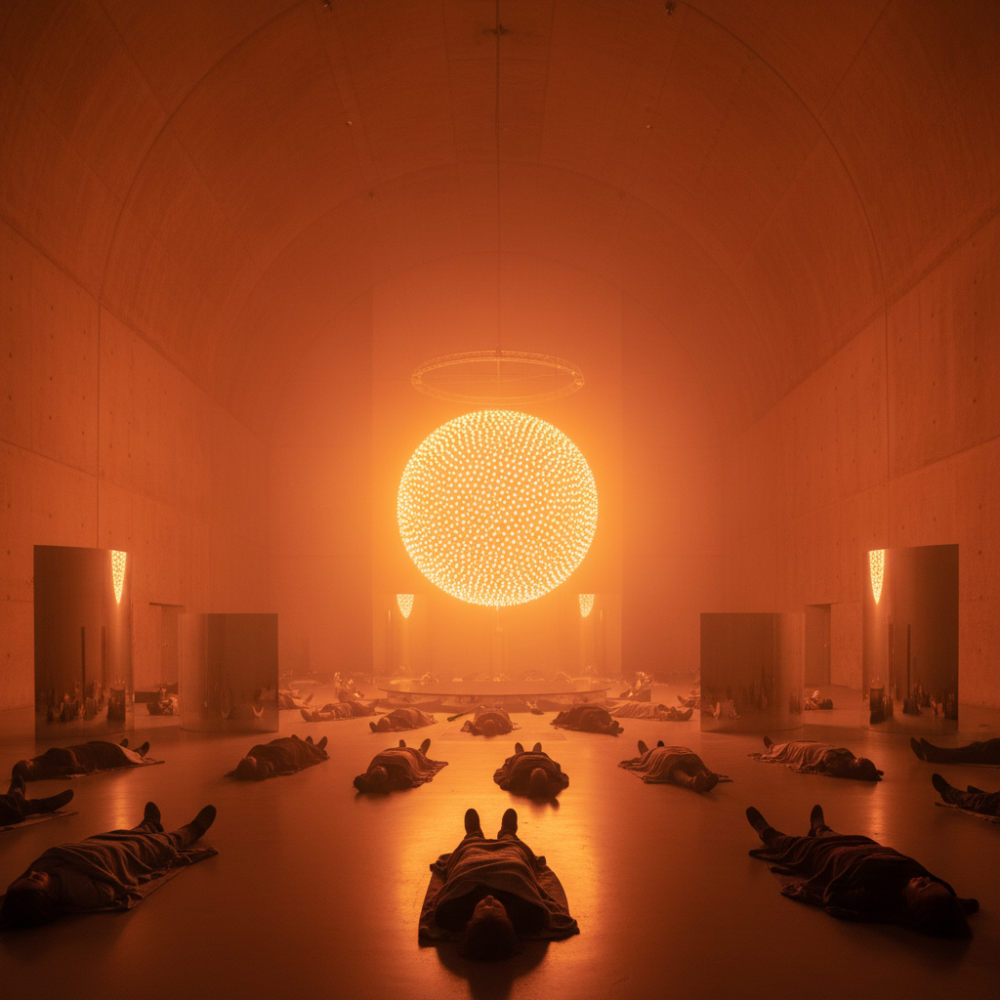

# Olafur Eliasson 奥拉维尔·埃利亚松

> **流派**: 当代装置艺术 · 环境艺术  
> **时期**: 1967–至今 丹麦/冰岛  
> **关键词**: 人造自然、沉浸体验、气候意识、光与水

## 概述

奥拉维尔·埃利亚松以创造大规模沉浸式自然现象装置闻名——人造太阳、室内瀑布、冰川碎片。他的作品模糊了自然与人工的界限，让观者在美术馆中体验天气、光线和地质力量，同时唤起对气候变化的关注。

## 视觉特征

- **人造自然**: 在室内重现日落、彩虹、雾气等自然现象
- **单色光**: 用钠灯等单频光源改变整个空间的色彩感知
- **水与冰**: 真实的水流、冰块作为艺术材料
- **镜面与万花筒**: 用镜面创造无限延伸的空间幻觉
- **参与性**: 观者的身体和感知是作品的一部分

## 代表作品

- 《天气项目》(2003) 泰特现代美术馆
- 《冰钟》(2014–) 公共空间
- 《你的彩虹全景》(2011) 奥胡斯ARoS美术馆
- 《纽约瀑布》(2008)

## 历史影响

埃利亚松证明了当代艺术可以同时是壮观的、科学的和政治的。他将环境意识融入沉浸式体验，影响了博物馆展览设计和公共艺术的新方向。

## 相关风格

- [James Turrell 詹姆斯·特瑞尔](james-turrell.md)
- [Dan Flavin 丹·弗莱文](dan-flavin.md)
- [Land Art 大地艺术](land-art.md)
