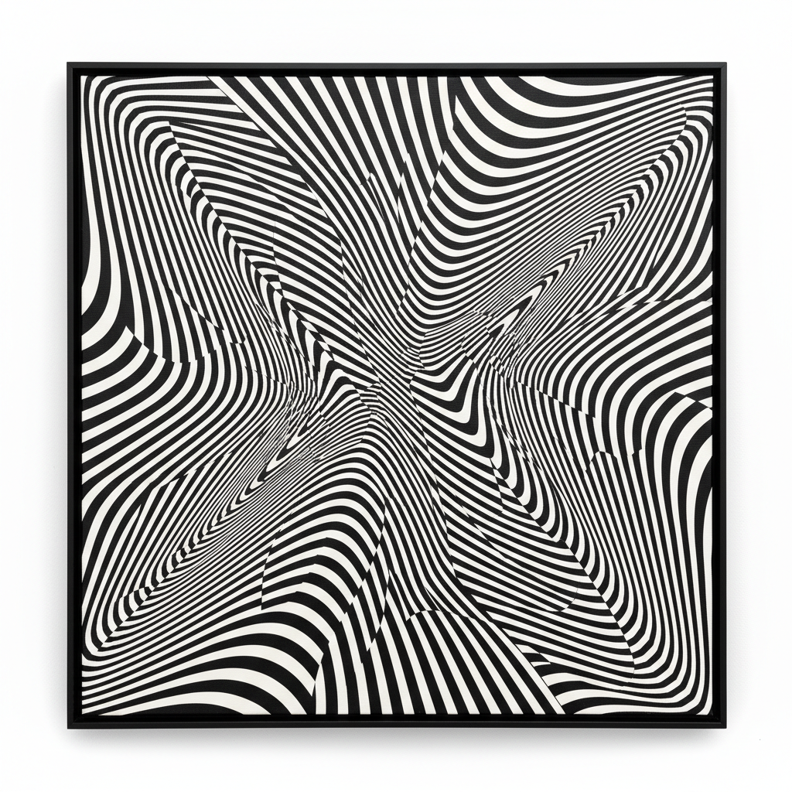

# Op Art Painting 欧普艺术绘画

> **时期：** 1960年代–至今  
> **关键词：** 视觉幻象、几何图案、运动错觉、黑白对比、知觉实验

## 概述

Op Art Painting（欧普艺术绘画，Optical Art）是1960年代兴起的视觉艺术运动，通过精确的几何图案和色彩排列制造运动、闪烁、膨胀等视觉幻象。维克多·瓦萨雷利和布里奇特·赖利的画面看似在呼吸和波动——它们不描绘任何外部对象，而是直接作用于观者的视觉神经系统，将绘画变为一场知觉实验。

## 风格特征

- **视觉幻象**：静态画面产生运动感
- **精确几何**：数学计算的图案排列
- **黑白对比**：高对比度增强幻觉效果
- **色彩振动**：互补色并置产生闪烁
- **观者参与**：效果依赖观看距离和角度

## 代表人物与作品

- 维克多·瓦萨雷利 几何幻象
- 布里奇特·赖利 波纹画
- 理查德·阿努什凯维奇 色彩振动
- 朱利安·斯坦恰克 光学实验

## 概念图

