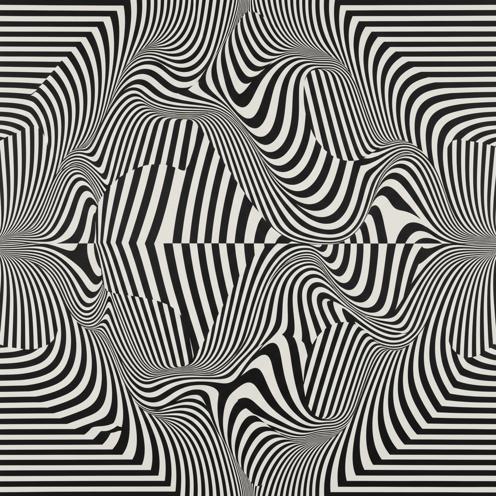

# Op Art 欧普艺术

> "My paintings are not meant to be looked at — they are meant to be experienced." — Victor Vasarely

## 概述

欧普艺术（Op Art，Optical Art 的缩写）是1960年代兴起的视觉艺术运动，利用精确的几何图案和色彩对比在观者视网膜上产生运动、振动、闪烁和深度的光学错觉。Op Art 作品是静态的，但观者的眼睛会"看到"运动——这是一种纯粹的视觉感知实验。

1965年纽约现代艺术博物馆的"The Responsive Eye"展览标志着 Op Art 的正式命名和鼎盛期。

## 核心特征

| 特征 | 描述 |
|------|------|
| 光学错觉 | 利用视觉感知原理产生运动和振动错觉 |
| 精确几何 | 数学般精确的几何图案 |
| 黑白对比 | 高对比度的黑白图案产生最强错觉 |
| 色彩振动 | 互补色并置产生视觉振动 |
| 观者参与 | 效果依赖于观者的视觉感知 |
| 科学基础 | 基于视觉心理学和感知科学 |

## 视觉特征

- **图案**：精确的重复几何图案——同心圆、波纹、棋盘
- **对比**：极端的黑白对比或互补色对比
- **运动**：静态图案产生的运动和振动错觉
- **深度**：平面图案产生的三维深度错觉
- **精确**：数学般的精确——通常用尺规绘制
- **规模**：通常是大尺寸——增强沉浸感

## 代表人物

| 艺术家 | 代表作 | 特点 |
|--------|--------|------|
| Victor Vasarely | *Zebra* (1937), 球体变形系列 | Op Art 之父——几何变形 |
| Bridget Riley | *Movement in Squares* (1961) | 黑白波纹的运动错觉 |
| Jesús Rafael Soto | 动态装置 | 从平面到三维的 Op Art |
| Carlos Cruz-Diez | 色彩加法装置 | 色彩感知实验 |
| Richard Anuszkiewicz | 色彩振动绘画 | 互补色的视觉能量 |

## 与其他风格的关系

- **Pointillism** → 点彩派的光学混色是直接先驱
- **Bauhaus** → 包豪斯的色彩理论和几何基础
- **Kinetic Art** → 动态艺术是 Op Art 的三维延伸
- **Minimalism** → 共享几何简洁和系统性
- **Psychedelic Art** → 迷幻艺术借鉴了 Op Art 的视觉效果
- **Digital Art** → 数字时代的生成艺术继承了 Op Art

## 概念图

---

*浮光艺志 | Chronicle of Artistry*
