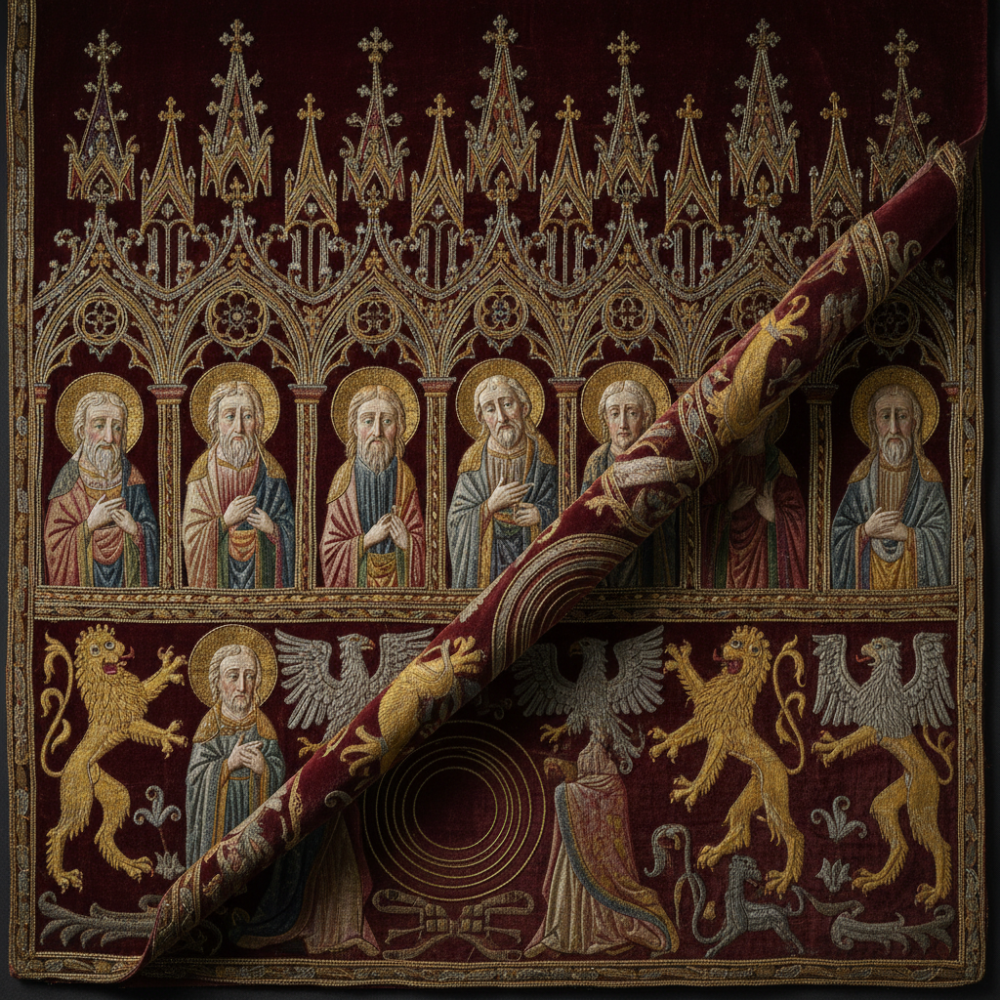

# Opus Anglicanum Art 英国中世纪刺绣艺术

> "Opus Anglicanum — English Work — was medieval Europe's most coveted luxury textile, exported from London workshops to popes and kings across Christendom. Gold and silver threads couched in spiraling patterns, split-stitch figures with faces as expressive as manuscript illuminations, and grounds seeded with heraldic beasts and architectural canopies made these vestments and altar frontals the supreme achievement of the needle." — Unknown

## 概述

英国中世纪刺绣艺术（Opus Anglicanum）是13至14世纪英国生产的极其精美的教会刺绣——以金银线铺绣、劈针人物和精细的图案设计著称，被视为中世纪欧洲最高水平的刺绣艺术。Opus Anglicanum主要用于制作宗教法衣、祭坛布和教会装饰，由伦敦的专业工坊生产，出口到整个基督教世界。

Opus Anglicanum的实践包括：1）劈针（Split Stitch）——用于人物面部和衣褶的精细针法；2）金线铺绣（Underside Couching）——从背面固定金线的独特技法；3）建筑框架——哥特式拱门和华盖的设计；4）纹章图案——贵族和教会的纹章设计；5）圣经叙事——圣经故事的图像叙事；6）丝绒底布——在丝绒或亚麻上工作；7）珍珠和宝石——镶嵌珍珠和宝石的装饰。

## 核心特征

| 特征 | 描述 |
|------|------|
| 金线 | 大量使用金银线 |
| 劈针 | 精细的劈针人物 |
| 宗教 | 宗教题材为主 |
| 奢华 | 极其奢华的材料 |
| 叙事 | 圣经故事叙事 |
| 出口 | 出口到全欧洲 |

## 视觉特征

- **金光**：金银线的华丽光泽
- **精细**：极其精细的人物刻画
- **建筑**：哥特式建筑框架
- **叙事**：连续的图像叙事
- **庄严**：庄严神圣的气质
- **层次**：丰富的装饰层次

## 代表作品

| 作品 | 艺术家/文化 | 年代 | 意义 |
|------|-------------|------|------|
| *Syon Cope* | 英国 | 约1300年 | 锡安斗篷 |
| *Butler-Bowdon Cope* | 英国 | 约1330年 | 巴特勒-鲍登斗篷 |
| *Jesse Cope* | 英国 | 约1310年 | 耶西斗篷 |
| *Vatican vestments* | 英国 | 13-14世纪 | 梵蒂冈收藏的英国刺绣 |
| *Bologna Cope* | 英国 | 约1315年 | 博洛尼亚斗篷 |

## 历史时间线

| 时期 | 事件 |
|------|------|
| 12世纪 | 英国刺绣声誉的建立 |
| 13世纪 | Opus Anglicanum的黄金时代 |
| 14世纪初 | 最精美作品的创作时期 |
| 14世纪中 | 黑死病后的衰落 |
| 当代 | 博物馆收藏和学术研究 |

## 中国语境

Opus Anglicanum与中国的宫廷刺绣传统有可比性。中国的宫廷刺绣（如明清龙袍刺绣）同样代表了刺绣艺术的最高水平——两者都是为权力和宗教服务的奢华纺织品。中国的金线刺绣（盘金绣）与Opus Anglicanum的金线铺绣技法有相似之处——都是将金属线铺在表面用丝线固定。中国的宗教刺绣（如佛教经幡和道教法衣）——与Opus Anglicanum的宗教功能相对应。中国的刺绣史研究中，Opus Anglicanum作为西方刺绣的巅峰——常被用来与中国宫廷刺绣进行比较研究。

## AI生成概念图

## 与其他风格的关系

- **Goldwork Embroidery** → 金线刺绣
- **Medieval Art** → 中世纪艺术
- **Gothic Art** → 哥特艺术
- **Religious Art** → 宗教艺术
- **Illuminated Manuscript** → 泥金手抄本
- **Heraldry** → 纹章学

---

*浮光艺志 | Chronicle of Artistry*
