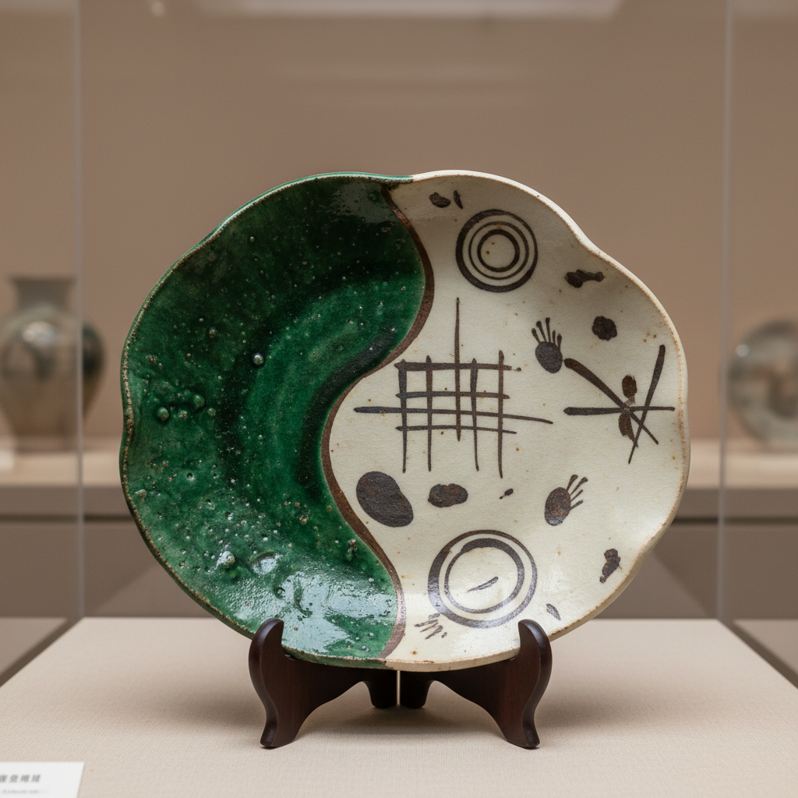

# Oribe Art 织部烧艺术

> "Oribe is the bold stroke of a tea master's imagination made clay — asymmetric forms glazed in deep copper green and creamy white, painted with abstract geometric patterns that feel startlingly modern yet were born four centuries ago in the kilns of Mino, where the aesthetic vision of warrior-poet Furuta Oribe transformed Japanese ceramics from quiet restraint into exuberant, daring theater." — Unknown

## 概述

织部烧艺术（Oribe Art）是日本桃山时代末期至江户初期（约1600-1630年）在美浓地区发展出的一种大胆创新的陶瓷风格。织部烧以茶人古田织部的审美命名，以其不对称的造型、鲜明的铜绿釉与白釉的对比、以及抽象几何纹样的铁绘装饰著称。织部烧打破了传统茶陶的含蓄内敛，以前卫大胆的姿态开创了日本陶瓷的新纪元。

织部烧艺术的核心要素包括：1）铜绿釉——鲜明浓郁的铜绿色釉料；2）不对称造型——刻意扭曲变形的器形；3）铁绘装饰——抽象几何图案的釉下彩绘；4）双色对比——绿釉与白釉的大胆分割；5）扇形与几何——扇形、格子等几何造型；6）茶道器——为茶道设计的各类器物；7）前卫精神——打破常规的创新态度。

## 核心特征

| 特征 | 描述 |
|------|------|
| 铜绿釉 | 鲜明浓郁的深绿色釉 |
| 不对称 | 刻意扭曲的自由造型 |
| 铁绘几何 | 抽象几何图案装饰 |
| 双色分割 | 绿白两色的大胆对比 |
| 前卫精神 | 打破传统的创新态度 |
| 茶道美学 | 为茶道而生的器物 |

## 视觉特征

- **铜绿色**：浓郁鲜明的绿色釉面
- **乳白色**：与绿釉对比的白色区域
- **几何纹样**：格子、条纹、圆点等抽象图案
- **不规则形态**：扭曲、折叠的自由造型
- **铁褐线条**：有力的铁绘笔触
- **扇形元素**：扇形等独特造型

## 代表作品

| 作品 | 艺术家/窑口 | 年代 | 意义 |
|------|-------------|------|------|
| *织部扇形向付* | 美浓窑 | 桃山时代 | 扇形造型的代表 |
| *黑织部茶碗* | 美浓窑 | 桃山-江户 | 黑织部的典范 |
| *织部沓形茶碗* | 美浓窑 | 17世纪初 | 不对称造型代表 |
| *青织部向付* | 美浓窑 | 桃山时代 | 铜绿釉的经典 |
| *织部手桶水指* | 美浓窑 | 17世纪初 | 几何造型水指 |

## 历史时间线

| 时期 | 事件 |
|------|------|
| 1544年 | 古田织部出生 |
| 1590年代 | 织部烧风格开始形成 |
| 1600-1615年 | 织部烧的黄金时期 |
| 1615年 | 古田织部切腹，风格逐渐衰落 |
| 20世纪 | 织部烧的现代复兴 |
| 当代 | 织部烧在国际陶艺界的影响 |

## 中国语境

织部烧虽为日本本土风格，但其铜绿釉技术源于中国的铜绿釉传统。中国唐三彩中的绿釉、宋代磁州窑的铁绘技法都对织部烧有间接影响。织部烧的大胆创新精神——打破对称、拥抱不规则——在中国当代陶艺界引起广泛共鸣。中国陶艺家从织部烧中看到了传统与前卫结合的可能性。织部烧所体现的"破格"精神与中国书法中的"破体"、绘画中的"逸品"有相通之处——都是在深厚传统基础上的自由突破。

## AI生成概念图

## 与其他风格的关系

- **Shino** → 志野烧
- **Tenmoku** → 天目釉
- **Tea Ceremony** → 茶道
- **Mino Ware** → 美浓烧
- **Asymmetry** → 不对称美学
- **Copper Glaze** → 铜绿釉

---

*浮光艺志 | Chronicle of Artistry*
