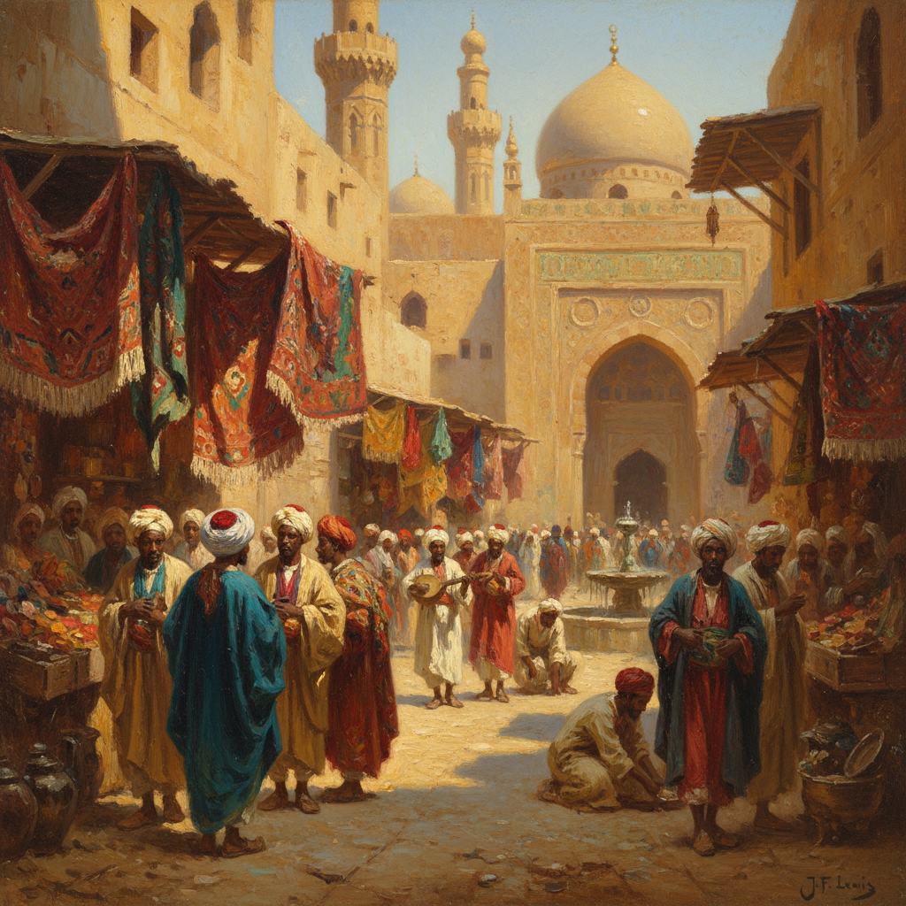

# Orientalism Art 东方主义绘画

> **时期：** 19世纪–20世纪初  
> **关键词：** 中东想象、异域风情、后宫场景、沙漠光线、殖民视角

## 概述

Orientalism（东方主义）是19世纪欧洲画家对中东、北非和亚洲的想象性描绘——后宫的慵懒、集市的喧嚣、沙漠的壮阔、清真寺的神秘。这些画作既展现了精湛的光线和色彩技巧，也反映了殖民时代西方对"东方"的浪漫化和刻板想象。爱德华·萨义德的批评使这一传统成为后殖民讨论的核心议题。

## 风格特征

- **异域光线**：强烈的阳光和深重的阴影
- **丰富色彩**：宝石色调的织物和瓷砖
- **建筑细节**：伊斯兰建筑的精确描绘
- **叙事想象**：基于旅行或纯粹幻想的场景
- **感官氛围**：强调奢华、慵懒和神秘

## 代表人物与作品

- 让-莱昂·热罗姆《蛇舞者》《奴隶市场》
- 欧仁·德拉克洛瓦《阿尔及尔的女人》
- 约翰·弗雷德里克·刘易斯 开罗室内
- 让-奥古斯特-多米尼克·安格尔《土耳其浴室》

## 概念图

