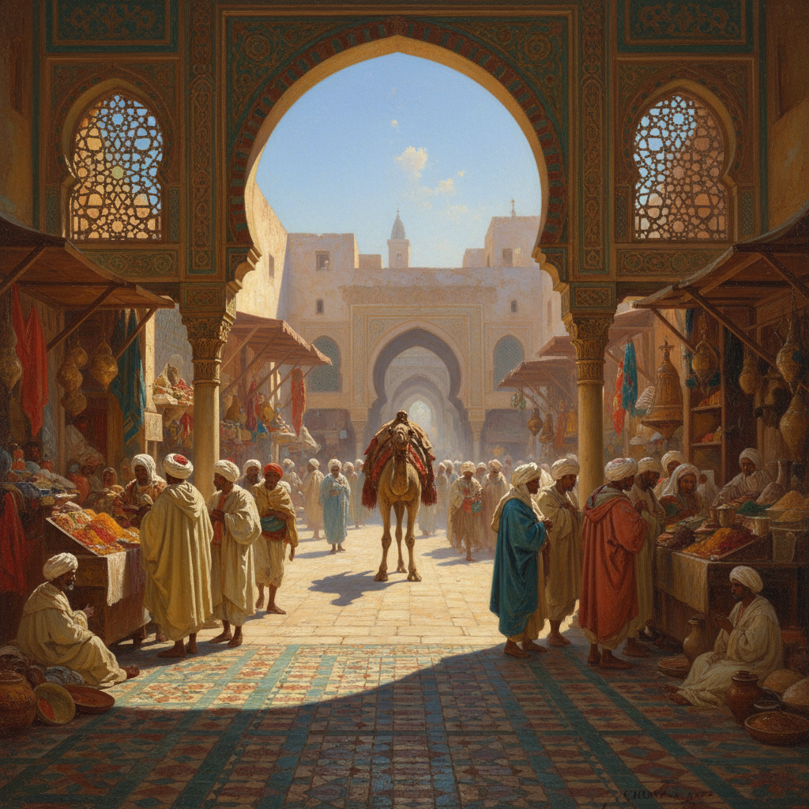

# Orientalism Painting 东方主义绘画

> **时期：** 19世纪  
> **关键词：** 异域想象、北非中东、殖民视角、异国情调、学院派

## 概述

Orientalism Painting（东方主义绘画）是19世纪欧洲画家对北非、中东和亚洲的视觉想象——他们用学院派的精湛技法描绘集市、后宫、沙漠和清真寺，创造出一个既精确又虚构的"东方"。让-莱昂·杰罗姆的开罗街头、欧仁·德拉克洛瓦的阿尔及尔——这些画作既是艺术杰作，也是殖民时代权力关系的视觉文献。

## 风格特征

- **异域场景**：集市、沙漠、宫殿、浴场
- **精密细节**：建筑纹样和织物的极致描绘
- **戏剧光线**：强烈的阳光和深邃的阴影
- **鲜艳色彩**：宝石蓝、金色、深红
- **学院技法**：完美的人体和空间透视

## 代表人物与作品

- 让-莱昂·杰罗姆 开罗场景
- 欧仁·德拉克洛瓦《阿尔及尔的女人》
- 约翰·弗雷德里克·刘易斯 开罗室内
- 让-奥古斯特-多米尼克·安格尔《土耳其浴室》

## 概念图

