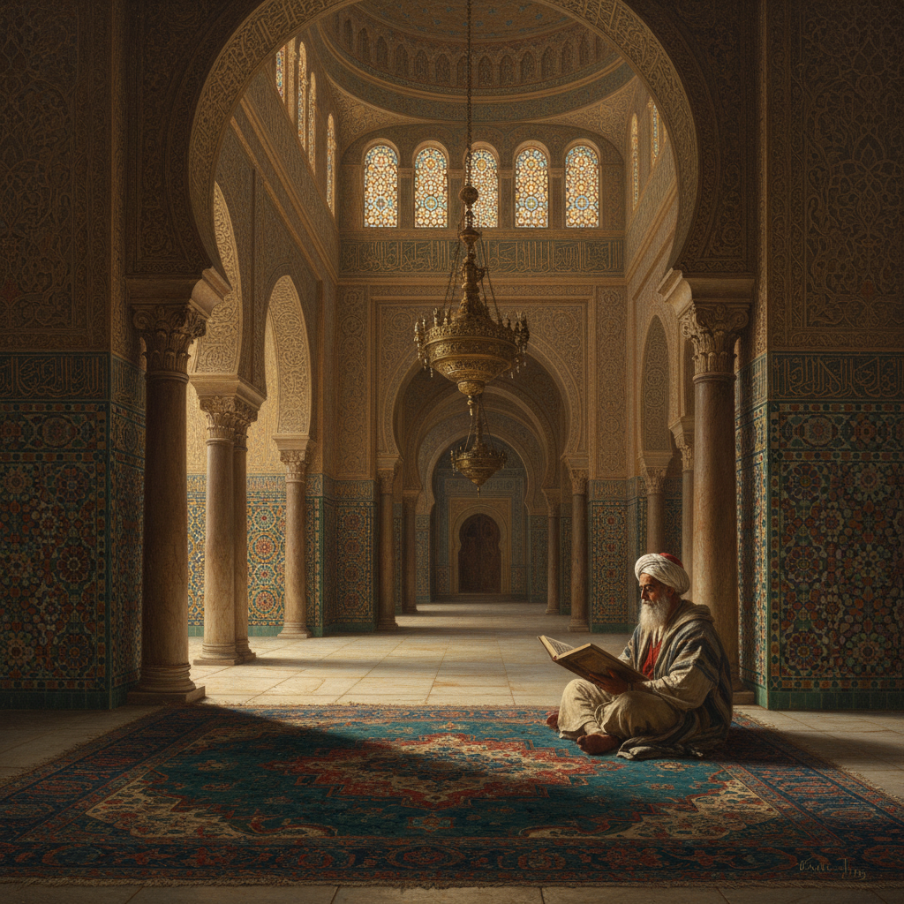

# Orientalism 东方主义

> "The Orient was almost a European invention." — Edward Said

## 概述

东方主义（Orientalism）是19世纪欧洲艺术中描绘中东、北非和亚洲场景的绘画流派（约1800–1900）。画家们通过旅行或想象，创作了大量描绘清真寺、后宫、沙漠、集市和异域人物的作品，既反映了真实的东方见闻，也投射了西方对"东方"的浪漫化想象。

这一流派在视觉上以华丽的色彩、精细的建筑装饰和戏剧性的光线著称，是浪漫主义和学院派的重要分支。

## 核心特征

| 特征 | 描述 |
|------|------|
| 异域题材 | 清真寺、后宫、沙漠商队、集市 |
| 华丽色彩 | 宝石色调——深蓝、翠绿、金色、朱红 |
| 精细装饰 | 伊斯兰几何纹样、马赛克、地毯 |
| 强烈光线 | 地中海/沙漠的强烈阳光与深邃阴影 |
| 人物描绘 | 阿拉伯骑士、舞女、商人、苦行僧 |
| 建筑细节 | 拱门、穹顶、宣礼塔的精确描绘 |

## 视觉特征

- **光线**：强烈的明暗对比，金色阳光穿透拱门
- **色彩**：宝石般的饱和色调，大量金色装饰
- **纹理**：丝绸、地毯、陶瓷的质感表现
- **空间**：复杂的建筑内部空间，层层拱门
- **人物**：异域服饰的精细描绘
- **氛围**：神秘、慵懒、奢华

## 代表人物

| 画家 | 代表作 | 特点 |
|------|--------|------|
| Jean-Léon Gérôme | *The Snake Charmer* (1870) | 学院派东方主义巅峰 |
| Eugène Delacroix | *Women of Algiers* (1834) | 浪漫主义色彩大师 |
| John Frederick Lewis | *The Harem* 系列 | 水彩东方场景 |
| Ludwig Deutsch | 开罗清真寺内部 | 极致建筑细节 |
| Frederick Arthur Bridgman | 北非日常生活 | 美国东方主义者 |
| Jean-Auguste-Dominique Ingres | *The Turkish Bath* (1862) | 新古典主义东方幻想 |

## 历史背景

1. **1798年**：拿破仑远征埃及，带回大量东方图像资料
2. **1830年**：法国征服阿尔及利亚，画家随军旅行
3. **1832年**：德拉克洛瓦访问摩洛哥，创作大量速写
4. **1850-80年代**：东方主义绘画在沙龙展览中达到高峰
5. **1978年**：Edward Said 出版《东方主义》，对这一传统进行后殖民批判

## 与其他风格的关系

- **浪漫主义** → 共享对异域和崇高的追求
- **学院派 Academic Art** → 东方主义是学院派的重要题材分支
- **新古典主义** → 安格尔等人将古典技法用于东方题材
- **印象派** → 雷诺阿等人也画过阿尔及利亚风景
- **Islamic Geometric Art** → 东方主义画家精确记录了伊斯兰装饰

## 概念图

---

*浮光艺志 | Chronicle of Artistry*
