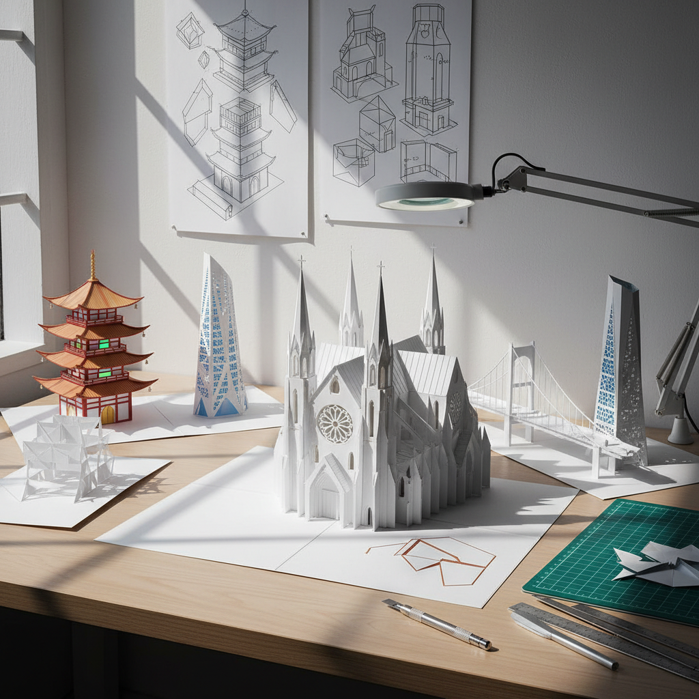

# Origami Architecture Art 折纸建筑艺术

> "Origami architecture transforms a flat sheet of paper into a three-dimensional building through nothing but folds and cuts — no glue, no tape, no separate pieces. When you open the card, a cathedral rises from the page; when you close it, the cathedral disappears back into flatness. It is architecture that exists only in the act of opening, a building that lives in the hinge between two dimensions and three, a structure that proves that complexity can emerge from simplicity through geometry alone." — Unknown

## 概述

折纸建筑艺术（Origami Architecture Art）是将折纸技法与建筑设计结合的艺术形式——通过在单张纸上进行精确的切割和折叠，创造出可以从平面弹出的三维建筑模型。这种艺术形式也被称为"弹出式建筑"（pop-up architecture）或"切折建筑"（kirigami architecture）。

折纸建筑艺术的实践包括：1）弹出式卡片——打开时弹出三维建筑的贺卡；2）建筑模型——用折纸技法制作精确的建筑比例模型；3）折叠结构——可折叠展开的建筑结构设计；4）纸建筑——用纸作为主要材料建造的临时建筑；5）参数化折叠——用计算机算法设计的复杂折叠图案；6）折纸工程——将折纸原理应用于真实建筑和工程结构。

## 核心特征

| 特征 | 描述 |
|------|------|
| 折叠 | 从平面到立体 |
| 精确 | 数学精确性 |
| 单张 | 单张纸完成 |
| 弹出 | 弹出式效果 |
| 几何 | 几何学原理 |
| 可逆 | 可折叠回平面 |

## 视觉特征

- **白色**：纸的白色纯净感
- **阴影**：折叠产生的阴影
- **几何**：精确的几何线条
- **层次**：多层折叠的深度
- **对称**：建筑的对称性
- **光影**：光线穿透的效果

## 代表作品

| 作品 | 艺术家 | 年代 | 意义 |
|------|--------|------|------|
| *Origamic Architecture* | Masahiro Chatani | 1981 | 折纸建筑创始人 |
| *Pop-up buildings* | Various | 1980年代至今 | 弹出式建筑 |
| *Folded structures* | Various | 2000年代 | 折叠结构设计 |
| *Paper architecture* | Shigeru Ban | 1990年代 | 纸建筑 |
| *Parametric origami* | Various | 2010年代 | 参数化折纸 |

## 历史时间线

| 时期 | 事件 |
|------|------|
| 6世纪 | 日本折纸传统 |
| 1981 | 茶谷正洋创立折纸建筑 |
| 1990年代 | 坂茂的纸建筑 |
| 2000年代 | 计算折纸的发展 |
| 当代 | 折纸原理在工程中的应用 |

## 中国语境

折纸建筑艺术在中国有独特的文化和技术背景。中国是纸的发明国，有悠久的纸艺传统。中国传统的"灯笼"——可折叠的纸质照明装置——本质上就是一种折纸建筑。中国传统建筑中的榫卯结构——不用钉子的组装方式——与折纸建筑的"无胶"理念有深层共鸣。中国当代的一些建筑师和艺术家在探索折纸建筑：将中国传统折纸（如纸伞、灯笼）的结构原理应用于当代建筑设计、用折纸建筑技法重现中国古建筑的精妙结构、以及将中国传统的"纸扎"工艺与当代参数化设计结合。

## AI生成概念图

## 与其他风格的关系

- **Origami** → 折纸
- **Architecture** → 建筑
- **Paper Art** → 纸艺术
- **Kirigami** → 切纸
- **Parametric Design** → 参数化设计
- **Pop-up Art** → 弹出式艺术

---

*浮光艺志 | Chronicle of Artistry*
