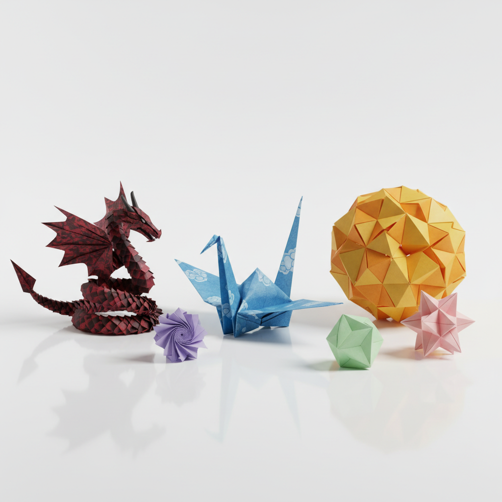

# Origami Art 折纸艺术

> "A single sheet of paper can become anything — that is the magic of origami." — Akira Yoshizawa

## 概述

折纸艺术（Origami Art）是通过折叠纸张（传统上不使用剪刀和胶水）创造三维形态的艺术形式。起源于日本（"ori"=折，"kami"=纸），折纸从简单的纸鹤发展为极其复杂的数学雕塑。当代折纸已经超越了传统的装饰功能，成为数学、工程和纯艺术的交叉领域。

折纸的哲学在于"从一到万"——一张平面的纸，不加不减，仅通过折叠就能变成任何形态。

## 核心特征

| 特征 | 描述 |
|------|------|
| 单张纸 | 传统上使用一张正方形纸 |
| 只折不剪 | 不使用剪刀和胶水 |
| 数学性 | 基于几何和数学原理 |
| 变换性 | 从平面到立体的变换 |
| 精确性 | 需要精确的折叠 |
| 无限性 | 理论上可以折出任何形态 |

## 视觉特征

- **几何**：清晰的折痕和几何面
- **对称**：高度的对称性
- **轻盈**：纸的轻盈和脆弱
- **阴影**：折面产生的光影变化
- **白色**：传统折纸的纯白色
- **精密**：复杂模型的精密结构

## 代表作品

| 作品/艺术家 | 年代 | 特征 |
|-------------|------|------|
| Akira Yoshizawa | 1950s-2000s | 现代折纸之父——湿折法 |
| Robert J. Lang | 1990s-至今 | 数学折纸——极复杂模型 |
| Eric Joisel | 1990s-2010 | 折纸雕塑——人物和面具 |
| Sipho Mabona | 2010s | 大型折纸装置——真人大小 |
| 千纸鹤 | 传统 | 日本文化的象征——和平祈愿 |
| Tomoko Fuse | 1980s-至今 | 模块折纸的大师 |

## 历史时间线

| 时期 | 事件 |
|------|------|
| 6世纪 | 纸张从中国传入日本 |
| 江户时代 | 日本折纸传统的形成 |
| 1797 | 《秘传千羽鶴折形》——最早的折纸书 |
| 1950s | 吉泽章——现代折纸的革命 |
| 1989 | 第一届国际折纸大会 |
| 2000s | 计算折纸——数学和工程应用 |
| 2010s-至今 | 折纸在航天、医学、建筑中的应用 |

## 中国语境

中国是纸的发明者，也有自己的折纸传统——元宝、纸船、风车等民间折纸。中国当代折纸艺术家如刘通等在国际折纸界有一定影响。折纸在中国的教育和儿童活动中广泛应用。中国的"纸艺"概念比折纸更广，包括剪纸、纸雕、纸塑等多种形式。

## AI生成概念图

## 与其他风格的关系

- **Paper Art** → 纸艺是折纸的上位概念
- **Sculpture** → 折纸是纸的雕塑形式
- **Minimalism** → 折纸的材料极简与极简主义相通
- **Geometric Art** → 折纸的几何性
- **Kinetic Art** → 可动折纸——折叠和展开
- **Digital Art** → 计算折纸——算法设计折痕

---

*浮光艺志 | Chronicle of Artistry*
