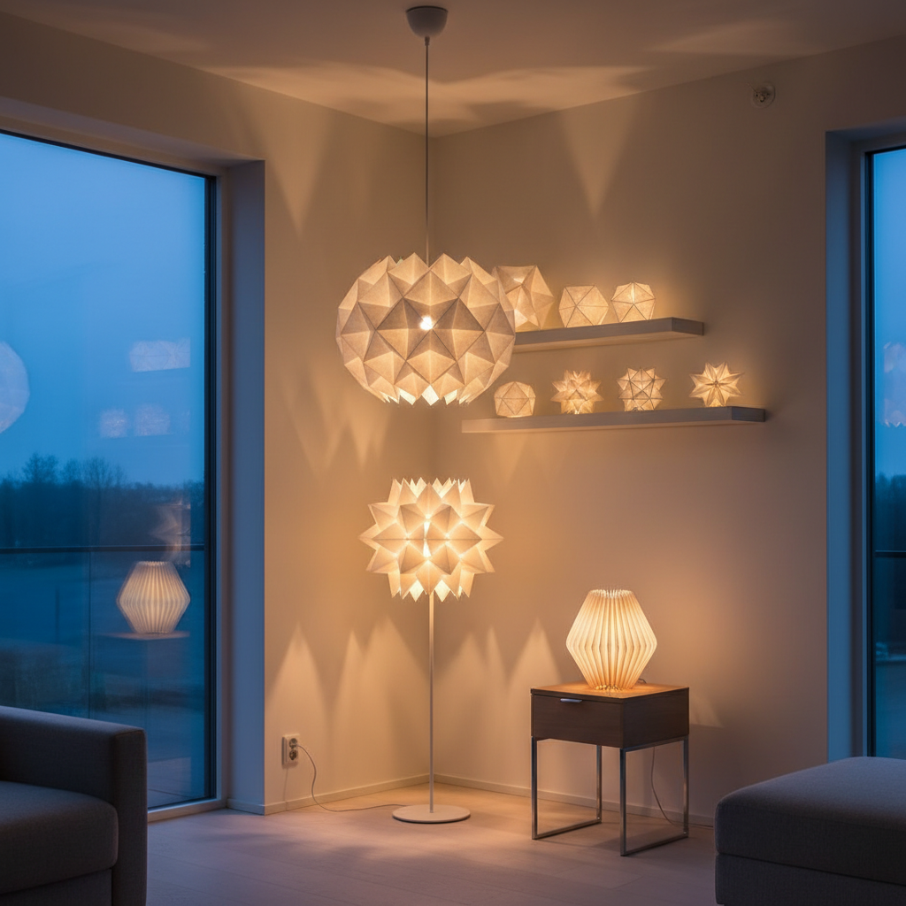

# Origami Lamp Art 折纸灯艺术

> "An origami lamp is light made architectural — paper folded into geometric forms that transform when illuminated from within, casting patterns of shadow and glow that change with every crease and valley fold. The same sheet that blocks light also shapes it, creating a dialogue between opacity and translucency, between the precision of geometry and the warmth of a living flame." — Unknown

## 概述

折纸灯艺术（Origami Lamp Art）是将折纸技法应用于灯具设计和光影艺术创作的艺术形式——通过折叠纸张或类纸材料创造出能够与光线互动的三维灯罩和光影装置。折纸灯将数学之美、手工之巧和光影之妙融为一体。

折纸灯艺术的实践包括：1）折纸灯罩——用折纸技法制作的灯罩；2）可折叠灯具——可以展开和折叠的便携灯具；3）折纸吊灯——大型折纸吊灯设计；4）光影装置——利用折纸结构创造光影效果的装置；5）动态折纸灯——可以改变形态的折纸灯具；6）纸质灯笼——结合传统灯笼和现代折纸的设计；7）参数化折纸灯——用计算机辅助设计的复杂折纸灯具。

## 核心特征

| 特征 | 描述 |
|------|------|
| 折叠 | 通过折叠创造形态 |
| 透光 | 纸张的透光特性 |
| 几何 | 精确的几何结构 |
| 光影 | 丰富的光影效果 |
| 可变 | 可改变形态 |
| 轻盈 | 极其轻盈 |

## 视觉特征

- **褶皱**：精确的折痕线条
- **透光**：温暖的透光效果
- **几何**：多面体几何形态
- **阴影**：折痕投射的阴影
- **渐变**：光线的渐变过渡
- **结构**：自支撑的纸结构

## 代表作品

| 作品 | 艺术家/品牌 | 年代 | 意义 |
|------|-------------|------|------|
| *Issey Miyake IN-EI* | Issey Miyake | 2012 | 三宅一生折纸灯 |
| *Moth origami lamp* | Studio Snowpuppe | 当代 | 荷兰折纸灯设计 |
| *Folding Light* | Michael Jantzen | 当代 | 可折叠灯具 |
| *Origami lampshades* | Various | 当代 | 折纸灯罩设计 |
| *Le Klint lamps* | Le Klint | 1943至今 | 丹麦折纸灯经典 |

## 历史时间线

| 时期 | 事件 |
|------|------|
| 古代 | 中国纸灯笼传统 |
| 1943 | Le Klint折纸灯的诞生 |
| 20世纪中 | 北欧设计中的纸灯 |
| 2012 | 三宅一生IN-EI系列 |
| 当代 | 参数化和智能折纸灯 |

## 中国语境

折纸灯艺术在中国有深厚的文化根基——中国是纸灯笼的发源地，传统的宫灯、走马灯和各种节日灯笼都是纸与光结合的艺术。中国传统灯笼的制作技艺——包括折叠、糊裱和彩绘——与现代折纸灯艺术有直接的传承关系。中国当代的一些设计师将传统灯笼美学与现代折纸设计相结合——创造出既有中国韵味又具现代感的灯具。中国的元宵节灯会是世界上最大规模的纸灯展示——各种创新的纸灯设计在这里展出。中国的一些设计品牌在探索折纸灯的商业化——将手工折纸灯发展为可量产的设计产品。中国的参数化设计师也在用计算机辅助技术创造复杂的折纸灯结构——将传统折纸与数字制造相结合。

## AI生成概念图

## 与其他风格的关系

- **Origami** → 折纸艺术
- **Lighting Design** → 灯具设计
- **Paper Art** → 纸艺术
- **Industrial Design** → 工业设计
- **Parametric Design** → 参数化设计
- **Lantern Art** → 灯笼艺术

---

*浮光艺志 | Chronicle of Artistry*
