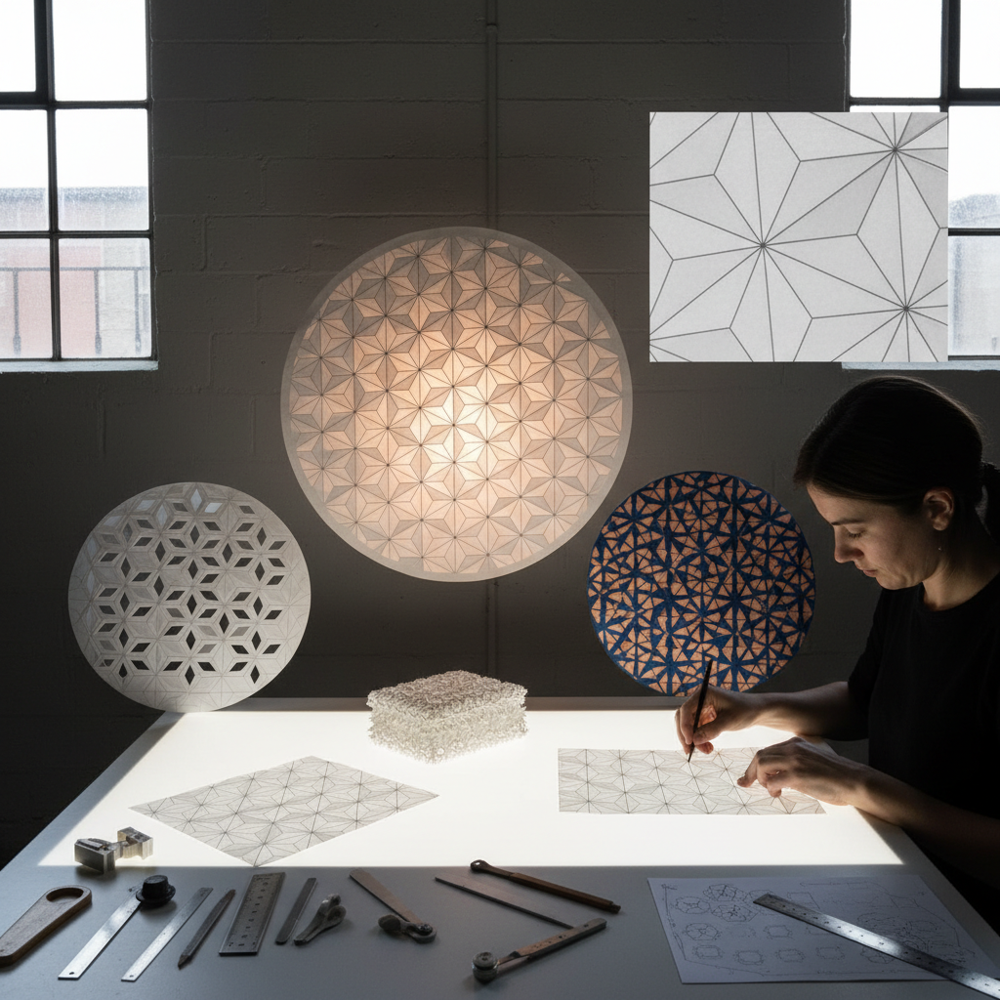

# Origami Tessellation 折纸镶嵌

> "Origami tessellation is mathematics made tangible — a single sheet of paper folded into repeating geometric patterns that tile the plane without gaps or overlaps, each crease a precise calculation, each molecule a unit cell that interlocks with its neighbors to create surfaces of extraordinary complexity from the simplest possible starting point." — Unknown

## 概述

折纸镶嵌（Origami Tessellation）是一种将单张纸通过精确的折叠创造出重复几何图案（tessellation/镶嵌）的折纸艺术形式。与传统折纸（创造三维物体）不同，折纸镶嵌创造的是平面或近平面的重复图案——当光线透过折叠的纸张时，不同层数的区域呈现不同的透明度，创造出如同彩色玻璃窗般的光影效果。

折纸镶嵌的核心概念是"分子"（molecule）——一个基本的折叠单元，通过重复排列覆盖整个纸面。常见的镶嵌基础包括：三角形网格、正方形网格和六角形网格。折纸镶嵌在1960年代由日本折纸大师吉�的一（Shuzo Fujimoto）开创，后来由Eric Gjerde、Chris Palmer、Joel Cooper等艺术家发展壮大。折纸镶嵌不仅是艺术——它在工程学（可折叠结构）、材料科学和建筑设计中有重要应用。

## 核心特征

| 特征 | 描述 |
|------|------|
| 单张纸 | 使用单张纸 |
| 重复 | 重复的几何单元 |
| 平面 | 平面或近平面 |
| 光影 | 透光的光影效果 |
| 数学 | 数学的精确性 |
| 无剪切 | 不剪切不粘贴 |

## 视觉特征

- **几何**：精确的几何图案
- **重复**：无缝的重复排列
- **光影**：透光的层次效果
- **精密**：极其精密的折痕
- **优雅**：数学的优雅美感
- **立体**：微妙的立体起伏

## 代表作品

| 作品 | 艺术家 | 年代 | 意义 |
|------|--------|------|------|
| *Fujimoto tessellations* | 藤本修三 | 1960s | 折纸镶嵌的开创 |
| *Flower Tower* | Chris Palmer | 当代 | 螺旋镶嵌 |
| *Tessellation designs* | Eric Gjerde | 当代 | 系统化镶嵌设计 |
| *Curved tessellations* | Various | 当代 | 曲线镶嵌 |
| *Backlit tessellations* | Various | 当代 | 背光镶嵌艺术 |

## 历史时间线

| 时期 | 事件 |
|------|------|
| 1960年代 | 藤本修三开创折纸镶嵌 |
| 1980-90年代 | 折纸镶嵌的理论发展 |
| 2000年代 | 折纸镶嵌的全球传播 |
| 2010年代 | 工程应用的发展 |
| 当代 | 折纸镶嵌的多样化创新 |

## 中国语境

折纸镶嵌在中国的折纸社区中有活跃的实践。中国的折纸爱好者通过网络和书籍学习折纸镶嵌。中国的一些设计师将折纸镶嵌的原理应用于建筑设计、产品设计和时装设计。中国的数学教育中，折纸镶嵌被用作几何教学的辅助工具。中国的一些艺术家创作大型折纸镶嵌装置。折纸镶嵌的"可折叠结构"原理在中国的航天工程中有研究应用。

## AI生成概念图

## 与其他风格的关系

- **Origami** → 折纸
- **Geometric Art** → 几何艺术
- **Islamic Pattern** → 伊斯兰图案
- **Mathematical Art** → 数学艺术
- **Paper Art** → 纸艺
- **Kirigami** → 剪纸折纸

---

*浮光艺志 | Chronicle of Artistry*
