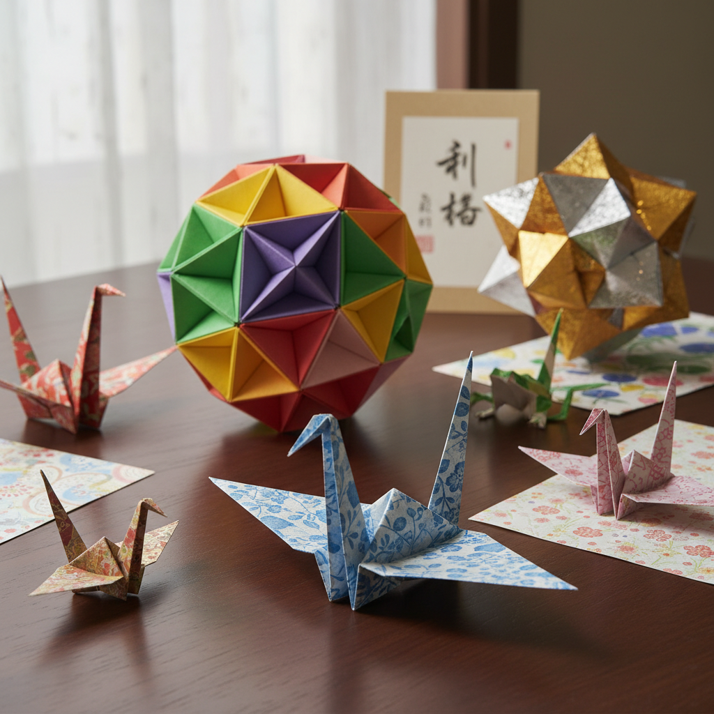

# Origami 折纸 | 折り紙

> **"一张纸的宇宙——不剪不粘，仅凭折叠就能创造万物。"**

## 概述

折纸（Origami / 折り紙 おりがみ）是日本传统的纸艺术，通过折叠一张正方形纸张（不剪切、不粘贴）创造出各种形态。"折り紙"由"折り"（折叠）和"紙"（纸）组成。折纸的历史可追溯到6世纪纸张传入日本之后，但现代折纸艺术的奠基人是吉�的章（Akira Yoshizawa，1911-2005），他创立了折纸的国际符号系统和湿折法。当代折纸已发展为一门融合数学、工程和艺术的学科——从Robert Lang的超复杂昆虫到NASA的太阳能板折叠。

## 主要流派

| 流派 | 特征 |
|------|------|
| 传统折纸 | 千纸鹤、纸船等经典 |
| 现代创作折纸 | 复杂写实造型 |
| 模块折纸 | 多张纸组合 |
| 湿折法 | 湿纸折叠，曲面造型 |
| 折纸数学 | 数学定理和算法 |
| 折纸工程 | 工业和航天应用 |

## 核心特征

- **一张纸**：传统上只用一张正方形纸
- **不剪不粘**：纯粹的折叠
- **数学性**：基于几何和拓扑学
- **从简到繁**：千纸鹤到超复杂造型
- **可逆性**：可以展开还原
- **普世性**：全球共通的艺术语言

## 经典作品

| 作品 | 特征 |
|------|------|
| 千纸鹤 | 日本文化象征 |
| 纸飞机 | 空气动力学 |
| 川崎玫瑰 | 川崎敏和的经典 |
| 恐龙 | Robert Lang的复杂折纸 |
| 镶嵌折纸 | 重复图案的平面折叠 |

## 视觉特征

- 纸张的自然质感和色彩
- 精确的几何折线
- 从平面到立体的转化
- 光影在折面上的变化
- 简洁而优雅的造型
- 数学之美的物理呈现

## 与其他风格的关系

| 风格 | 关系 |
|------|------|
| 剪纸 Kirigami | 折纸+剪切 |
| 建筑折板 | 折纸原理的建筑应用 |
| 参数化设计 | 折纸算法的数字应用 |
| 极简主义 | 共享简约美学 |
| 当代雕塑 | 折纸的艺术转化 |

## 概念图

---

*浮光艺志 | Chronicle of Artistry*
