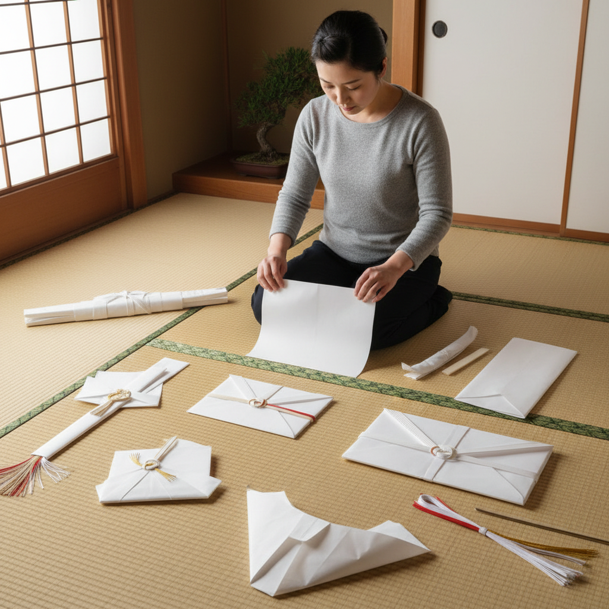

# Origata 折形

> "Origata is the art of wrapping with meaning — each fold carries etiquette, each crease communicates respect, transforming a simple sheet of paper into a vessel of ceremony." — Unknown

## 概述

折形（Origata）是日本传统的礼仪折纸——用纸张折叠来包装礼物、金钱和祭品的正式礼仪技法。与Origami（折纸，以创造立体形状为目的）不同，Origata的核心是礼仪和沟通——不同的折法传达不同的场合（庆祝、丧事、感谢等）、不同的关系（上下级、亲疏）和不同的内容物。Origata起源于武家礼法——室町时代的武士阶层发展出了精密的折形体系，用于包装刀剑、扇子、金钱等礼物。

折形的美学在于：简洁中的深意——看似简单的折叠蕴含着复杂的社会规范和美学判断。白色和纸（washi）的折形是最正式的，折痕的方向、纸的正反面、结的位置都有严格的规定。

## 核心特征

| 特征 | 描述 |
|------|------|
| 礼仪 | 礼仪性的折纸 |
| 包装 | 用于包装礼物 |
| 规范 | 严格的规范 |
| 沟通 | 折法传达信息 |
| 和纸 | 使用和纸 |
| 简洁 | 简洁的美学 |

## 视觉特征

- **白色**：白色和纸为主
- **简洁**：简洁的折叠
- **对称**：对称的形式
- **折痕**：精确的折痕
- **水引**：搭配水引装饰
- **正式**：正式的气质

## 代表作品

| 作品 | 艺术家 | 年代 | 意义 |
|------|--------|------|------|
| *Ogasawara-ryu origata* | 小笠原流 | 室町时代 | 武家折形体系 |
| *Ise-ryu origata* | 伊勢流 | 室町时代 | 伊勢流折形 |
| *Noshi* | 匿名 | 传统 | 熨斗（祝仪折形） |
| *Kinpu (money envelope)* | 匿名 | 传统 | 金封折形 |
| *Contemporary origata* | 山根折形礼法教室 | 当代 | 当代折形教育 |

## 历史时间线

| 时期 | 事件 |
|------|------|
| 室町时代 | 武家折形礼法的确立 |
| 江户时代 | 折形的普及和规范化 |
| 明治时代 | 折形的衰落 |
| 20世纪后半 | 折形的重新发现 |
| 当代 | 折形作为文化遗产的保护 |
| 当代 | 当代设计中的折形应用 |

## 中国语境

折形在中国有对应的传统——中国古代的"封"（信封的折叠方式）和礼品包装也有讲究。中国传统的红包（利是封）虽然形式不同，但同样承载着礼仪和祝福的功能。当代中国的设计领域中，一些设计师从日本折形中汲取灵感，将其应用于包装设计和品牌设计。中国的茶道和花道爱好者群体中，折形作为日本传统文化的一部分也受到关注。

## AI生成概念图

## 与其他风格的关系

- **Origami** → 折纸
- **Mizuhiki** → 水引
- **Washi** → 和纸
- **Japanese Aesthetics** → 日本美学
- **Gift Wrapping** → 礼品包装
- **Paper Craft** → 纸艺

---

*浮光艺志 | Chronicle of Artistry*
