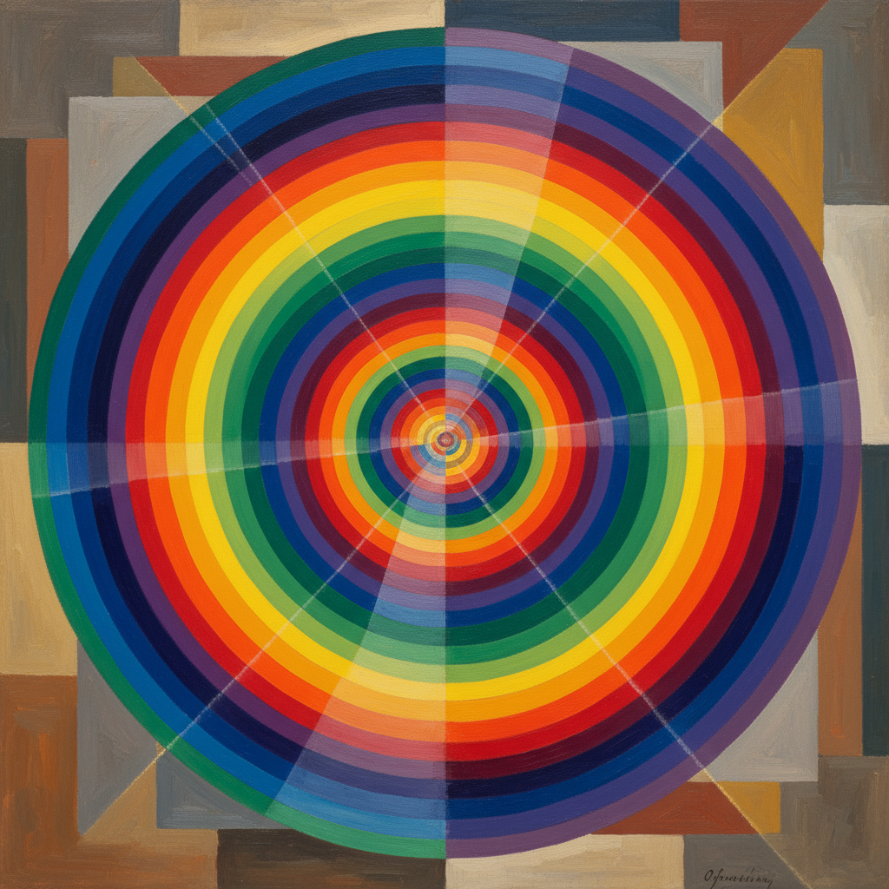

# Orphism Painting 俄耳甫斯主义绘画

> **时期：** 1912年–1914年  
> **关键词：** 纯色彩抽象、音乐性、同心圆、德劳内、光线节奏

## 概述

Orphism（俄耳甫斯主义）是1912年由罗伯特·德劳内和索尼娅·德劳内发展的绘画运动——从立体主义的几何分析中解放出来，转向纯粹色彩的音乐性表达。阿波利奈尔以古希腊诗人俄耳甫斯命名这一流派，因为它像音乐一样用纯粹的形式（色彩）直接触动感官。德劳内的同心圆盘、旋转的色彩韵律——这是西方绘画走向纯抽象的关键一步。

## 风格特征

- **纯色彩**：色彩本身即主题，不再描绘物体
- **同心圆**：旋转的色盘和弧形构图
- **光线分解**：棱镜般的色彩分离
- **音乐性**：视觉节奏和色彩和声
- **动态感**：旋转和振动的视觉效果

## 代表人物与作品

- 罗伯特·德劳内《同时性窗户》
- 索尼娅·德劳内 色彩节奏
- 弗朗提谢克·库普卡 垂直平面
- 弗朗西斯·毕卡比亚 早期抽象

## 概念图

