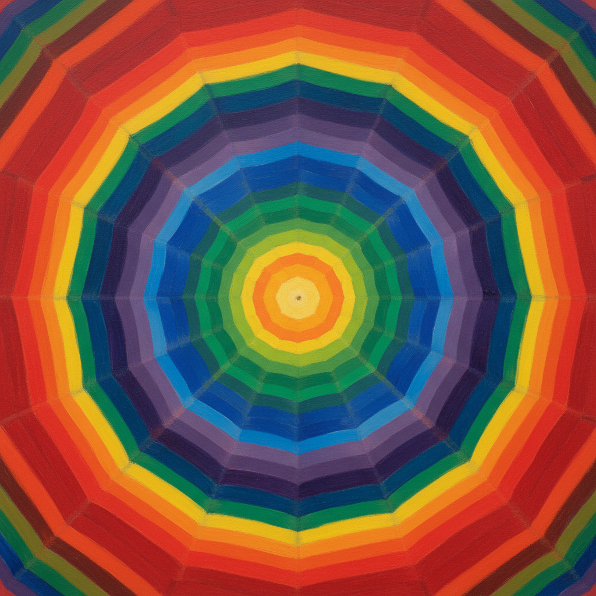

# Orphism 俄耳甫斯主义



> **"纯色彩的音乐——不需要物体，色彩本身就能歌唱。"**

## 概述

| 维度 | 描述 |
|------|------|
| 时期 | 1912–1914 |
| 别名 | Orphism, Orphic Cubism, 俄耳甫斯主义, 奥费主义 |
| 核心色彩 | 光谱色彩——红橙黄绿蓝紫的同时对比 |
| 关键元素 | 同心圆、色彩同时对比、光的分解、音乐性 |
| 代表人物 | Robert Delaunay, Sonia Delaunay, František Kupka |
| 关联风格 | Cubism, Futurism, Abstract Art, Color Field, Op Art |

---

## 历史脉络

| 年份 | 事件 |
|------|------|
| 1912 | Apollinaire命名"Orphism"——以音乐之神命名 |
| 1912 | Robert Delaunay《同时对比的窗户》 |
| 1913 | Sonia Delaunay将Orphism带入时尚和设计 |
| 1912 | Kupka《Amorpha》——纯抽象的先驱 |
| 1914 | 一战中断——Orphism短暂但影响深远 |

### 核心哲学

俄耳甫斯主义的精神是**"立体主义太灰了——我们要色彩！要光！要音乐！"**：
- Apollinaire："Orphism = 用纯色彩创造新现实的艺术"
- "色彩不需要物体来承载——色彩本身就是主题"
- "同时对比 = 色彩的和声——像音乐的和弦"
- "圆形 = 完美——太阳、月亮、眼睛、宇宙"
- "从立体主义的分析走向色彩的综合"

---

## 视觉语法

### 色彩系统

```
核心原理——同时对比：
  红+绿 — 互补振动
  蓝+橙 — 互补振动
  黄+紫 — 互补振动

形式：
  同心圆 — Delaunay的标志
  扇形 — 色彩的展开
  棱镜 — 光的分解
  螺旋 — 运动和时间

规则：
  - 色彩必须"同时"——相邻互补色
  - 形式来自色彩——不是色彩填充形式
  - 圆形和曲线为主
  - 光谱色彩——不用灰色
  - 节奏和韵律——像音乐
```

### 标志性元素

| 类别 | 元素 |
|------|------|
| 形状 | 同心圆、扇形、棱镜、螺旋 |
| 色彩 | 光谱全色、同时对比、高饱和 |
| 节奏 | 色彩的韵律、视觉音乐 |
| 光 | 分解的光、棱镜效果 |
| 态度 | 乐观、音乐性、宇宙性 |

---

## 与当代设计的关系

### 色轮和色彩理论
- Delaunay的同心圆 = 现代色轮的视觉化
- 色彩同时对比理论 = 设计师的基础工具
- "每次你用互补色——都在做Orphism"

### 动态品牌设计
- 渐变色轮Logo = Orphism的商业化
- Chrome/彩虹效果 = 数字时代的Orphism
- "Google的四色 = Orphism精神的简化"

---

## 设计应用

| 场景 | 应用方式 |
|------|----------|
| 品牌 | 彩虹渐变+色轮+动态色彩 |
| 数字 | 色彩动画+棱镜效果 |
| 时尚 | Sonia Delaunay的遗产——色块拼接 |
| 空间 | 彩色玻璃+光影装置 |

---

## 相关风格

← [Cubism 立体主义](cubism.md) | [Futurism 未来主义](futurism.md) →

↑ [返回千禧怀旧目录](README.md) | [返回总目录](../README.md)
