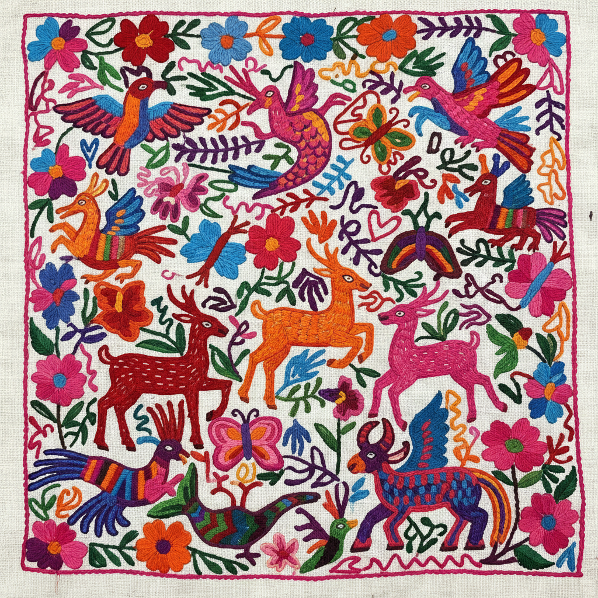

# Otomi Embroidery 奥托米刺绣 | Tenango

> **"森林里的精灵在布上跳舞——墨西哥山区的彩色针线宇宙。"**

## 概述

奥托米刺绣（Otomi Embroidery / Tenango）是墨西哥伊达尔戈州（Hidalgo）特南戈德多里亚（Tenango de Doria）地区奥托米族（Otomí/Hñähñu）的传统刺绣艺术。这种刺绣以其密集的、色彩鲜艳的动植物图案著称——鸟、鹿、花、蝴蝶、美人鱼和各种幻想生物填满整块白色棉布。图案源自当地岩洞壁画和萨满传统，1960年代因严重干旱，当地女性开始将传统壁画图案转化为刺绣出售，逐渐发展为墨西哥最受欢迎的民间艺术之一。

## 核心特征

- **密集填充**：整块布面被图案完全覆盖
- **白色底布**：白色棉布或麻布为基底
- **鲜艳色彩**：粉、红、蓝、绿、橙、紫的多色组合
- **缎面绣**：主要使用缎面绣（satin stitch）填充
- **万物共存**：动物、植物、人物、精灵共处一个画面
- **无透视**：所有元素平等分布，无前后关系
- **幻想生物**：美人鱼、双头鸟、人面花等

## 常见母题

| 母题 | 含义 |
|------|------|
| 鸟 | 自由、精神世界 |
| 鹿 | 森林之灵、祖先 |
| 花 | 生命、美丽 |
| 美人鱼 | 水之精灵 |
| 蝴蝶 | 灵魂、变化 |
| 兔子 | 月亮、丰饶 |
| 生命之树 | 宇宙中心 |

## 视觉特征

- 白色底上的多彩密集图案
- 平面化的动植物造型
- 所有空间被图案填满
- 鲜艳饱和的刺绣色彩
- 有机流动的构图
- 幻想与现实的融合

## 与其他风格的关系

| 风格 | 关系 |
|------|------|
| 维乔尔艺术 | 共享墨西哥原住民视觉传统 |
| 巴厘岛绘画 | 共享密集填充和神话主题 |
| Madhubani | 共享民间女性艺术传统 |
| 当代插画 | Tenango图案影响全球设计 |
| Matisse剪纸 | 共享平面化的有机形式 |

## 概念图

---

*浮光艺志 | Chronicle of Artistry*
