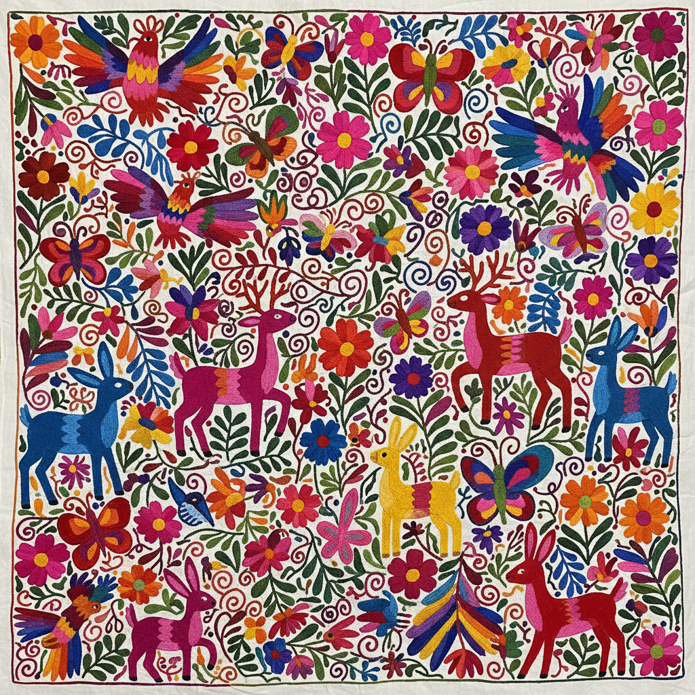

# Otomi Tenango 奥托米刺绣 | Tenango de Doria

> **"山里人的彩色宇宙——墨西哥奥托米族用针线在白布上绣出一整个动物王国的狂欢。"**

## 概述

奥托米刺绣（Otomi Tenango / Tenango de Doria）是墨西哥伊达尔戈州（Hidalgo）奥托米族（Otomí）的传统刺绣艺术，以Tenango de Doria镇为中心。这种刺绣以其大胆的彩色动物、植物和人物图案著称——在白色棉布上用鲜艳的彩色线绣出密集的动物（鸟、鹿、兔子、蝴蝶）、花卉和日常生活场景，填满整个画面。奥托米刺绣的图案源自当地的岩画传统和萨满视觉，具有强烈的叙事性和装饰性。近年来因被国际时尚品牌"借鉴"而引发文化挪用争议。

## 核心特征

- **白底彩绣**：白色棉布上的彩色刺绣
- **密集填充**：图案填满整个画面
- **动物主题**：鸟、鹿、兔子、蝴蝶
- **平面化**：无透视的平面构图
- **叙事性**：讲述日常和神话故事
- **社区创作**：全村女性参与

## 常见图案

| 图案 | 特征 |
|------|------|
| 鸟 | 最常见，各种姿态 |
| 鹿 | 跳跃的动态 |
| 花卉 | 大朵装饰花 |
| 人物 | 日常活动 |
| 蝴蝶 | 变形和灵魂 |
| 美人鱼 | 水的精灵 |

## 视觉特征

- 白底上的鲜艳彩色
- 密集的图案填充
- 平面化的动物造型
- 大胆的色彩对比
- 叙事性的场景构图
- 民间艺术的活力

## 与其他风格的关系

| 风格 | 关系 |
|------|------|
| Huichol Beadwork | 共享墨西哥原住民艺术 |
| Papel Picado | 共享墨西哥装饰传统 |
| Matisse剪纸 | 共享平面化和色彩 |
| 当代插画 | Otomi的全球影响 |
| 北欧民间刺绣 | 共享叙事性刺绣 |

## 概念图

---

*浮光艺志 | Chronicle of Artistry*
