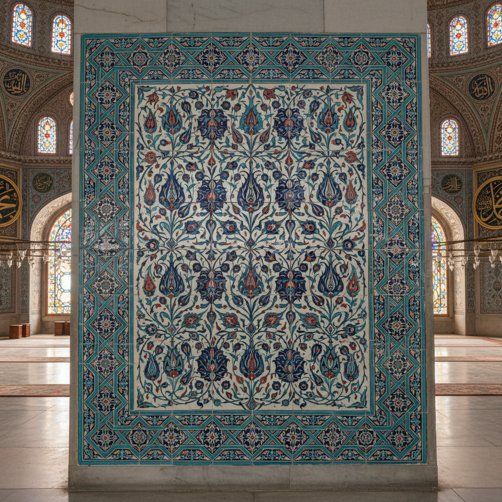

# 奥斯曼艺术 · Ottoman Art

> "书法是灵魂的几何学，建筑是信仰的诗篇。" —— 奥斯曼谚语

## 概述

奥斯曼艺术（Ottoman Art）是14世纪至20世纪初奥斯曼帝国（1299-1922）发展出的综合性艺术体系，融合了拜占庭、波斯、阿拉伯和中亚突厥的多元传统。从伊斯坦布尔的清真寺建筑到精美的伊兹尼克瓷砖，从宫廷细密画到书法艺术，奥斯曼艺术以其几何装饰的精密、色彩的和谐与建筑的宏伟，构成了伊斯兰世界最辉煌的视觉遗产之一。

## 核心特征

| 特征 | 描述 |
|------|------|
| 时期 | 14世纪–1922年 |
| 地域 | 土耳其（伊斯坦布尔、布尔萨、埃迪尔内）及帝国全境 |
| 媒介 | 建筑、瓷砖、书法、细密画、纺织、金属工艺 |
| 核心理念 | 以几何与植物纹样表达神圣秩序与帝国荣耀 |
| 色彩 | 伊兹尼克蓝、翠绿、珊瑚红、白色、金色 |

## 视觉特征

- **几何纹样**：无限重复的几何图案象征神的无限性
- **阿拉伯花纹（Arabesque）**：卷曲的植物纹样无尽延伸
- **书法艺术**：阿拉伯文书法作为最高视觉艺术形式
- **穹顶与光**：清真寺内部以穹顶和窗户营造神圣光线
- **伊兹尼克瓷砖**：蓝白红绿的釉下彩瓷砖装饰

## 代表作品

| 作品 | 创作者 | 年代 | 类型 |
|------|--------|------|------|
| 苏莱曼清真寺 | 锡南 | 1550-1557 | 建筑 |
| 蓝色清真寺 | 塞德夫卡尔·穆罕默德·阿加 | 1609-1616 | 建筑 |
| 托普卡帕宫瓷砖装饰 | 伊兹尼克工坊 | 16世纪 | 瓷砖艺术 |
| 《苏莱曼纪》插图 | 宫廷画坊 | 1558 | 细密画 |
| 哈菲兹·奥斯曼书法 | 哈菲兹·奥斯曼 | 17世纪 | 书法 |

## 发展时间线

| 时期 | 事件 |
|------|------|
| 1299 | 奥斯曼帝国建立 |
| 1453 | 征服君士坦丁堡，拜占庭艺术传统融入 |
| 1520-1566 | 苏莱曼大帝时期，奥斯曼艺术黄金时代 |
| 1550s | 建筑师锡南创造奥斯曼清真寺经典形制 |
| 16世纪 | 伊兹尼克瓷砖生产达到巅峰 |
| 17-18世纪 | 郁金香时期，欧洲洛可可影响渗入 |
| 19世纪 | 西化改革，传统艺术与欧洲风格并存 |
| 1922 | 帝国终结，艺术遗产成为土耳其国家文化认同 |

## 中国语境

奥斯曼艺术与中国的交流源远流长。中国青花瓷深刻影响了伊兹尼克瓷砖的蓝白色调和花卉纹样；托普卡帕宫收藏了世界上最大的中国瓷器收藏之一。反过来，奥斯曼的几何装饰和阿拉伯花纹通过丝绸之路影响了中国伊斯兰建筑（如西安大清真寺的装饰）。当代中土文化交流中，两国的陶瓷和书法传统成为重要的对话领域。

## AI 概念图

*AI 生成概念图：奥斯曼艺术风格*

## 关联词条

- [[persian-miniature-art]] - 波斯细密画
- [[mughal-miniature-art]] - 莫卧儿细密画
- [[russian-mosaic-art]] - 俄罗斯马赛克艺术

---

*浮光艺志 · Chronicle of Artistry*
