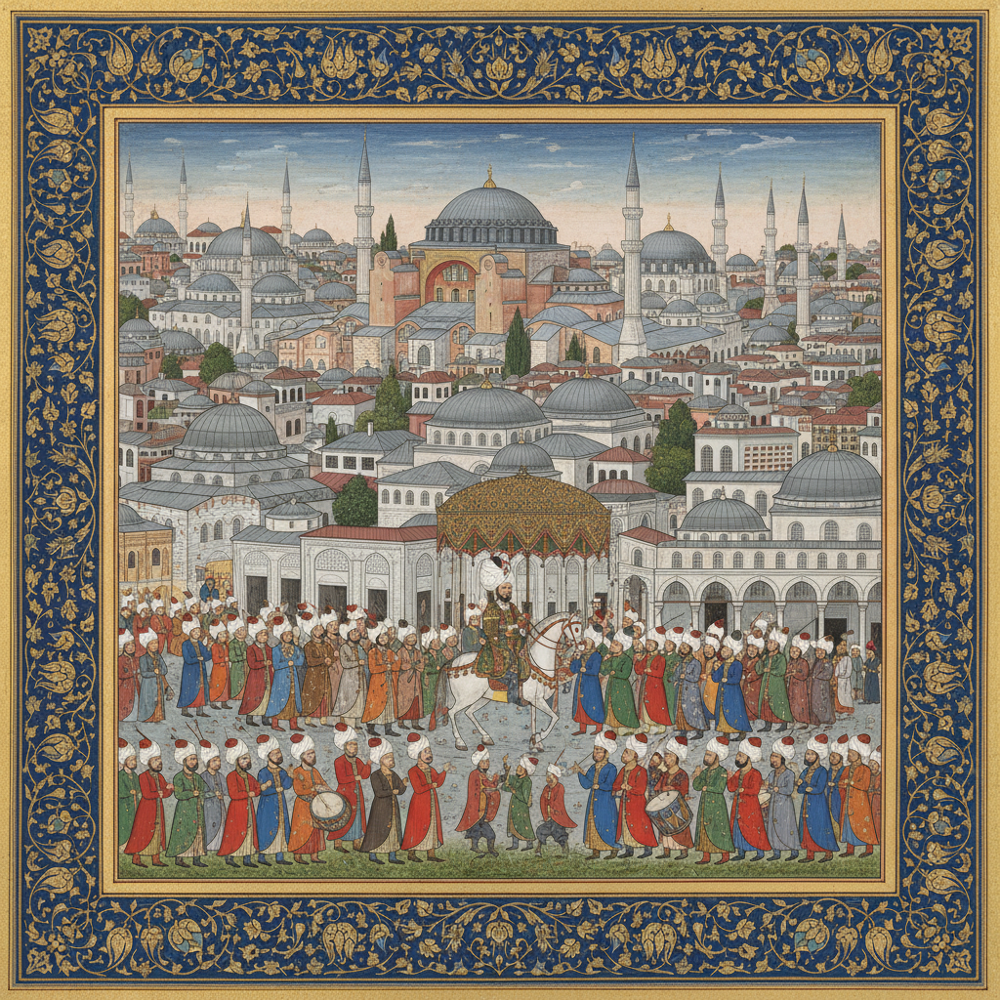

# Ottoman Miniature 奥斯曼细密画

> **"帝国的视觉编年史——用画笔记录苏丹的荣耀与帝国的疆域。"**

## 概述

奥斯曼细密画（Osmanlı minyatürü / Ottoman Miniature）是奥斯曼帝国（1299–1922）宫廷艺术工作室（Nakkaşhane）创作的精致书籍插图传统。与波斯细密画侧重文学诗歌不同，奥斯曼细密画更注重历史编年和纪实记录——苏丹的征战、宫廷仪式、城市地形和帝国版图。这种独特的"视觉新闻"传统使奥斯曼细密画在伊斯兰艺术中独树一帜。

## 时间线

| 时期 | 特征 |
|------|------|
| 15世纪 | 征服者穆罕默德二世建立宫廷画院 |
| 15世纪末 | 成立希腊画家学院（Nakkashane-i-Rum）和波斯画家学院（Nakkashane-i-Irani） |
| 16世纪 | 苏莱曼大帝时期的黄金时代 |
| 1570s–1590s | 纳卡什·欧斯曼（Nakkaş Osman）主导宫廷工作室 |
| 17世纪 | Levni 标志着风格转折，更具个人特色 |
| 18世纪 | 郁金香时代，受欧洲影响 |
| 19世纪 | 西方绘画影响下逐渐衰落 |

## 核心特征

- **纪实性**：记录真实历史事件而非文学想象
- **鸟瞰视角**：城市和战场的地图式描绘
- **多场景叙事**：一幅画中展现事件的多个阶段
- **宫廷工作室制度**：集体创作，分工明确
- **编年史插图**：为苏丹的官方历史著作配图
- **伊兹尼克色彩**：受伊兹尼克瓷砖影响的蓝绿红色调

## 代表作品与画家

| 画家/作品 | 特征 |
|-----------|------|
| Nakkaş Osman | 穆拉德三世时期宫廷主管，纪实风格 |
| Levni | 18世纪，个人风格突出，人物生动 |
| 《苏莱曼纳玛》 | 苏莱曼大帝的编年史插图 |
| 《征服者之书》 | 穆罕默德二世的军事功绩 |
| 《姓氏之书》(Surname) | 宫廷庆典的详细记录 |

## 视觉特征

- 色彩鲜艳、笔法精细的小尺幅画面
- 建筑和城市的精确地形描绘
- 人物的程式化但可辨识的面容
- 金色和蓝色的大量使用
- 花卉纹样边框（受伊兹尼克瓷砖影响）
- 文字与图像的有机结合

## 与其他风格的关系

| 风格 | 关系 |
|------|------|
| 波斯细密画 | 直接源流，但奥斯曼更纪实 |
| 拜占庭艺术 | 地理继承，互相影响 |
| 伊兹尼克瓷砖 | 共享色彩体系和花卉纹样 |
| 欧洲文艺复兴 | 穆罕默德二世邀请贝里尼来宫廷作画 |
| 莫卧儿细密画 | 平行发展的伊斯兰宫廷艺术 |

## 概念图

---

*浮光艺志 | Chronicle of Artistry*
