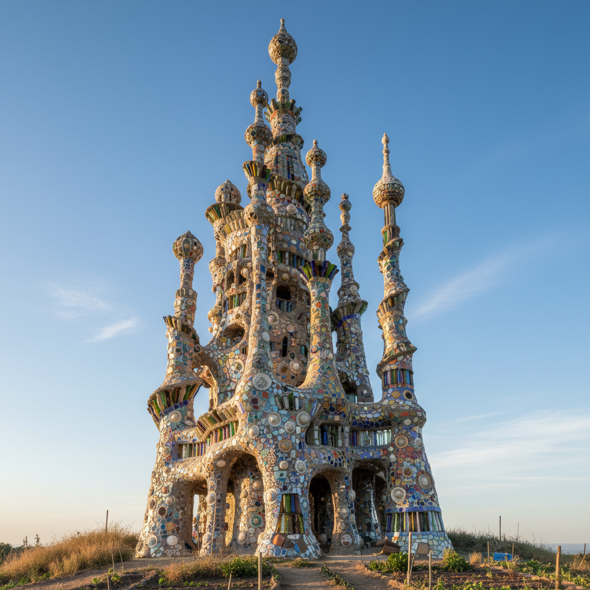

# Outsider Architecture 局外人建筑

> "I built it because God told me to." — Simon Rodia (Watts Towers)

## 概述

局外人建筑（Outsider Architecture / Visionary Environments）是由未经建筑训练的个人独自建造的奇异建筑和环境。这些创作者——退休工人、隐士、宗教幻想者——花费数十年时间，用废弃材料、水泥、贝壳、瓶子等建造出令人惊叹的个人宇宙。

局外人建筑的力量在于它的执念——一个人用一生的时间，不为名利，只为实现内心的愿景。

## 核心特征

| 特征 | 描述 |
|------|------|
| 自学 | 建造者未接受建筑训练 |
| 独力 | 通常由一人独自建造 |
| 长期 | 花费数十年持续建造 |
| 废料 | 使用回收和废弃材料 |
| 幻想性 | 源于个人幻想或宗教启示 |
| 不可复制 | 每个环境都是独一无二的 |

## 视觉特征

- **密集**：极度密集的装饰和结构
- **有机**：非几何的、有机的形态
- **材料**：瓶子、贝壳、瓷片、水泥
- **色彩**：马赛克般的碎片色彩
- **尺度**：从花园到整个山丘
- **累积**：数十年累积的层次

## 代表作品

| 作品 | 建造者 | 地点/年代 | 意义 |
|------|--------|-----------|------|
| *Watts Towers* | Simon Rodia | 洛杉矶 1921-54 | 局外人建筑的标志 |
| *Palais Idéal* | Ferdinand Cheval | 法国 1879-1912 | 邮递员的理想宫殿 |
| *Rock Garden* | Nek Chand | 印度 1957-至今 | 废料建造的石头花园 |
| *Coral Castle* | Edward Leedskalnin | 佛罗里达 1923-51 | 珊瑚石的神秘城堡 |
| *House on the Rock* | Alex Jordan Jr. | 威斯康星 1945+ | 悬崖上的奇幻屋 |
| *Salvation Mountain* | Leonard Knight | 加州 1984-2011 | 彩色水泥的爱之山 |

## 历史时间线

| 时期 | 事件 |
|------|------|
| 1879 | Cheval开始建造理想宫殿 |
| 1921 | Rodia开始建造Watts Towers |
| 1957 | Nek Chand开始建造Rock Garden |
| 1970s | "局外人环境"概念的学术化 |
| 1990s | 保护运动——这些建筑面临拆除威胁 |
| 2000s-至今 | 作为文化遗产的认定和保护 |

## 中国语境

中国也有类似的局外人建筑现象——一些农民或退休工人花费数十年建造个人的奇异建筑。这些"民间奇观"在中国社交媒体上偶尔引起关注，但缺乏系统的记录和保护。中国传统的私家园林在某种意义上也是个人愿景的物质化，尽管建造者通常受过教育。

## AI生成概念图

## 与其他风格的关系

- **Outsider Art** → 局外人建筑是局外人艺术的建筑形式
- **Folk Art** → 与民间艺术共享非学院背景
- **Assemblage** → 废料的集合与组装
- **Environmental Art** → 创造完整的环境体验
- **Mosaic Art** → 碎片拼贴的建筑表面
- **Installation Art** → 沉浸式的空间体验

---

*浮光艺志 | Chronicle of Artistry*
