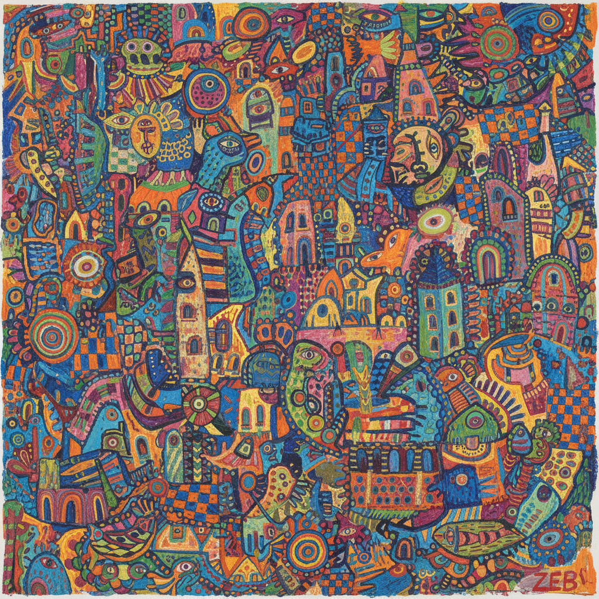

# Outsider Art Painting 局外人艺术绘画

> **时期：** 20世纪–至今  
> **关键词：** 自学成才、精神病院、边缘创作、原始冲动、反体制

## 概述

Outsider Art Painting（局外人艺术绘画）指那些在主流艺术体制之外——精神病院、监狱、孤独的自学者——创作的绘画。没有学院训练，没有市场意识，没有艺术史参照，只有不可遏制的创作冲动。亨利·达格的幻想王国、阿道夫·韦尔夫利的宇宙曼陀罗——它们的力量恰恰来自对"正确"画法的无知。

## 风格特征

- **强迫性重复**：密集填满每一寸空间
- **个人神话**：完全私密的想象世界
- **无透视**：不遵循学院空间规则
- **鲜艳色彩**：直觉性的大胆用色
- **混合媒材**：任何可用的材料都是画材

## 代表人物与作品

- 亨利·达格《不真实的国度》
- 阿道夫·韦尔夫利 宇宙构图
- 马丁·拉米雷斯 隧道与骑手
- 比尔·特雷勒 记忆场景

## 概念图

