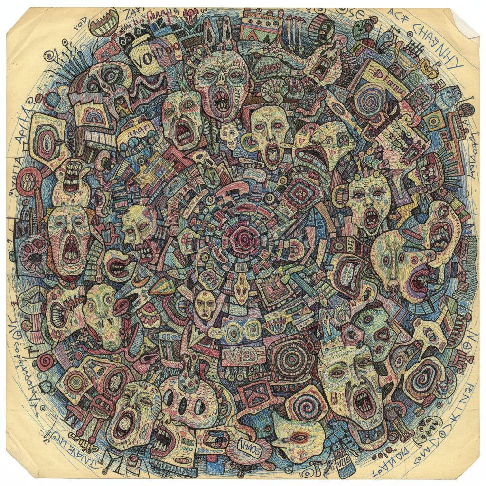

# Outsider Art 局外人艺术

> "Art is a guarantee of sanity." — Louise Bourgeois

## 概述

局外人艺术（Outsider Art / Art Brut）是由未经正规艺术训练的人——精神病患者、隐士、自学者、边缘人——创作的艺术。法国艺术家让·杜布菲（Jean Dubuffet）在1945年创造了"Art Brut"（原生艺术）这个术语，指那些不受文化传统和艺术市场影响的、来自内心深处的纯粹创作。

局外人艺术挑战了"谁有资格做艺术"的问题，揭示了创造力不依赖于教育、社会地位或艺术界的认可。

## 核心特征

| 特征 | 描述 |
|------|------|
| 非学院 | 创作者未接受正规艺术教育 |
| 内在驱动 | 出于内心的强迫性需要而创作 |
| 独立系统 | 每个创作者发展出独特的视觉语言 |
| 强迫性 | 重复、密集、不可遏制的创作冲动 |
| 边缘性 | 创作者通常处于社会边缘 |
| 原始力量 | 未经"文明化"的原始表达力 |

## 视觉特征

- **密度**：极度密集的填充——horror vacui
- **重复**：强迫性的图案重复
- **色彩**：不遵循色彩理论——直觉的色彩选择
- **比例**：不遵循透视和比例——主观的空间
- **材料**：任何可得的材料——铅笔、圆珠笔、废纸
- **尺度**：从小纸片到覆盖整栋建筑

## 代表作品

| 作品 | 艺术家 | 年代 | 意义 |
|------|--------|------|------|
| *Palais Idéal* | Ferdinand Cheval | 1879-1912 | 邮递员用33年建造的梦幻宫殿 |
| *Drawings* | Adolf Wölfli | 1899-1930 | 精神病院中的宇宙创世 |
| *Paintings* | Henry Darger | 1930s-70s | 15000页的秘密史诗 |
| *Watts Towers* | Simon Rodia | 1921-54 | 用废品建造的17座塔 |
| *Drawings* | Madge Gill | 1920s-60s | 灵媒状态下的密集线描 |
| *Throne of the Third Heaven* | James Hampton | 1950-64 | 用锡箔纸建造的天国宝座 |

## 历史时间线

| 时期 | 事件 |
|------|------|
| 1922 | Hans Prinzhorn出版《精神病人的艺术》 |
| 1945 | Dubuffet创造"Art Brut"概念 |
| 1947 | Dubuffet开始收集Art Brut作品 |
| 1972 | Roger Cardinal创造"Outsider Art"英文术语 |
| 1976 | Collection de l'Art Brut在洛桑开馆 |
| 1993 | American Visionary Art Museum开馆 |
| 2000s | 局外人艺术进入主流拍卖市场 |
| 2010s | 局外人艺术与当代艺术的边界日益模糊 |

## 子类型

| 子类型 | 特征 |
|--------|------|
| Art Brut | Dubuffet定义的原生艺术 |
| 精神病艺术 | 精神病患者的创作 |
| 幻想建筑 | Cheval、Rodia——自建的梦幻建筑 |
| 灵媒艺术 | 声称受灵性指引的创作 |
| 自学艺术 | 自学成才的民间艺术家 |
| 环境艺术 | 将整个生活环境变成艺术品 |

## 中国语境

中国的"素人艺术"近年获得越来越多的关注。农民画家、退休工人画家、精神障碍者的创作被重新发现和评价。中国的WABC无障碍艺途等机构为精神障碍者提供创作支持。中国民间的"怪人"——如用石头建造城堡的农民、在山洞里画壁画的隐士——都是中国版的局外人艺术家。中国传统的"疯僧"文化（如怀素的狂草）在精神上与局外人艺术有共鸣。

## AI生成概念图

## 与其他风格的关系

- **Expressionism** → 表现主义对内心表达的追求与局外人艺术相通
- **Surrealism** → 超现实主义对无意识的兴趣与局外人艺术交汇
- **Primitivism** → 原始主义对"未开化"艺术的浪漫化
- **Folk Art** → 民间艺术与局外人艺术共享非学院背景
- **Stuckism** → 卡住主义对真诚表达的追求与局外人艺术相通
- **Neo-Expressionism** → 新表现主义借鉴了局外人艺术的原始力量

---

*浮光艺志 | Chronicle of Artistry*
