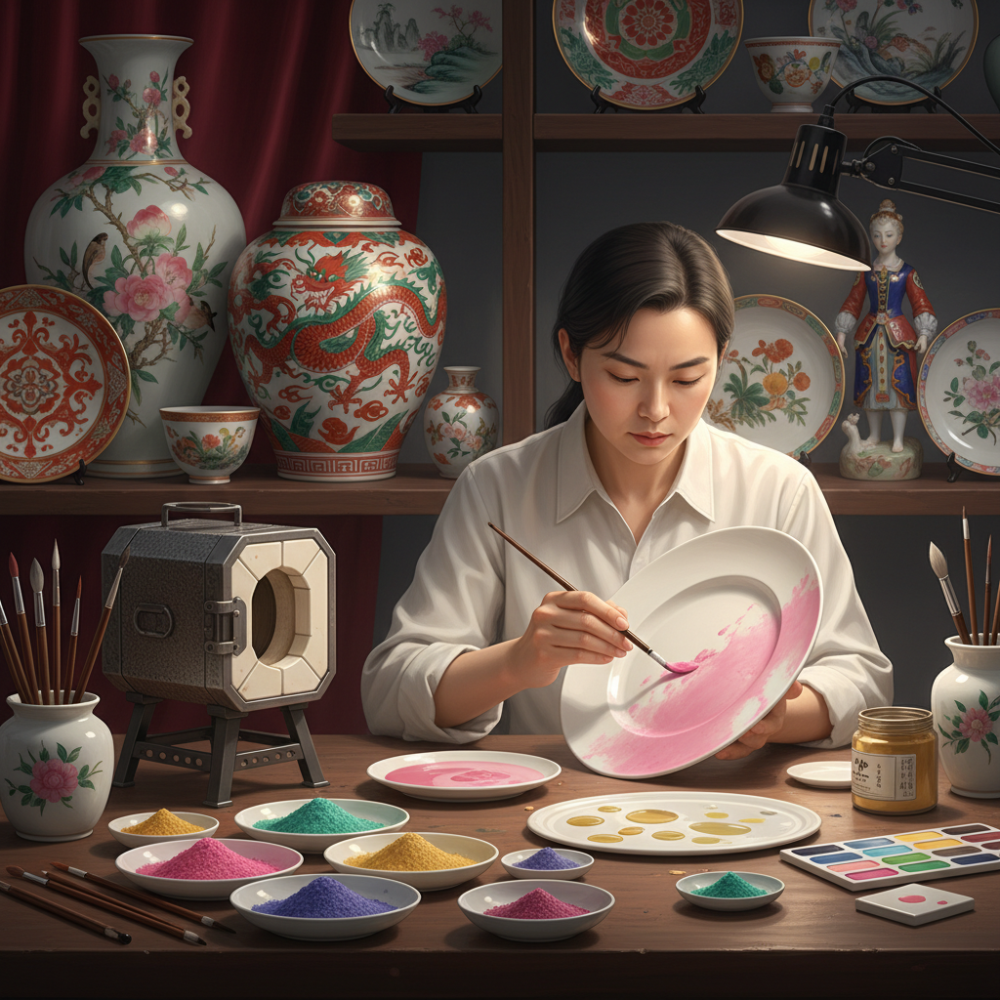

# Overglaze Art 釉上彩艺术

> "Overglaze painting is porcelain's final flourish — colors applied atop the fired glaze and fused in a second, gentler firing that melts the pigments just enough to bond them permanently to the glassy surface. Because overglaze enamels fire at lower temperatures, they can achieve colors impossible in the fierce heat of the main kiln: delicate pinks, rich purples, brilliant greens, and opaque whites that sit like jewels on the porcelain surface." — Unknown

## 概述

釉上彩艺术（Overglaze Art）是在已经烧成的釉面瓷器上用低温彩料绑画，然后经低温二次烧制使颜料固定在釉面之上的陶瓷装饰技法——因为烧成温度较低（约700-900°C），可以使用更丰富的色彩，包括釉下彩无法实现的粉红、紫色等颜色。

釉上彩艺术的实践包括：1）粉彩——使用含砷白色打底的柔和彩绑画；2）五彩——明代发展的多色釉上彩；3）珐琅彩——使用进口珐琅料的精细彩绑画；4）新彩——使用现代化学颜料的釉上彩；5）金彩——使用金粉的釉上装饰；6）当代釉上彩——将传统技法与现代艺术结合的创作。

## 核心特征

| 特征 | 描述 |
|------|------|
| 色彩 | 色彩极其丰富 |
| 低温 | 低温二次烧制 |
| 精细 | 可实现极精细的绑画 |
| 表面 | 颜料在釉面之上 |
| 层次 | 可多次烧制叠加 |
| 奢华 | 视觉效果华丽 |

## 视觉特征

- **丰富**：极其丰富的色彩
- **凸起**：颜料微微凸起于釉面
- **精细**：极其精细的绑画细节
- **华丽**：华丽的装饰效果
- **层次**：多层色彩的叠加
- **光泽**：彩料自身的光泽

## 代表作品

| 作品 | 艺术家/文化 | 年代 | 意义 |
|------|-------------|------|------|
| *康熙五彩* | 中国清代 | 17世纪 | 五彩的巅峰 |
| *雍正粉彩* | 中国清代 | 18世纪 | 粉彩的极致 |
| *珐琅彩* | 中国清代 | 康雍乾 | 釉上彩最高成就 |
| *Japanese Kutani* | 日本 | 17世纪至今 | 日本九谷烧 |
| *European porcelain* | 欧洲 | 18世纪至今 | 欧洲釉上彩 |

## 历史时间线

| 时期 | 事件 |
|------|------|
| 宋代 | 中国早期釉上彩的出现 |
| 明代 | 五彩的发展和成熟 |
| 清代 | 粉彩和珐琅彩的黄金时代 |
| 18世纪 | 欧洲釉上彩的发展 |
| 当代 | 釉上彩的现代传承 |

## 中国语境

釉上彩艺术在中国有极其辉煌的传统——中国清代的粉彩和珐琅彩代表了釉上彩艺术的最高成就。中国的五彩瓷器（明代成化、万历，清代康熙）以其大胆的色彩和生动的图案著称——是中国陶瓷装饰的重要品种。中国的粉彩（清代雍正、乾隆）以其柔和细腻的色彩和精致的绑画著称——被誉为"东方的洛可可"。中国的珐琅彩瓷器是宫廷专用的极品——其精细程度和色彩丰富度代表了中国瓷绘的最高水平。中国景德镇至今仍是釉上彩瓷器的重要产地——传统的粉彩和新彩技艺在这里传承。中国的釉上彩技艺被列入多项国家级非物质文化遗产。中国当代的陶瓷艺术家在釉上彩领域持续创新——将传统技法与当代艺术理念结合。

## AI生成概念图

## 与其他风格的关系

- **Underglaze** → 釉下彩
- **Porcelain Painting** → 瓷绘艺术
- **Enamel Art** → 珐琅艺术
- **Ceramics** → 陶瓷艺术
- **Miniature Painting** → 细密画
- **Decorative Art** → 装饰艺术

---

*浮光艺志 | Chronicle of Artistry*
