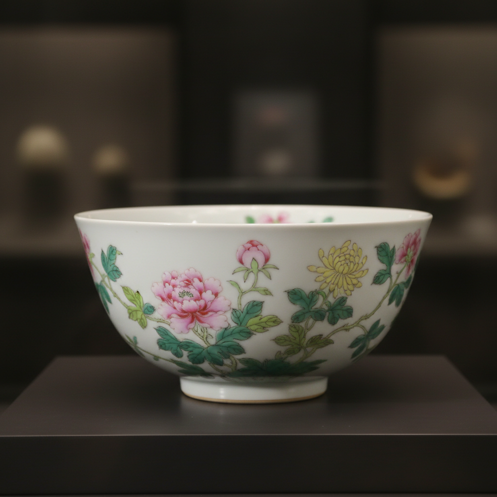

# Overglaze Enamel Art 釉上彩艺术

> "Overglaze enamel is painting on glass — pigments ground with flux and oil applied with a brush onto an already-fired glazed surface, then refired at lower temperature until the colors fuse into the glaze like stained glass laid flat, each layer of color requiring its own firing, the painter building up a palette of impossible brilliance one kiln-journey at a time." — Unknown

## 概述

釉上彩艺术（Overglaze Enamel Art）是一种在已烧成的釉面上用彩料绘制图案，再经低温二次烧制使彩料与釉面融合的陶瓷装饰技法。釉上彩因为在釉面之上绘制，不受高温限制，可以使用更丰富的色彩——红、黄、绿、紫等鲜艳颜色都可以实现。中国的粉彩、珐琅彩、五彩，日本的赤绘，欧洲的瓷器彩绘都属于釉上彩范畴。

釉上彩艺术的核心要素包括：1）已烧成釉面——在已完成的釉面上作画；2）低温彩料——使用低温熔融的彩色颜料；3）二次烧制——在700-900°C低温中再次烧制；4）色彩丰富——可实现高温下无法获得的颜色；5）精细绘画——可进行极其精细的绑画；6）多次烧制——复杂作品需要多次烧制；7）表面装饰——彩料附着在釉面之上。

## 核心特征

| 特征 | 描述 |
|------|------|
| 釉面之上 | 在已烧成釉面上绑画 |
| 色彩丰富 | 可用颜色远多于釉下彩 |
| 低温烧制 | 700-900°C的低温固化 |
| 精细绘画 | 可实现极精细的画面 |
| 多次烧制 | 复杂作品需多次入窑 |
| 表面质感 | 彩料凸起于釉面之上 |

## 视觉特征

- **鲜艳色彩**：红、黄、绿、紫等鲜艳色
- **精细画面**：极其精细的绘画细节
- **凸起质感**：彩料在釉面上的微凸
- **光泽对比**：彩料与釉面的光泽差异
- **层次丰富**：多次烧制的色彩层次
- **金彩装饰**：常配合金彩使用

## 代表作品

| 作品 | 艺术家/窑口 | 年代 | 意义 |
|------|-------------|------|------|
| *珐琅彩瓷* | 景德镇御窑 | 清康雍乾 | 釉上彩的最高成就 |
| *粉彩瓷器* | 景德镇 | 清代 | 粉彩的柔和美感 |
| *五彩瓷器* | 景德镇 | 明清 | 五彩的鲜艳对比 |
| *九谷烧* | 日本 | 17世纪起 | 日本釉上彩传统 |
| *迈森瓷器彩绘* | 德国迈森 | 18世纪 | 欧洲釉上彩 |

## 历史时间线

| 时期 | 事件 |
|------|------|
| 宋金时期 | 中国早期釉上彩的出现 |
| 明代 | 五彩瓷器的成熟 |
| 清康熙 | 五彩的巅峰 |
| 清雍正 | 粉彩和珐琅彩的发展 |
| 18世纪 | 欧洲瓷器彩绘的兴起 |
| 当代 | 釉上彩的传承与创新 |

## 中国语境

釉上彩是中国陶瓷装饰的重要组成部分。中国的釉上彩传统极其丰富——从明代的五彩到清代的粉彩、珐琅彩、广彩，形成了完整的体系。珐琅彩瓷器被视为中国陶瓷装饰的最高成就——它将西方珐琅技术与中国瓷器结合，在极薄的瓷胎上绘制精美的画面。粉彩以其柔和的色调和细腻的渲染著称。景德镇至今保持着釉上彩的完整传统，从配料、研磨到绘制、烧制的每一个环节都有专门的工匠。釉上彩是景德镇"非遗"保护的重要内容。

## AI生成概念图

## 与其他风格的关系

- **Underglaze Painting** → 釉下彩
- **Famille Rose** → 粉彩
- **Cloisonne Enamel** → 景泰蓝
- **Porcelain Painting** → 瓷器绘画
- **Cobalt Blue** → 青花（釉下）
- **Gold Decoration** → 金彩装饰

---

*浮光艺志 | Chronicle of Artistry*
