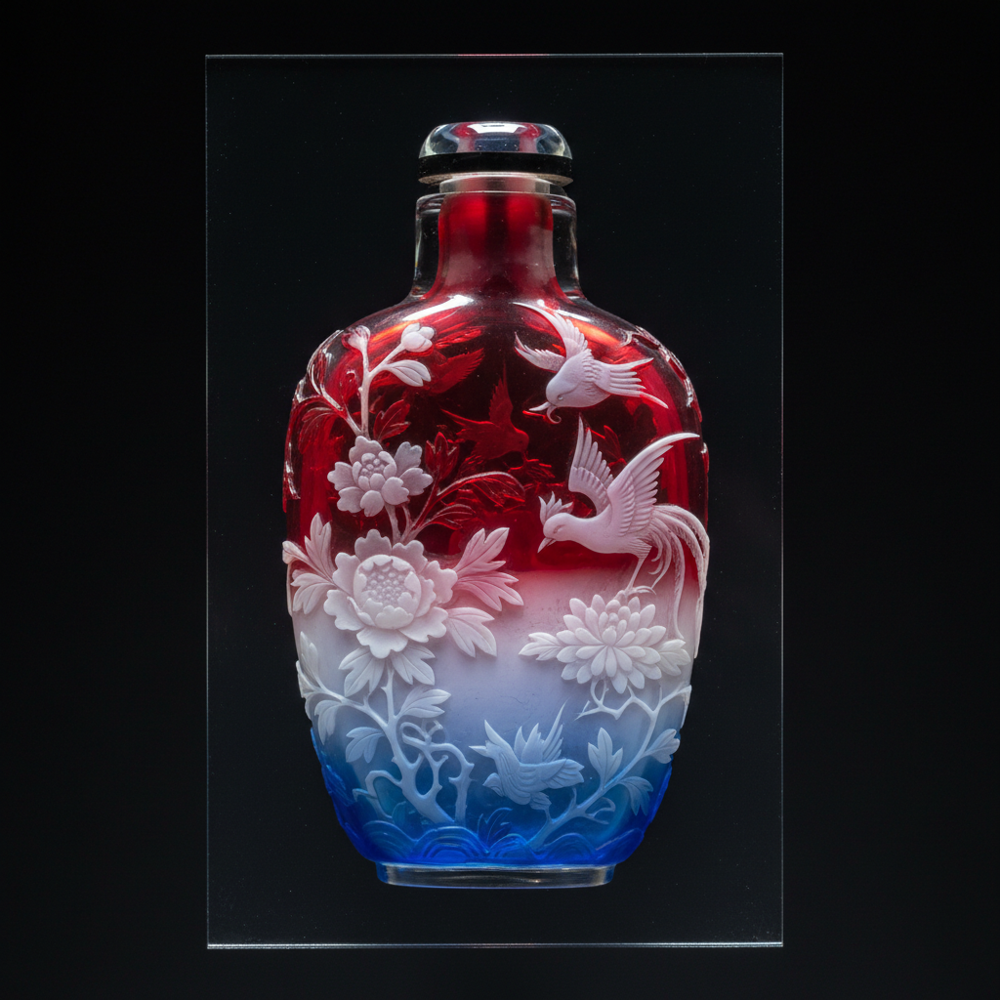

# Overlay Glass Art 套色玻璃艺术

> "Overlay glass is sculpture revealed by subtraction — layers of colored glass are fused one upon another like geological strata, then carved, cut, or acid-etched away to expose the colors beneath, creating cameo-like reliefs where each layer becomes a different plane of depth and hue, the design emerging not by addition but by the careful removal of what conceals it." — Unknown

## 概述

套色玻璃艺术（Overlay Glass Art）是一种将多层不同颜色的玻璃叠加在一起，然后通过雕刻、切割或酸蚀去除部分外层来露出内层颜色的装饰技法——也称为cased glass或cameo glass。套色玻璃通过减法创造图案，每一层颜色代表不同的深度平面，形成浮雕般的立体效果。

套色玻璃艺术的实践包括：1）多层叠加——将不同颜色的玻璃层叠加；2）轮雕——用砂轮雕刻去除外层；3）酸蚀——用氢氟酸蚀刻去除外层；4）浮雕效果——创造浮雕般的立体图案；5）多色层次——多层颜色的层次变化；6）中国套料——中国传统的套料玻璃；7）当代套色——将传统技法与现代创作结合。

## 核心特征

| 特征 | 描述 |
|------|------|
| 多层 | 多层颜色的叠加 |
| 减法 | 通过去除创造图案 |
| 浮雕 | 浮雕般的立体效果 |
| 层次 | 丰富的色彩层次 |
| 雕刻 | 精细的雕刻技术 |
| 对比 | 不同层颜色的对比 |

## 视觉特征

- **层次**：多层颜色的深度层次
- **浮雕**：浮雕般的立体感
- **对比**：不同颜色层的对比
- **精细**：精细的雕刻细节
- **光泽**：玻璃的光泽和透明
- **华丽**：华丽的整体效果

## 代表作品

| 作品 | 艺术家/文化 | 年代 | 意义 |
|------|-------------|------|------|
| *Portland Vase* | 古罗马 | 1世纪 | 波特兰花瓶 |
| *Chinese snuff bottles* | 中国 | 18-19世纪 | 中国套料鼻烟壶 |
| *Émile Gallé cameo glass* | 法国 | 19世纪 | 加莱浮雕玻璃 |
| *Thomas Webb cameo* | 英国 | 19世纪 | 托马斯·韦伯浮雕玻璃 |
| *Contemporary overlay* | 国际 | 当代 | 当代套色玻璃 |

## 历史时间线

| 时期 | 事件 |
|------|------|
| 1世纪 | 古罗马浮雕玻璃（波特兰花瓶） |
| 18世纪 | 中国套料玻璃的发展 |
| 19世纪 | 欧洲浮雕玻璃的复兴 |
| 新艺术时期 | 加莱等人的艺术浮雕玻璃 |
| 当代 | 套色玻璃的持续创作 |

## 中国语境

套色玻璃在中国有重要的传统和地位。中国的套料玻璃是国家级非物质文化遗产——清代宫廷的套料玻璃达到了极高的艺术水平。中国的套料鼻烟壶——是中国套料玻璃最精美的代表，在国际收藏界享有盛誉。北京的料器——传统的套料玻璃制作中心。中国的套料技法——将多层不同颜色的玻璃套在一起然后雕刻，与西方的overlay技法完全一致。中国当代的玻璃艺术家——在传统套料基础上进行创新。中国的工艺美术教育中，套料玻璃作为中国传统玻璃工艺的代表——在相关课程中教授。

## AI生成概念图

## 与其他风格的关系

- **Cameo Glass** → 浮雕玻璃
- **Graal** → 格拉尔玻璃
- **Art Nouveau Glass** → 新艺术玻璃
- **Chinese Snuff Bottles** → 中国鼻烟壶
- **Gallé** → 加莱
- **Relief Sculpture** → 浮雕

---

*浮光艺志 | Chronicle of Artistry*
