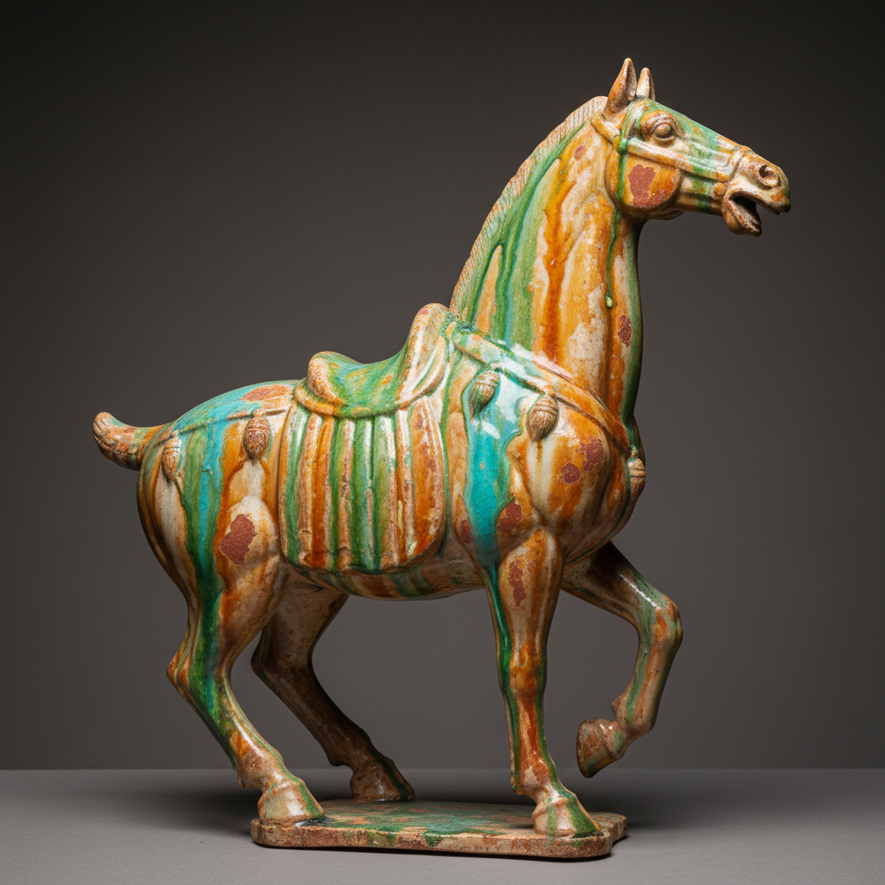

# Oxidation Firing Art 氧化烧成艺术

> "Oxidation firing is ceramics in full breath — the kiln fed abundant air so every metal atom in clay and glaze takes its fill of oxygen, iron blooming warm red and amber, copper settling into stable turquoise green, each element expressing its most relaxed and predictable self, the potter trading the drama of reduction for the reliability of a kiln that breathes freely and colors that arrive exactly as promised." — Unknown

## 概述

氧化烧成艺术（Oxidation Firing Art）是一种在充足氧气供应的窑炉气氛中烧制陶瓷的技法。在氧化气氛中，坯体和釉料中的金属氧化物保持其最高氧化态——铁呈现红色/棕色/黄色，铜呈现绿色/蓝绿色。氧化烧成的色彩效果更加可预测和稳定，是电窑烧制的默认气氛，也是许多传统陶瓷的烧制方式。

氧化烧成艺术的核心要素包括：1）充足氧气——窑内有充分的空气供应；2）完全氧化——金属保持最高氧化态；3）暖色调——铁产生红/棕/黄色；4）可预测——色彩效果稳定可控；5）电窑适用——电窑的默认烧制气氛；6）色彩明亮——比还原烧成更明亮的色调；7）广泛应用——大多数日用陶瓷的烧制方式。

## 核心特征

| 特征 | 描述 |
|------|------|
| 充足氧气 | 窑内空气充分供应 |
| 暖色调 | 铁产生红/棕/黄色 |
| 可预测 | 色彩效果稳定可控 |
| 电窑默认 | 电窑的标准烧制气氛 |
| 色彩明亮 | 明亮清晰的色彩 |
| 广泛应用 | 最常见的烧制方式 |

## 视觉特征

- **暖红��调**：铁氧化产生的红棕色
- **绿松石色**：铜氧化产生的蓝绿色
- **明亮色彩**：清晰明亮的釉色
- **白色坯体**：氧化保持坯体白色
- **均匀色调**：稳定均匀的色彩分布
- **清晰边界**：釉色之间清晰的界限

## 代表作品

| 作品 | 艺术家/文化 | 年代 | 意义 |
|------|-------------|------|------|
| *唐三彩* | 中国唐代 | 7-10世纪 | 氧化烧成的经典 |
| *马约利卡陶* | 意大利 | 15-16世纪 | 欧洲氧化烧成传统 |
| *代尔夫特蓝陶* | 荷兰 | 17世纪 | 锡釉氧化烧成 |
| *当代电窑陶艺* | 各地陶艺家 | 当代 | 电窑氧化烧成 |
| *工业日用瓷* | 各品牌 | 当代 | 工业氧化烧成 |

## 历史时间线

| 时期 | 事件 |
|------|------|
| 远古 | 最早的陶器均为氧化烧成 |
| 唐代 | 唐三彩等氧化烧成的辉煌 |
| 15世纪 | 欧洲马约利卡的氧化传统 |
| 20世纪 | 电窑普及使氧化烧成成为主流 |
| 当代 | 氧化烧成在工作室陶艺中的广泛应用 |

## 中国语境

氧化烧成在中国陶瓷史上同样有重要地位。唐三彩——中国最著名的低温釉陶——就是氧化烧成的产物，其鲜艳的黄、绿、白三色来自铁和铜在氧化气氛中的呈色。中国的许多民间陶瓷——从陶罐到砖瓦——都是氧化烧成。中国当代陶艺教育中，电窑氧化烧成是最基础的烧制方式——学生首先学习氧化烧成的规律，再进阶到还原烧成。氧化烧成虽然不如还原烧成那样充满戏剧性，但其可控性和稳定性使其成为陶瓷创作中最可靠的技术基础。

## AI生成概念图

## 与其他风格的关系

- **Reduction Firing** → 还原烧成
- **Electric Kiln** → 电窑
- **Tang Sancai** → 唐三彩
- **Majolica** → 马约利卡
- **Studio Pottery** → 工作室陶艺
- **Industrial Ceramics** → 工业陶瓷

---

*浮光艺志 | Chronicle of Artistry*
