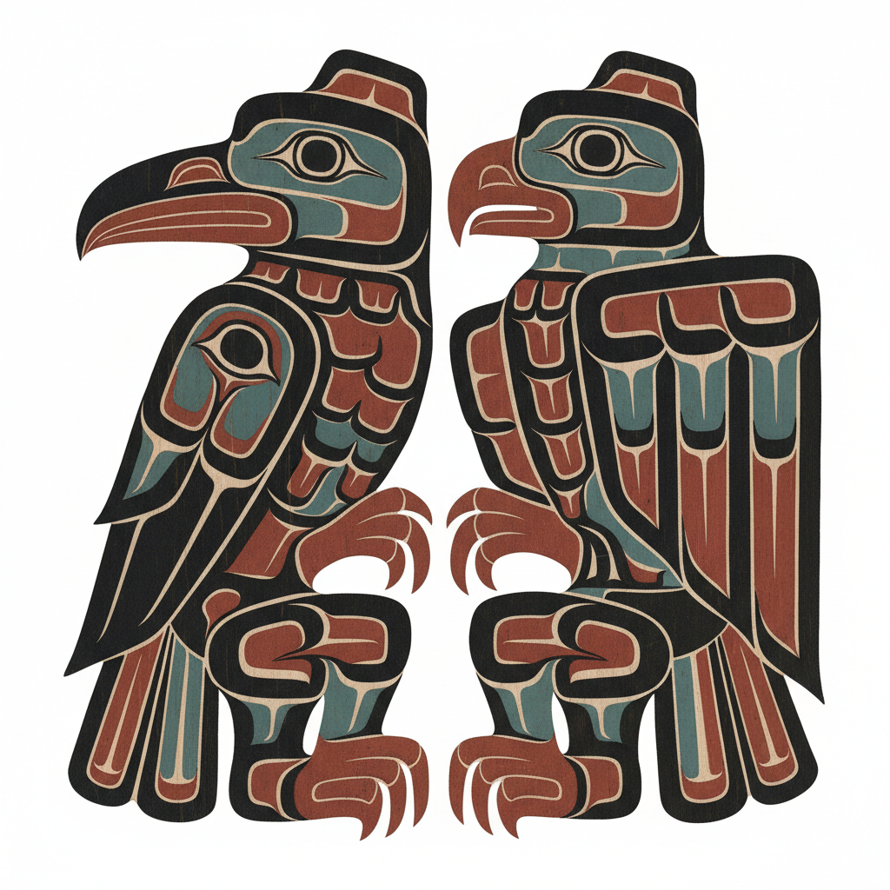

# Pacific Northwest Coast Art 太平洋西北海岸艺术

> **"每一条线都有生命——乌鸦、鹰、熊和鲸在红与黑之间变形。"**

## 概述

太平洋西北海岸艺术（Pacific Northwest Coast Art）是北美原住民艺术中最具辨识度的视觉传统，由海达族（Haida）、特林吉特族（Tlingit）、夸夸嘉夸族（Kwakwaka'wakw）、努特卡族（Nuu-chah-nulth）和钦西安族（Tsimshian）等民族创造。这一传统以其独特的"形线"（Formline）设计系统闻名——用流畅的黑色轮廓线和红色/蓝绿色填充，将动物图腾转化为高度程式化的平面设计，应用于图腾柱、独木舟、面具、毯子和日常器物。

## 核心设计系统：Formline

- **主线 (Primary Formline)**：黑色，定义形状的主要轮廓
- **次线 (Secondary Formline)**：红色，内部分割和细节
- **三级元素 (Tertiary)**：蓝绿色，填充和装饰
- **卵形 (Ovoid)**：基本构成单元，类似眼睛的椭圆形
- **U形 (U-form)**：另一基本单元，用于羽毛、鳞片等
- **S形 (S-form)**：连接和过渡元素

## 主要图腾动物

| 动物 | 象征 |
|------|------|
| 乌鸦 Raven | 创世者、变形者、智慧 |
| 鹰 Eagle | 力量、领导、精神世界 |
| 熊 Bear | 力量、家族、治愈 |
| 虎鲸 Orca | 海洋之王、家族纽带 |
| 雷鸟 Thunderbird | 超自然力量、天空之主 |
| 狼 Wolf | 忠诚、团队、教导 |
| 鲑鱼 Salmon | 生命循环、丰饶 |

## 主要艺术形式

| 形式 | 特征 |
|------|------|
| 图腾柱 Totem Pole | 家族历史和权利的纪念碑 |
| 面具 Mask | 仪式用，可变形的机械面具 |
| 奇尔卡特毯 Chilkat Blanket | 山羊毛和雪松树皮编织 |
| 独木舟 Canoe | 巨型雪松独木舟的彩绘装饰 |
| 蒸汽弯曲木箱 Bentwood Box | 单块木板蒸汽弯曲成箱 |

## 视觉特征

- 黑、红、蓝绿三色为主
- 流畅有力的轮廓线
- 正负空间的精确平衡
- 动物形象的高度程式化和变形
- "X光"视角——同时展现外部和内部
- 填满整个表面的设计（horror vacui）
- 对称与不对称的巧妙运用

## 代表艺术家

| 艺术家 | 民族 | 贡献 |
|--------|------|------|
| Bill Reid | Haida | 20世纪海达艺术复兴的核心人物 |
| Robert Davidson | Haida | 当代Formline大师 |
| Mungo Martin | Kwakwaka'wakw | 图腾柱雕刻传承者 |

## 与其他风格的关系

| 风格 | 关系 |
|------|------|
| Art Nouveau | 共享有机曲线，但独立发展 |
| 凯尔特艺术 | 共享交织纹和动物变形 |
| 日本家纹 | 共享程式化的自然图案 |
| 当代平面设计 | Formline系统影响现代标志设计 |
| 抽象表现主义 | Barnett Newman 受西北海岸艺术启发 |

## 概念图

---

*浮光艺志 | Chronicle of Artistry*
