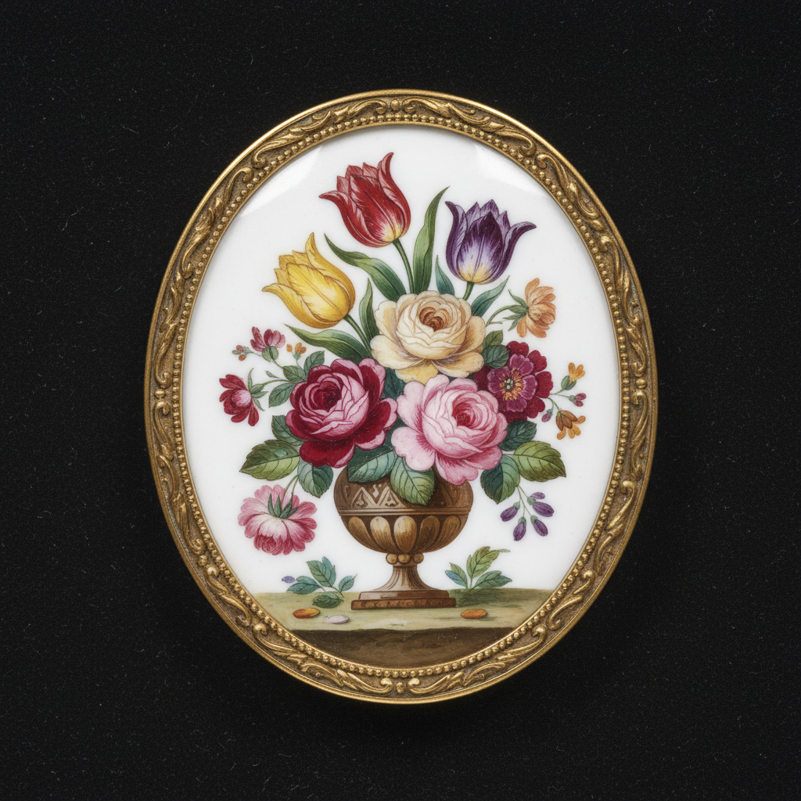

# Painted Enamel Art 画珐琅艺术

> "Painted enamel is miniature painting made eternal — pigments ground from metallic oxides are mixed with flux and painted onto a fired enamel ground with the finest brushes, then fired again and again at progressively lower temperatures so that each layer of color fuses permanently into glass, building up an image as luminous and durable as a jewel." — Unknown

## 概述

画珐琅艺术（Painted Enamel Art）是一种在金属胎体的珐琅底色上用珐琅颜料进行绘画的精美工艺——与普通绘画不同，画珐琅的每一层颜色都需要单独烧制，使颜料熔化成玻璃质，最终形成永久性的、色彩鲜艳的画面。这种技法能够达到极其精细的效果，常用于微型肖像、钟表表盘和高级珠宝。

画珐琅艺术的实践包括：1）底色制作——施加白色或浅色珐琅底色；2）描绘——用极细的画笔描绘图案；3）分层烧制——每层颜色单独烧制；4）渐进温度——从高温到低温逐层烧制；5）微型绘画——极其精细的微型绘画；6）钟表表盘——在钟表表盘上的应用；7）当代画珐琅——将传统技法与现代创作结合。

## 核心特征

| 特征 | 描述 |
|------|------|
| 绘画 | 用珐琅颜料绘画 |
| 分层 | 多层分别烧制 |
| 永久 | 永久性的色彩 |
| 精细 | 极其精细的笔触 |
| 微型 | 常为微型绘画 |
| 奢华 | 高级奢华的工艺 |

## 视觉特征

- **鲜艳**：珐琅颜料的鲜艳色彩
- **精细**：极其精细的笔触和细节
- **光泽**：玻璃质的光泽
- **层次**：多层烧制的丰富层次
- **永久**：不褪色的永久色彩
- **微型**：常为微型尺寸的精品

## 代表作品

| 作品 | 艺术家/文化 | 年代 | 意义 |
|------|-------------|------|------|
| *Limoges painted enamel* | 法国 | 16世纪 | 利摩日画珐琅 |
| *Canton painted enamel* | 中国 | 18世纪 | 广州画珐琅 |
| *Miniature portrait enamels* | 欧洲 | 17-18世纪 | 微型肖像珐琅 |
| *Patek Philippe enamel dials* | 瑞士 | 20世纪 | 百达翡丽珐琅表盘 |
| *Contemporary painted enamel* | 国际 | 当代 | 当代画珐琅 |

## 历史时间线

| 时期 | 事件 |
|------|------|
| 15世纪 | 画珐琅在利摩日发展 |
| 17世纪 | 画珐琅传入中国 |
| 18世纪 | 广州画珐琅的黄金时代 |
| 19世纪 | 微型肖像珐琅的流行 |
| 当代 | 高级钟表中的画珐琅传承 |

## 中国语境

画珐琅在中国有重要的历史地位和传承。中国的画珐琅（铜胎画珐琅）是国家级非物质文化遗产——康熙年间从欧洲传入并在宫廷发展。广州画珐琅（广珐琅）是中国画珐琅的重要流派——以其精细的绘画和鲜艳的色彩著称。北京画珐琅——在清代宫廷中达到了极高的艺术水平。中国的珐琅彩瓷器——将画珐琅技法应用于瓷器，是清代宫廷的珍贵品种。中国当代的画珐琅艺术家——在传统基础上进行创新。中国的工艺美术大师——在画珐琅领域有多位国家级传承人。

## AI生成概念图

## 与其他风格的关系

- **Cloisonné** → 景泰蓝
- **Grisaille Enamel** → 灰色珐琅
- **Miniature Painting** → 微型绘画
- **Porcelain Painting** → 瓷器绘画
- **Horology** → 钟表艺术
- **Canton Enamel** → 广州珐琅

---

*浮光艺志 | Chronicle of Artistry*
