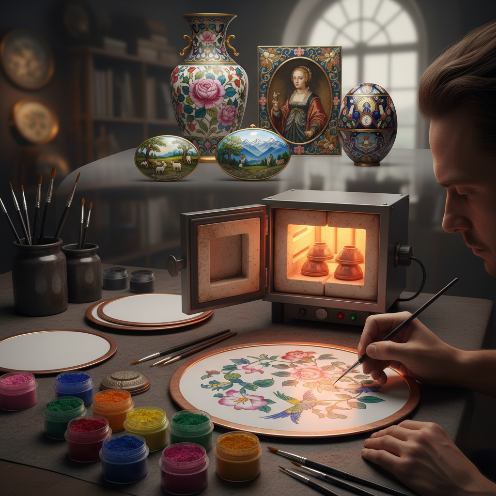

# Painted Enamel 画珐琅

> "Painted enamel is miniature painting made eternal — pigments ground from glass and metal oxides are brushed onto copper with the precision of a portrait painter, then fired until the colors fuse into an imperishable surface that time cannot fade." — Unknown

## 概述

画珐琅（Painted Enamel）是在金属基体（通常是铜）上使用珐琅颜料（磨碎的彩色玻璃粉混合油性介质）像绑画一样描绘图案，然后经过多次烧制使颜料熔融固化的珐琅工艺。画珐琅是珐琅工艺中最接近绘画的形式——艺术家可以像在画布上一样自由地描绘任何图案。

画珐琅与掐丝珐琅（Cloisonné）和凹雕填珐琅（Champlevé）的区别在于：后两者需要金属线或凹槽来分隔不同颜色的珐琅，而画珐琅完全依靠画笔直接描绘——颜色之间没有金属分隔。画珐琅通常需要多次烧制——每次烧制一层颜色，从浅色到深色逐层叠加，每层都需要单独烧制固化。

## 核心特征

| 特征 | 描述 |
|------|------|
| 绘画 | 像绘画一样描绘 |
| 自由 | 完全自由的表现 |
| 多次烧 | 需要多次烧制 |
| 精细 | 可实现极精细描绘 |
| 永久 | 色彩永不褪色 |
| 铜胎 | 通常使用铜胎 |

## 视觉特征

- **绘画**：绘画般的自由表现
- **色彩**：丰富鲜艳的色彩
- **精细**：极精细的描绘
- **光泽**：玻璃般的光泽
- **永久**：永不褪色
- **层次**：多层次的色彩叠加

## 代表作品

| 作品 | 艺术家 | 年代 | 意义 |
|------|--------|------|------|
| *Limoges painted enamels* | Various | 16世纪 | 利摩日画珐琅 |
| *Canton painted enamel* | 广州工匠 | 清代 | 广州画珐琅 |
| *Battersea enamels* | 匿名 | 18世纪 | 巴特西珐琅 |
| *Russian painted enamel* | Various | 18-19世纪 | 俄罗斯画珐琅 |
| *Contemporary painted enamel* | Various | 当代 | 当代画珐琅 |

## 历史时间线

| 时期 | 事件 |
|------|------|
| 15世纪 | 威尼斯画珐琅的出现 |
| 16世纪 | 利摩日画珐琅的繁荣 |
| 17世纪 | 画珐琅传入中国 |
| 18世纪 | 中国画珐琅的鼎盛（康雍乾） |
| 18世纪 | 英国巴特西珐琅 |
| 当代 | 画珐琅在高级钟表中的应用 |

## 中国语境

画珐琅在中国有着辉煌的历史——清代康熙年间，画珐琅技法从欧洲传入中国宫廷。康熙、雍正、乾隆三朝的宫廷画珐琅达到极高水平——被称为"珐琅彩"或"瓷胎画珐琅"。广州是中国画珐琅的重要产地——"广珐琅"（Canton enamel）在18-19世纪大量出口欧洲。中国的画珐琅传统至今仍在传承——北京、广州等地有画珐琅工艺大师。画珐琅被列为国家级非物质文化遗产。

## AI生成概念图

## 与其他风格的关系

- **Grisaille Enamel** → 灰色珐琅画
- **Cloisonné** → 掐丝珐琅
- **Limoges Enamel** → 利摩日珐琅
- **Miniature Painting** → 微型画
- **Porcelain Painting** → 瓷器彩绘
- **Canton Enamel** → 广珐琅

---

*浮光艺志 | Chronicle of Artistry*
