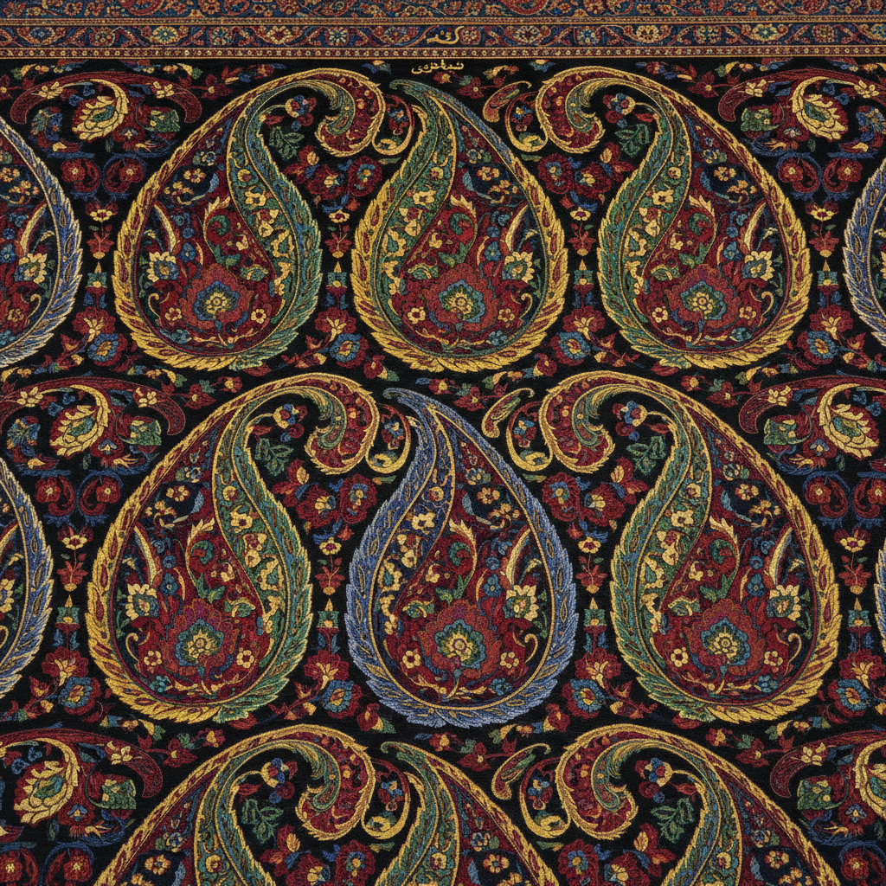

# Paisley 佩斯利 | بته‌جقه

> **"从波斯的柏树到苏格兰的织机——一滴泪形图案征服了全世界。"**

## 概述

佩斯利（Paisley / بته‌جقه / Boteh Jegheh）是一种泪滴形或逗号形的装饰图案，起源于波斯萨珊王朝（3-7世纪），代表生命之树（柏树）或火焰。这种图案通过莫卧儿帝国传入印度克什米尔，成为克什米尔披肩（Pashmina）的标志性图案。18-19世纪，英国东印度公司将克什米尔披肩带入欧洲，苏格兰佩斯利镇（Paisley）大规模仿制生产，图案因此得名。1960-70年代，佩斯利图案成为嬉皮士和迷幻文化的视觉符号。

## 历史传播路线

| 时期 | 地区 | 特征 |
|------|------|------|
| 3-7世纪 | 波斯 | 柏树/火焰原型 |
| 15-18世纪 | 莫卧儿印度 | 克什米尔披肩 |
| 18-19世纪 | 英国/法国 | 欧洲仿制 |
| 19世纪 | 苏格兰佩斯利 | 工业化生产 |
| 1960-70s | 全球 | 嬉皮士/迷幻文化 |
| 当代 | 全球 | 时装和室内设计 |

## 核心特征

- **泪滴形**：弯曲的泪滴或逗号形状
- **内部填充**：泪滴内部有精细的花卉填充
- **重复排列**：图案密集重复排列
- **曲线尾巴**：泪滴顶部的弯曲尾巴
- **多层嵌套**：大泪滴内包含小泪滴
- **对称构图**：通常左右对称排列

## 象征含义

| 解释 | 来源 |
|------|------|
| 柏树 | 波斯——永恒生命 |
| 火焰 | 琐罗亚斯德教——神圣之火 |
| 芒果 | 印度——丰饶 |
| 生命之树 | 多文化——生命循环 |
| 灵魂 | 苏菲派——精神追求 |

## 视觉特征

- 优雅的泪滴曲线
- 精细的内部花卉填充
- 密集的重复排列
- 丰富的色彩层次
- 曲线尾巴的动态感
- 东方的异域美感

## 与其他风格的关系

| 风格 | 关系 |
|------|------|
| 克什米尔披肩 | 佩斯利图案的经典载体 |
| 波斯细密画 | 共享波斯装饰传统 |
| Art Nouveau | 受佩斯利曲线影响 |
| 迷幻艺术 | 1960s佩斯利复兴 |
| 当代时装 | 佩斯利持续流行 |

## 概念图

---

*浮光艺志 | Chronicle of Artistry*
