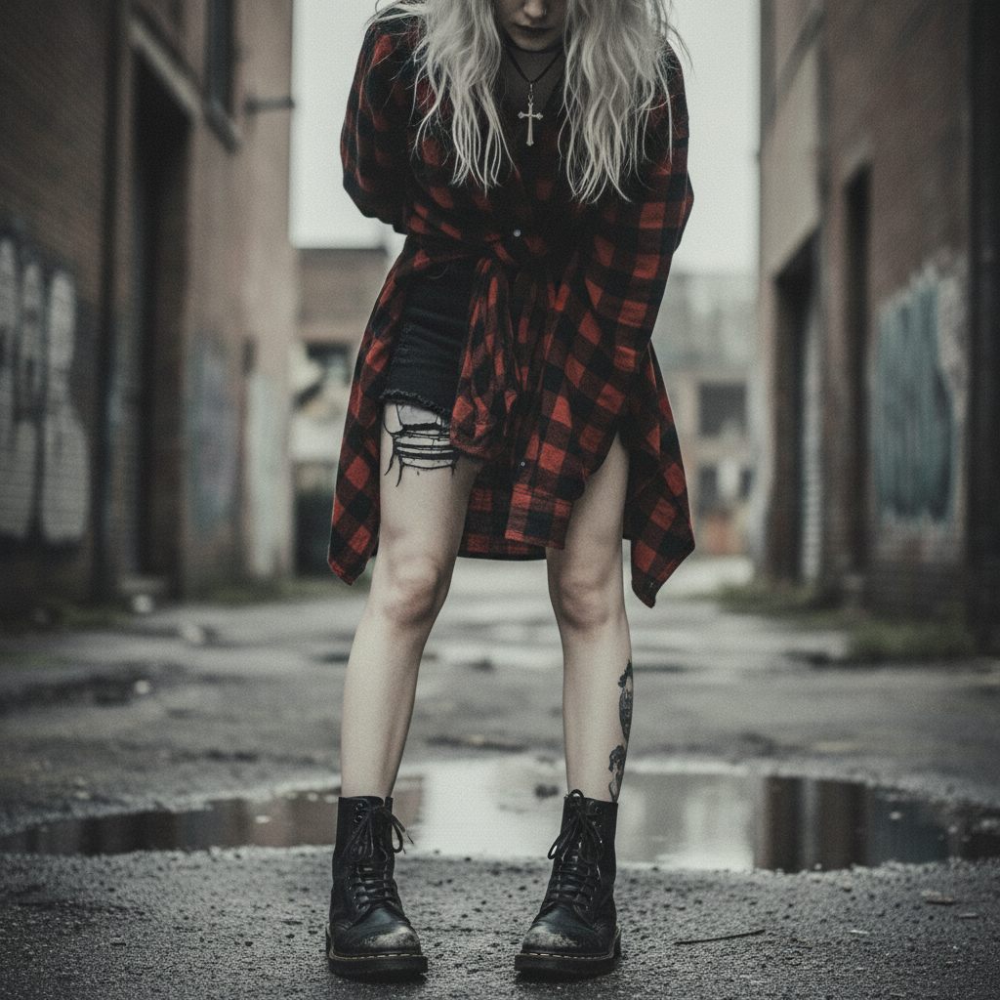
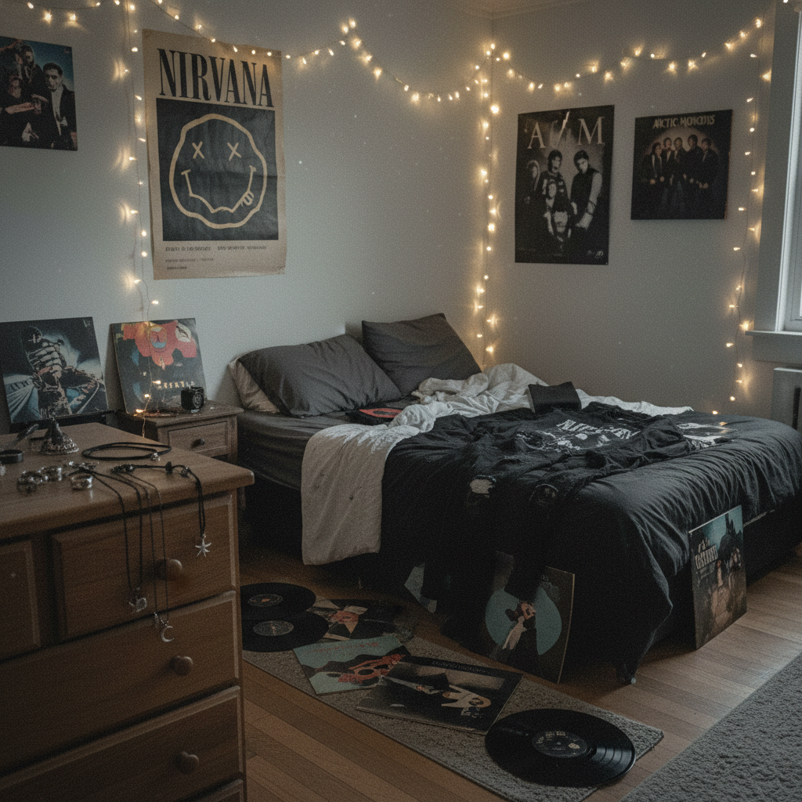

# Pale Grunge / Soft Grunge 苍白垃圾摇滚





> **"Tumblr 2013：把 Nirvana 的愤怒稀释成一杯冰美式。"**

## 概述

| 维度 | 描述 |
|------|------|
| 时期 | 2012–2016（Tumblr 鼎盛期） |
| 别名 | Soft Grunge, Tumblr Grunge, Pastel Grunge, 2014 Tumblr |
| 核心色彩 | 黑色、白色、灰色、淡粉、淡蓝（低饱和） |
| 关键元素 | Doc Martens、格子衬衫、黑色短裙、choker、十字架 |
| 代表人物 | Tumblr 匿名用户群体、Sky Ferreira、Lana Del Rey |
| 关联风格 | Emo, Indie Sleaze, E-Girl (后继者), Pastel Goth |

---

## 历史脉络

### 2012–2013：Tumblr 的视觉炼金术

Pale Grunge 是 Tumblr 平台在 2012–2013 年间自发产生的视觉风格。它的核心操作是：**取 90 年代 Grunge 的视觉元素，去掉愤怒和政治性，保留美学外壳，再用 Tumblr 的滤镜和排版重新包装**。

原版 Grunge（1991–1994）：
- Kurt Cobain 的破洞毛衣 → 真正的贫穷和反消费主义
- 格子法兰绒衬衫 → 西雅图工人阶级的日常穿着
- 脏乱的头发 → 对主流美容标准的拒绝
- 歌词主题 → 疏离、愤怒、药物滥用

Pale Grunge（2012–2016）：
- 精心做旧的破洞牛仔裤 → 购买自 Urban Outfitters
- 格子衬衫 → 搭配黑色短裙和过膝袜
- "凌乱"的头发 → 实际上花了30分钟打理
- 情绪 → 忧郁但美丽，"sad but pretty"

### 为什么叫"Pale"？

"Pale" 指的是这种美学的色彩处理方式：
- 照片被调成低饱和度、高亮度
- 皮肤被修成苍白色
- 黑色不是纯黑，而是灰黑
- 整体色调像被漂白过一样

这种"苍白"既是视觉风格，也是情感隐喻——一种被稀释的、温和的忧郁。

### 2014：巅峰与争议

2014 年是 Pale Grunge 的巅峰年：
- Tumblr 上 #grunge #pale #softgrunge 标签达到顶峰
- 争议爆发："这不是真正的 grunge"——原版 grunge 粉丝的批评
- "Tumblr aesthetic" 成为一个独立的文化现象
- 品牌开始模仿：Brandy Melville、Urban Outfitters

### 2016–至今：遗产

Pale Grunge 在 2016 年后逐渐被 E-Girl 美学取代，但它的影响深远：
- E-Girl 的黑色+链条+格子裙直接继承自 Pale Grunge
- "Tumblr aesthetic" 成为一个时代标签
- 低饱和度摄影风格影响了整个 Instagram 时代
- Lana Del Rey 的视觉系统与 Pale Grunge 高度重合

---

## 视觉语法

### 色彩系统

```
主色（全部低饱和）：
  灰黑 (#333333) — 不是纯黑
  灰白 (#F0F0F0) — 不是纯白
  烟灰 (#808080) — 过渡色
  淡粉 (#FFE4E1) — 极低饱和的粉
  淡蓝 (#E0E8F0) — 极低饱和的蓝

摄影调色：
  降低饱和度 30-50%
  提高亮度/曝光
  加入轻微的蓝/紫色调
  压低对比度
  加入胶片颗粒感
```

### 标志性元素

| 类别 | 元素 |
|------|------|
| 鞋履 | 黑色 Doc Martens（必备）、Converse、Creepers |
| 上衣 | 格子法兰绒衬衫、band tee（Nirvana/Arctic Monkeys）、黑色crop top |
| 下装 | 黑色高腰短裤、A字短裙、破洞紧身裤 |
| 外套 | 皮夹克、牛仔夹克（做旧） |
| 配饰 | Choker（黑色天鹅绒）、十字架项链、银色戒指堆叠 |
| 袜子 | 黑色过膝袜、网袜 |
| 妆容 | 浓重眼线+裸色唇+苍白底妆 |
| 发型 | 凌乱中长发、挑染（灰色/紫色） |

### Tumblr 排版美学

Pale Grunge 不仅是穿搭风格，更是一种**Tumblr 页面设计**美学：
- 黑白/低饱和度照片
- 无衬线小写字体
- 大量留白
- 忧郁的文字引用（通常是歌词或诗句）
- 照片+文字的交替排列
- 极简的页面主题（黑底白字或白底灰字）

---

## 与千禧怀旧的关系

Pale Grunge 怀念的是**两个时代**：
1. **90年代的 Grunge**：通过服装元素（格子衫、Doc Martens）致敬
2. **2013年的 Tumblr**：对于 Z 世代来说，Pale Grunge 本身已经成为怀旧对象

这种"双重怀旧"——怀念一个本身就在怀念过去的时代——是互联网美学的典型特征。

---

## 中国语境

在中国，Pale Grunge 的对应概念包括：
- 2014–2016 年微博/Lofter 上的"丧系"穿搭
- "性冷淡风"的早期版本（但更暗黑）
- 独立音乐圈（万能青年旅店、海龟先生）的视觉风格
- 豆瓣"废物小组"的视觉美学

---

## 延伸阅读

- Aesthetics Wiki: [Soft Grunge](https://aesthetics.fandom.com/wiki/Soft_Grunge)
- Tumblr 2013–2015 视觉文化回顾
- "Is Soft Grunge Real Grunge?" 争论分析

---

## 相关风格

← [Indie Sleaze 独立邋遢](indie-sleaze.md) | [E-Girl / E-Boy](egirl-eboy.md) →

↑ [返回千禧怀旧目录](README.md) | [返回总目录](../README.md)
