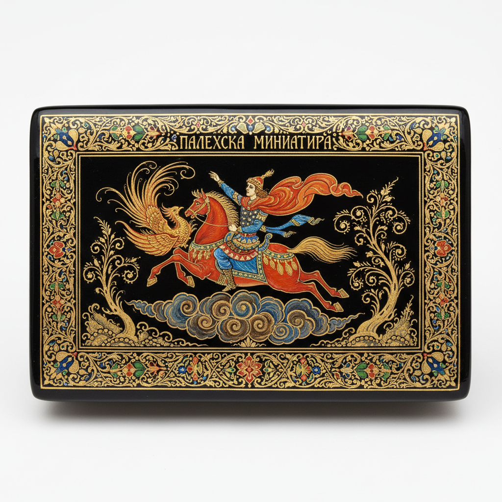

# Palekh Lacquer Miniature 帕列赫漆画 | Палехская миниатюра

> **"黑漆上的金色童话——俄罗斯圣像画师转行后，在漆盒上画出比教堂壁画更精细的民间故事。"**

## 概述

帕列赫漆画（Palekh Lacquer Miniature / Палехская миниатюра）是俄罗斯伊万诺沃州帕列赫村的传统漆器微型绘画艺术。1917年革命后，帕列赫的东正教圣像画师（иконописец）失去了宗教绘画的市场，转而将精湛的蛋彩画技法应用到纸浆漆器（papier-mâché）上，在黑色漆面上用极细的画笔绘制俄罗斯民间故事、童话和史诗场景。帕列赫漆画以其金色线条、黑色背景、极精细的人物和华丽的装饰性著称，1924年正式成立工坊，被列入UNESCO非物质文化遗产。

## 核心特征

- **黑漆背景**：纸浆漆器的黑色底面
- **蛋彩画技法**：源自圣像画的传统技法
- **金色线条**：大量使用金粉描线
- **极精细**：微型画的极致细节
- **叙事性**：讲述完整的故事场景
- **装饰性**：华丽的边框和构图

## 常见题材

| 题材 | 特征 |
|------|------|
| 俄罗斯童话 | 火鸟、伊万王子 |
| 史诗 Bylina | 英雄故事 |
| 民间生活 | 节日、三驾马车 |
| 文学作品 | 普希金等 |
| 自然风景 | 俄罗斯四季 |

## 视觉特征

- 黑色背景上的金色光辉
- 极精细的人物和场景
- 圣像画的构图传统
- 华丽的装饰边框
- 蛋彩画的温润色彩
- 童话般的叙事氛围

## 与其他风格的关系

| 风格 | 关系 |
|------|------|
| 东正教圣像画 | 帕列赫的技法源头 |
| Zhostovo | 共享俄罗斯装饰传统 |
| Khokhloma | 共享金色装饰美学 |
| 波斯细密画 | 共享微型绘画传统 |
| 当代插画 | 帕列赫的叙事影响 |

## 概念图

---

*浮光艺志 | Chronicle of Artistry*
