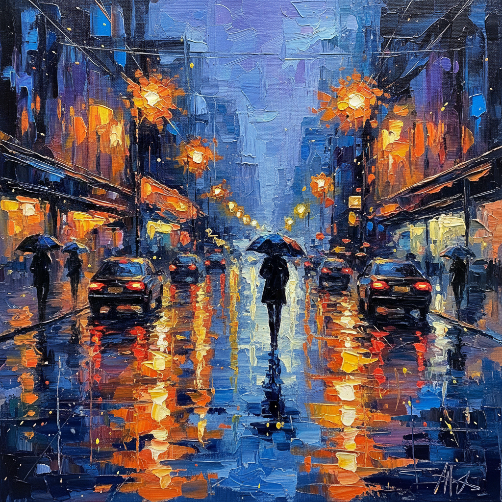

# Palette Knife Art 调色刀画

> **时期：** 19世纪–至今  
> **关键词：** 厚涂肌理、刮刀技法、色块堆叠、触觉质感、即兴表现

## 概述

Palette Knife Art（调色刀画）是以调色刀代替画笔进行创作的绘画技法。刀片刮涂产生的厚重肌理、锐利边缘和色彩混合效果，赋予画面强烈的触觉感和雕塑般的立体感。从库尔贝的岩石到当代抽象表现，调色刀将颜料本身的物质性推到前台。

## 风格特征

- **厚重肌理**：颜料堆积形成浮雕般的表面
- **锐利边缘**：刀片创造的清晰色块分界
- **色彩混合**：刀面上的颜色自然融合
- **即兴性**：快速果断的涂抹动作
- **物质感**：强调颜料作为物质的存在

## 代表人物与作品

- 古斯塔夫·库尔贝 岩石风景
- 尼古拉·德·斯塔尔 抽象风景
- 列昂尼德·阿夫列莫夫 城市雨景
- 当代：Francoise Nielly 肖像

## 概念图

